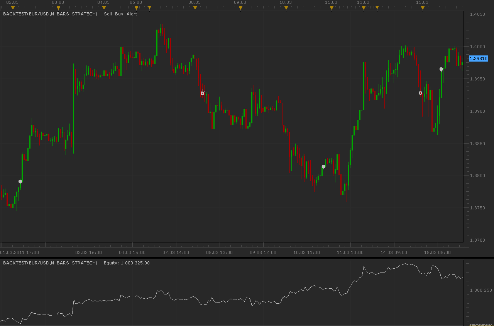
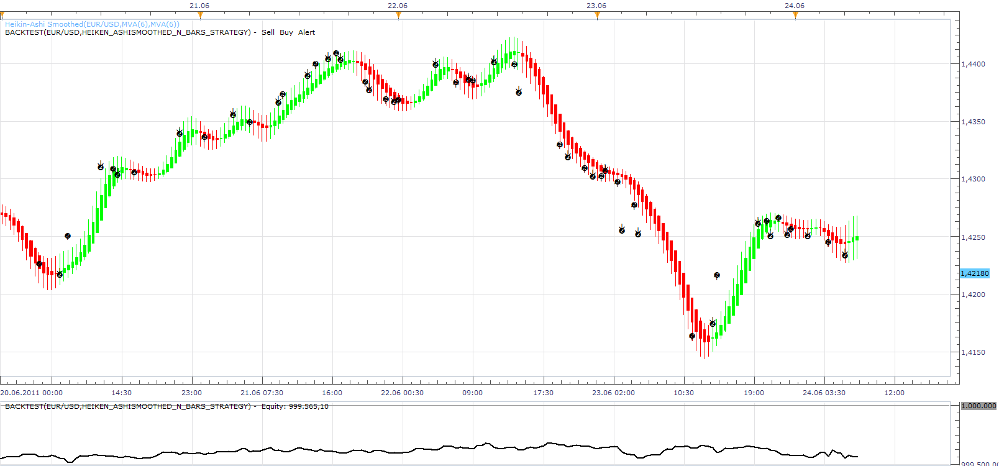
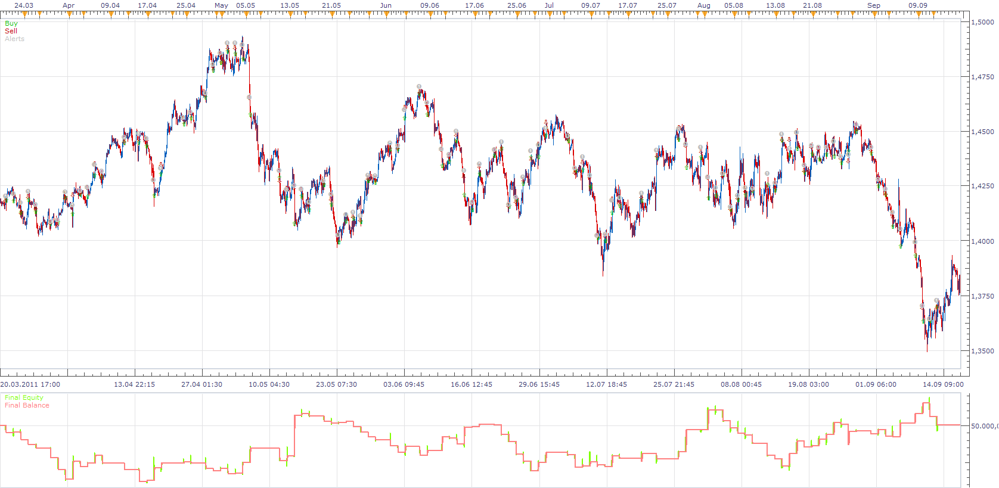

# N bars strategy

> Source: https://fxcodebase.com/code/viewtopic.php?f=31&t=3655  
> Forum: 31 · Topic 3655 · 21 post(s)

---

## N bars strategy

**Alexander.Gettinger** · Thu Mar 17, 2011 12:26 am

Strategy don't use indicators.

Strategy open/close orders if there is N consequent one-direction bars.

At picture N=5:

 

Download:

 [N_Bars_Strategy.lua](files/8838/N_Bars_Strategy.lua)

The Strategy was revised and updated on December 11, 2018.

---

## Re: N bars strategy

**alishus** · Sat Jun 18, 2011 6:03 pm

what time frame is best to use this strategy?
regards

---

## Re: N bars strategy

**mfoste1** · Thu Jun 23, 2011 1:48 pm

Could you make a strategy like this to work with heiken ashi smoothed? I have done some backtesting and this type of algo would be very profitable with proper risk management So it would work like this:

[if (number) consecutive color bars after candle color change, then open position]
[if (number) consecutive color bars after candle color change, then close position]

 Additional parameters it would need
1. trend filter(allow specified side, buy, sell or both)
2. time allowed to trade (allow to trade between (T) hours and (T) hours)
3. Allow multiple positions in the same direction

---

## Re: N bars strategy

**Apprentice** · Fri Jun 24, 2011 6:30 am

 [Heiken_AshiSmoothed_N_Bars_Strategy.lua](files/12016/Heiken_AshiSmoothed_N_Bars_Strategy.lua)

Heikin-Ashi Smoothed is required.
[viewtopic.php?f=17&t=606&p=10600&hilit=HASM#p10600](https://fxcodebase.com/code/viewtopic.php?f=17&t=606&p=10600&hilit=HASM#p10600)

---

## Re: N bars strategy

**Apprentice** · Fri Jun 24, 2011 7:05 am

Time Options Added.

---

## Re: N bars strategy

**mfoste1** · Fri Jun 24, 2011 8:01 am

It looks good, but it seems like it is triggering more orders than it should, which would lead me to believe it works on tick data instead of candle close? Could there be an option added for order execution based on the choice of tick or close? It seems like close would work much better

---

## Re: N bars strategy

**Apprentice** · Fri Jun 24, 2011 10:04 am

I update this one.
Try new version or Set Allow Multiple to No on existing one.

---

## Re: N bars strategy

**t1982t** · Sat Jun 25, 2011 10:56 am

It seems it's not working Heiken-Ashi smoothed parameters. Its changes do not affect back test

---

## Re: N bars strategy

**Kowmung** · Mon Nov 21, 2011 5:15 pm

Does anyone know if this issue has been resolved yet?

This strategy looks very attractive.

---

## Re: N bars strategy

**Apprentice** · Tue Nov 22, 2011 2:27 am

I have fix this bug.

---

## Re: N bars strategy

**ronald3rg** · Thu Dec 01, 2011 10:29 pm

Could you add Mandatory 24:00 closing to the original n-bars please. I want trade to enter at begining of day candle and close at end of it entering position based on direction of last candle.

another benefit would be confirmation by mva and or candles on another TF like the 1m-1hr.

Thanks in advance.

i copied and pasted the property from the smoothed nbars but the code doesn't execute as it should and for good reason i can read the code understand it but takes me forever to make it work correctly after many times of trial and error

---

## Re: N bars strategy

**Apprentice** · Fri Dec 02, 2011 6:10 pm

Your request is added to the developmental cue.

---

## Re: N bars strategy

**ronald3rg** · Sun Dec 04, 2011 5:04 pm

Is there a reason for the Heiken strategy not executing orders. i got the signal for a short order but it did not enter the position. Please Advice.

i have a US based account

---

## Re: N bars strategy

**Alexander.Gettinger** · Wed Dec 21, 2011 8:56 pm

Please, see this strategy.
I added the parameters: Begin time, End time and Close at end.

Download:

 [N_Bars_Strategy2.lua](files/21392/N_Bars_Strategy2.lua)

---

## Re: N bars strategy

**ronald3rg** · Wed Dec 28, 2011 12:20 pm

Thank you Alexander much appreciated

---

## Re: N bars strategy

**ronald3rg** · Thu Dec 29, 2011 12:46 pm

Alexander,

i downloaded the new strategy but something is wrong. Trades don't seem to trigger; strategy flat lines

right place at the right time

3RG

---

## Re: N bars strategy

**Apprentice** · Mon Jan 02, 2012 4:52 am

Make sure to set, Allow Strategy to Trade, to Yes.

---

## Re: N bars strategy

**amazon1a** · Wed Aug 07, 2013 1:56 pm

HI guys, Re: Heiken_AshiSmoothed_N_Bars_Strategy.lua

When I Start this Strategy I do not see a legend on my charts as I do with other Strategies. Also, the Dashboard shows a Green arrow indicating that the Strategy has started, but the word Yes does not show up in the Allow Trading column. I have checked the box to Allow Trading.

Is there a bug or some other problem?

Thanks for all your help

---

## Re: N bars strategy

**amazon1a** · Wed Aug 07, 2013 2:58 pm

Hi again,

A followup to my last post. I now see that if I expand the active window I can see the Strategy label. This is not convenient and not necessary with other Strategies. Because I use a layout with 3 windows open, for some reason this Strategy does not show up unless I expand one of the windows.

Is it possible for me to change the location of the Strategy legend or can you suggest a work around?

Thanks, A.

---

## Re: N bars strategy

**Apprentice** · Mon Oct 20, 2014 10:44 am

Heiken_AshiSmoothed_N_Bars_Strategy.lua Update.

---

## Re: N bars strategy

**Apprentice** · Sun Dec 11, 2016 8:36 am

Strategy was revised and updated.
