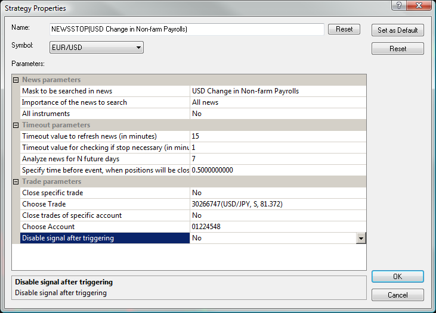

# News Stop

> Source: https://fxcodebase.com/code/viewtopic.php?f=31&t=2551  
> Forum: 31 · Topic 2551 · 3 post(s)

---

## News Stop

**vstrelnikov** · Fri Oct 29, 2010 10:01 am

The strategy closes position at the time when specified economic news is released (according to DailyFX news calendar).

The are several parameters here:
 Mask - This is substring which will be searched in news description. That is a main news selection criteria.
 Close specific trade flag - if set to 'Yes' then only this specific position will be closed
 Close trades of specific account flag - if set to 'Yes' then ALL trades (on currency pair) for specified account will be closed
 Disable signal after trigger flag - If set yes then strategy will stop working after triggering news, in other case strategy will continue working.

For example you can set this strategy to always stop all trading activity half hour before "Non-Farm Payrolls" release:

 

Download:

 [newsstop.lua](files/5664/newsstop.lua)

Any suggestions or comments are welcome.

The Strategy was revised and updated on December 18, 2018.

---

## Re: News Stop

**tdesiato** · Wed Oct 07, 2015 9:14 pm

I was thinking about developing such a program myself. Thank you! I'll try it out.

---

## Re: News Stop

**Apprentice** · Wed Dec 14, 2016 3:30 am

Strategy was revised and updated.
