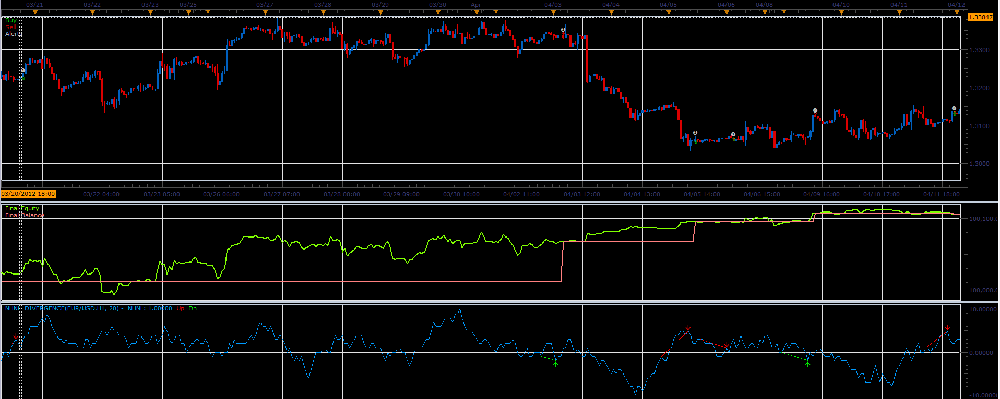

# NHNL divergence strategy

> Source: https://fxcodebase.com/code/viewtopic.php?f=31&t=24018  
> Forum: 31 · Topic 24018 · 9 post(s)

---

## NHNL divergence strategy

**Alexander.Gettinger** · Tue Oct 02, 2012 10:45 am

Strategy based on NHNL divergence indicator ([viewtopic.php?f=17&t=24017](https://fxcodebase.com/code/viewtopic.php?f=17&t=24017)).
Strategy supports direct and reverse signals.

 

Download:

 [NHNL_Divergence_Strategy.lua](files/41285/NHNL_Divergence_Strategy.lua)

The Strategy was revised and updated on January 21, 2019.

---

## Re: NHNL divergence strategy

**guangho** · Mon Oct 08, 2012 1:43 pm

HI,Alexander.Gettinger:How does this strategy signal conditions?

---

## Re: NHNL divergence strategy

**Apprentice** · Tue Oct 09, 2012 5:20 am

If NHNL divergence indicator, suggesting divergence, we enter the trade.
Depending on the type of divergence, we have Long or Short trade.

---

## Re: NHNL divergence strategy

**guangho** · Tue Oct 09, 2012 12:20 pm

> **Apprentice wrote:**
> If NHNL divergence indicator, suggesting divergence, we enter the trade.
> Depending on the type of divergence, we have Long or Short trade.

Thank you for your answer, but sorry, I can't understand.
Can you give me the actual data examples? For example the euro a point corresponding to the result.

Again, thank you very much.

---

## Re: NHNL divergence strategy

**gunawanadi** · Wed Dec 12, 2012 10:23 am

> **guangho wrote:**
> HI,Alexander.Gettinger:How does this strategy signal conditions?

Hi Alexander please can you sent me your email?
I need you to answer me about your EA and it is verry important.

Amillion thanks for you to reply me.

Gunawan adi

---

## Re: NHNL divergence strategy

**Apprentice** · Thu Dec 08, 2016 2:58 pm

Strategy has been revised and updated.

---

## Re: NHNL divergence strategy

**Mountaintrader** · Wed Oct 25, 2017 5:20 pm

Hi,

Please could somebody give me clarity regarding the difference in the NHNL strategy Parameter options "Type of signal - Direct or Reverse"

IE how does Direct affect the trade entry compared to Reverse ?

Thanks

---

## Re: NHNL divergence strategy

**Apprentice** · Thu Oct 26, 2017 3:44 am

For Direct
We will have our Buy and Sell signals
If Reverse is used.
We will Have Sell instead of Buy
and Buy instead of Sell respectively.

---

## Re: NHNL divergence strategy

**Mountaintrader** · Sun Oct 29, 2017 12:15 pm

Thank you Apprentice.
