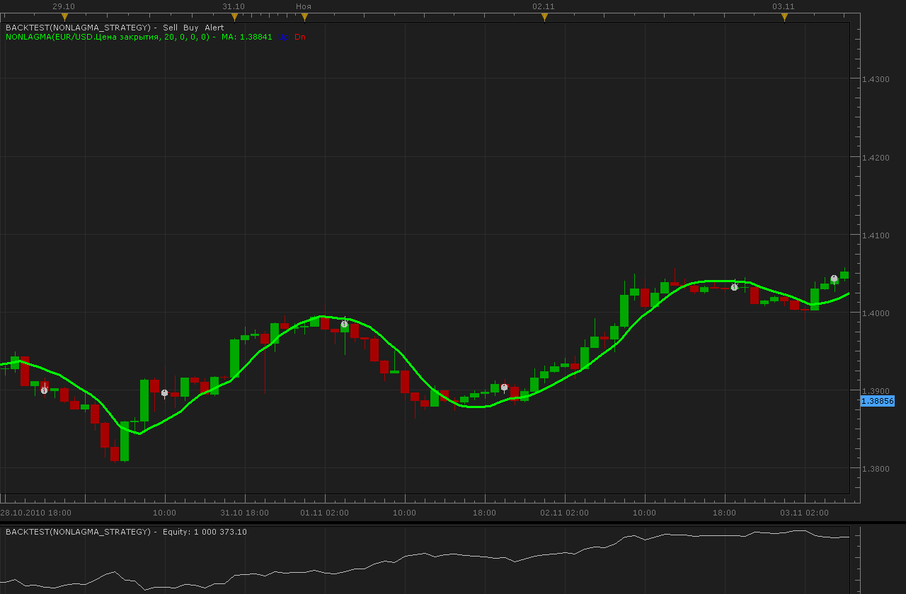
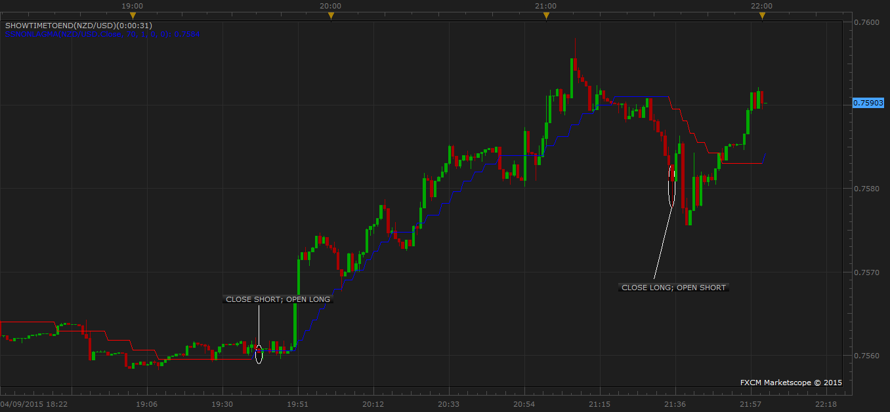

# Non-Lag Moving Average strategy

> Source: https://fxcodebase.com/code/viewtopic.php?f=31&t=2632  
> Forum: 31 · Topic 2632 · 25 post(s)

---

## Non-Lag Moving Average strategy

**Alexander.Gettinger** · Tue Nov 09, 2010 2:18 am

Strategy on Non-Lag Moving Average ([viewtopic.php?f=17&t=2231&p=5930#p5930](https://fxcodebase.com/code/viewtopic.php?f=17&t=2231&p=5930#p5930))

 



For this strategy must be installed indicator SSNonLagMA from [viewtopic.php?f=17&t=2231&p=5930#p5930](https://fxcodebase.com/code/viewtopic.php?f=17&t=2231&p=5930#p5930)

---

## Re: Non-Lag Moving Average strategy

**thejesters1** · Mon Nov 15, 2010 6:23 am

thank you for this one. however everytime the autotrade is initiated, the stoploss and limit order that i've set is not triggered. any help?

---

## Re: Non-Lag Moving Average strategy

**mazdaq100** · Tue Jan 11, 2011 12:04 pm

Hi

Thank you for this strategy. Can someone explain to me what the 'Filter' option is please?

Thanks.

---

## Re: Non-Lag Moving Average strategy

**sunshine** · Fri Jan 14, 2011 8:26 am

> **mazdaq100 wrote:**
> Hi
>
> Thank you for this strategy. Can someone explain to me what the 'Filter' option is please?
>
> Thanks.

Hi,

This parameter refers to the NonLagMA indicator which this strategy is based on.

The parameter allows ignoring price fluctuations that are smaller than the value specified in the parameter. So the indicator doesn't change its direction until the price jumps by a value greater than the value of the parameter.

The parameter is set in pips. A zero value means there is no filtering.

---

## Re: Non-Lag Moving Average strategy

**jontaur81** · Thu Jan 20, 2011 10:18 pm

The indicator works well; but the straegy does not. Can you advise as to a fix. I am using Trading station II

---

## Re: Non-Lag Moving Average strategy

**sunshine** · Sat Jan 22, 2011 5:22 am

What error do you get?
Please let me know so I can further assist you.

---

## Re: Non-Lag Moving Average strategy

**Fortunelost** · Thu Feb 03, 2011 11:20 am

I am testing the NonLag MA Strategy and the Indicator, is it possible to have the ascending and the decending trend line in seperate colours, I am a visual person and this will help tremendously. Thanks in advance.

---

## Re: Non-Lag Moving Average strategy

**thejesters1** · Mon Mar 21, 2011 9:43 am

hi all. i've played around with this strategy and it does brings decent profit from time to time. unfortunately, its a a disaster in a ranging market.

so can i request for this strategy be incorporated with the MACD? the entry rules are as follows:

1) when the MACD is pointing upwards indicating a buy signal (this is the main entry point)
2) and the trade will be executed when the non-lag MA gives a buy signal (blue colour)
3) it will follow the trend until the MACD is pointing downwards thus the trade will be closed

can i also have an option to automatically close the trade when the non-lag MA is in downward pressure (sell signal) eventhough the MACD is still upwards?

---

## Re: Non-Lag Moving Average strategy

**Apprentice** · Mon Mar 21, 2011 11:17 am

Your request has been added to developmental cue.

---

## Re: Non-Lag Moving Average strategy

**Apprentice** · Mon Mar 28, 2011 5:13 am

Requested can be found here.
[viewtopic.php?f=31&t=3752&p=9112#p9112](https://fxcodebase.com/code/viewtopic.php?f=31&t=3752&p=9112#p9112)

---

## Re: Non-Lag Moving Average strategy

**RJH501** · Sun Aug 07, 2011 12:20 pm

Hi Alexander,

I am getting a buy and/or sell signal on every candle.

What would cause this to happen?

Thanks,

Richard

---

## Re: Non-Lag Moving Average strategy

**arieldutchess** · Mon Jan 14, 2013 10:47 pm

I've been testing this indicator as well, has anyone requested an EA to be develop? thanks.

---

## Re: Non-Lag Moving Average strategy

**Apprentice** · Tue Jan 15, 2013 7:24 am

RJH501 Try my updated version, See topmost post.
I also use different updated indicator.

 Arieldutchess
Can you describe your strategy.

---

## Re: Non-Lag Moving Average strategy

**rstar250** · Fri Dec 20, 2013 12:10 pm

I've been working with this for a week or so. Haven't been able to understand how it is working. Set up the non lag indicator and the strategy with the same settings but the entry and exits don't match at all. Anyone have any input that might help?

---

## Re: Non-Lag Moving Average strategy

**Apprentice** · Sat Dec 21, 2013 7:44 am

Trade will be generated if we have a change in the slope of Non-Lag Moving Average.

The positive slope
Open Long Trade

Negative Slope
Open Short Trade

---

## Re: Non-Lag Moving Average strategy

**rstar250** · Mon Dec 23, 2013 11:31 pm

Thanks Apprentice.

---

## Re: Non-Lag Moving Average strategy

**Sedamenta** · Thu Apr 09, 2015 10:14 pm

> **Apprentice wrote:**
> Trade will be generated if we have a change in the slope of Non-Lag Moving Average.
>
> The positive slope
> Open Long Trade
>
> Negative Slope
> Open Short Trade

I was having a hard time getting the strategy to execute trades when the indicator would change trends. so when you say the change in slope of the non-lag moving average do you mean it should execute trades at the close of the tick I circled below if the strategy was set with the data source being form the close of each candle stick?

 



If not could you make a strategy that places an order when it changes color on the indicator as above?

I was also wondering about the filter.
It was said that

> The parameter is set in pips. A zero value means there is no filtering.

so if the filter is set on 1 would that be a 1 pip filter?

sorry about all the questions I am just trying to figure out how it works.

---

## Re: Non-Lag Moving Average strategy

**Apprentice** · Sun Apr 12, 2015 10:21 am

As it is Strategy is End of Turn Strategy.
Trade is delayed until end of turn.
Filter parameter is Non-Lag MA Indicator parameter.
Filter parameter will determine the minimum required changes need to change in MA.

---

## Re: Non-Lag Moving Average strategy

**Sedamenta** · Wed Jun 10, 2015 9:27 pm

I wanted to change this :

```lua
if   Indicator[1].DATA[period]> Indicator[1].DATA[period-1]
      and   Indicator[1].DATA[period-2] > Indicator[1].DATA[period-1] 
      then
       
      
            if Direction then
                BUY();
            else
                SELL();
            end
         
      elseif   Indicator[1].DATA[period] < Indicator[1].DATA[period-1]
      and   Indicator[1].DATA[period-2] < Indicator[1].DATA[period-1] 
       then
            if Direction then
                SELL();
            else
                BUY();
```

To this:
I want this to take in account for the the ColorBarBack and not the actual level of the MA but the color that is printed on the MA

```lua
if Indicator[1].DATA[period] prints GREEN and Indicator[1].DATA[period-1] prints GREEN
then
if Color then
BUY();

if Indicator[1].DATA[period] prints RED and Indicator[1].DATA[period-1] prints RED
then
if Color then
SELL();
```

---

## Re: Non-Lag Moving Average strategy

**Apprentice** · Fri Jun 12, 2015 3:15 am

You mean, Take a trade on color change?

---

## Re: Non-Lag Moving Average strategy

**Sedamenta** · Fri Jun 12, 2015 6:05 pm

yes, is it possible?

---

## Re: Non-Lag Moving Average strategy

**Apprentice** · Mon Jun 15, 2015 3:34 am

Try this version.
[viewtopic.php?f=31&t=62314](https://fxcodebase.com/code/viewtopic.php?f=31&t=62314)

---

## Re: Non-Lag Moving Average strategy

**Apprentice** · Mon Dec 12, 2016 3:44 pm

Strategy was revised and updated.

---

## Re: Non-Lag Moving Average strategy

**Sheera123** · Tue Jun 05, 2018 1:23 pm

Hi, I just started using this strategy and every time it closes a position and tries to open the opposite position it fails to open the position and I get an error in TradeStation under "Action" that says "Trading activity delayed while Net Quantity Order xxxxxxx is pending". Any idea why this is happening.

Thanks in advance.

---

## Re: Non-Lag Moving Average strategy

**Sheera123** · Tue Jun 05, 2018 1:35 pm

Hi, I just started using this strategy and every time it closes a position and tries to open the opposite position it fails to open the position and I get an error in TradeStation under "Action" that says "Trading activity delayed while Net Quantity Order xxxxxxx is pending". Any idea why this is happening.

Thanks in advance.
