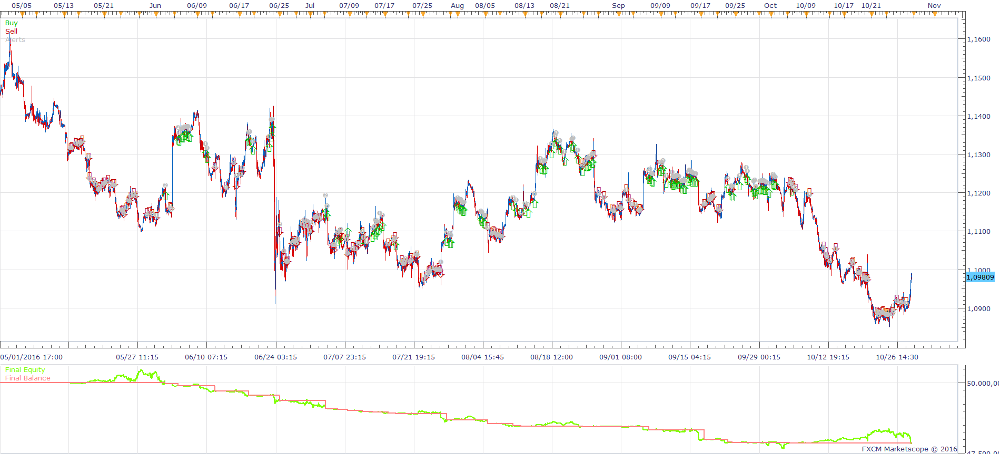

# Normalized LWMA Slope Strategy

> Source: https://fxcodebase.com/code/viewtopic.php?f=31&t=64088  
> Forum: 31 · Topic 64088 · 2 post(s)

---

## Normalized LWMA Slope Strategy

**Apprentice** · Fri Nov 11, 2016 12:49 pm

 

Open Long
1 NORMALIZED LWMA SLOPE IN H4> BUY LEVEL AND
2. NORMALIZED LWMA SLOPE IN M15 CROSS OVER BUY LEVEL

Open Short
1.NORMALIZED LWMA SLOPE IN H4< SELL LEVEL AND
2. NORMALIZED LWMA SLOPE IN M15 CROSS UNDER SELL LEVEL

 [Normalized LWMA Slope Strategy.lua](files/109011/Normalized%20LWMA%20Slope%20Strategy.lua)

Normalized LWMA Slope
[viewtopic.php?f=17&t=62214&p=109012&hilit=NORMALIZED+LWMA+SLOPE#p109012](https://fxcodebase.com/code/viewtopic.php?f=17&t=62214&p=109012&hilit=NORMALIZED+LWMA+SLOPE#p109012)

---

## Re: Normalized LWMA Slope Strategy

**Apprentice** · Fri Jan 26, 2018 12:32 pm

The strategy was revised and updated.
