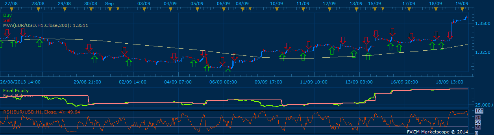

# OB OS RSI Strategy

> Source: https://fxcodebase.com/code/viewtopic.php?f=31&t=15783  
> Forum: 31 · Topic 15783 · 21 post(s)

---

## OB OS RSI Strategy

**Apprentice** · Tue Apr 10, 2012 5:37 am

Long
Price > 200 MA
RSI < OS.
Exit
RSI > OB
I have added RSI Cross and in Zone Trade Signals.
For Short, use inverse logic.

 [OB OS RSI Strategy.lua](files/29677/OB%20OS%20RSI%20Strategy.lua)

---

## Re: OB OS RSI Strategy

**dstoltz** · Mon Nov 04, 2013 2:24 pm

I am using the OB OS RSI strategy on a live account for the first time. The first trade it made was a short when RSI crossed below OB range,as it was supposed to. However, it was taken with price above the MVA200 which, if I understand the setup procedure, it should only take shorts when price is under MVA200 and OB down crossover occurs and longs are only taken when price is above MVA 200 and OS level is crosses up Could you confirm my assumptions or tell me how to correct the behavior to do what I want it to?

---

## Re: OB OS RSI Strategy

**Apprentice** · Wed Nov 06, 2013 4:37 am

For Long Trade
Trade if Price greater than MA
AND
If "Zone" is selected
If RSI is less then OS
If "Cross" is selected
RSI crossover OS

For Short Trade
Trade if Price less than MA
AND
If "Zone" is selected
If RSI is greater then OB
If "Cross" is selected
RSI crossunder OB

---

## Re: OB OS RSI Strategy

**virgilio** · Thu Nov 07, 2013 6:44 pm

Is it possible to make the following variations:

For Long Trade (and keep it LONG until a reverse happens)
Trade if Price greater than MA
AND
RSI greater than OB

For Short Trade (and keep it SHORT until a reverse happens)
Trade if Price less than MA
AND
RSI smaller than OS

Thanks a million.

---

## Re: OB OS RSI Strategy

**Apprentice** · Fri Nov 08, 2013 6:55 am

Try this version.

 [OB OS RSI Strategy.lua](files/90671/OB%20OS%20RSI%20Strategy.lua)

Trades are generated by Price / MA Cross.

RSI Filter
If "Trade only during Oversold Overbought conditions" is set to "Yes"
Long trades will happen if RSI> OB
Short trades will happen if RSI <OS
otherwise
Long trades will happen if RSI <OB
Short trades will happen if RSI> OS

---

## Re: OB OS RSI Strategy

**virgilio** · Fri Nov 08, 2013 4:23 pm

Thank you for your variations. I have been testing this strategy all day and this is what I found.

If the Price crosses over/under the MA at the same time as the RSI crosses over/under the OB OS, then the trade is triggered.

But, if the Price was already over/under the MA then it does not matter what the RSI does because the trade will not trigger.

To finalize this strategy you would have to make sure that it triggers when the Price over/under MA and the RSI over/under OB OS but they don't need to happen at the same time, each variable needs to be independent.

Thank you so very much.

---

## Re: OB OS RSI Strategy

**dstoltz** · Fri Nov 08, 2013 10:55 pm

I've been live trading this strategy all week and your observation would explain why most of the RSI crossings out of the zones aren't being triggered. The strategy did trade 5 or 6 times this week on a 2hr chart of 10 pairs or so. The low number of trades may be attributed as you described. I'll look at the trades it did take, this weekend.

---

## Re: OB OS RSI Strategy

**Apprentice** · Sun Nov 10, 2013 2:26 pm

Try updated version.

---

## Re: OB OS RSI Strategy

**Paulo C** · Wed Nov 27, 2013 12:03 am

Hi mate, you can take the strategy to MA, and leave only the RSI?
thank you

---

## Re: OB OS RSI Strategy

**Apprentice** · Thu Nov 28, 2013 4:29 am

Can you explain your request in more detail.
To Remove, MA filter?

---

## Re: OB OS RSI Strategy

**Paulo C** · Mon Dec 09, 2013 5:29 am

> **Apprentice wrote:**
> Can you explain your request in more detail.
> To Remove, MA filter?

Yes

---

## Re: OB OS RSI Strategy

**Apprentice** · Wed Dec 11, 2013 9:14 am

[OB OS RSI Strategy.lua](files/91467/OB%20OS%20RSI%20Strategy.lua)

MA filter switch has been added to this version.

---

## Re: OB OS RSI Strategy

**Paulo C** · Thu Jan 02, 2014 12:36 am

> **Apprentice wrote:**
>
>
> OB OS RSI Strategy.lua
>
>
> MA filter switch has been added to this version.

Hi Apprentice,

The strategy is good, but I wonder if it is possible, instead of giving a market order, give an entry order, such as for example:
EUR / USD RSI reaches 70 with price as $ 1.38, at that time the program gives an entry order to "X pips that amount" if you choose 20, the program gives an entry order to $ 1.3820
Already my thanks

---

## Re: OB OS RSI Strategy

**Apprentice** · Fri Jan 03, 2014 3:28 pm

Your request is added to the development list.

---

## Re: OB OS RSI Strategy

**Paulo C** · Fri Jan 03, 2014 7:12 pm

> **Apprentice wrote:**
> Your request is added to the development list.

Is very important to me, thank you

---

## Re: OB OS RSI Strategy

**virgilio** · Mon Jan 06, 2014 7:06 pm

Dear apprentice, right now this strategy is based on the MA and RSI viewed as one variable.
In order to much improve the performance and flexibility, this strategy should be modified as follows:
TRADE LONG when the Price > MA (this should remain fixed for all LONG Positions) AND each time the RSI crosses above OS. Close Position when Price is still > MA but RSI<OB.
As I said, currently this strategy trades ONLY when both Price > MA and RSI cross at the same time. This should not happen. In fact, let's assume Price crosses above MA and stays above the MA for a long time. During the same period of time, the RSI crosses over OS and under OB multiple times. Each time the RSI crosses above the OS should be a new trigger for a new buy (and each time RIS crosses under OB it should close the position) without waiting for the Price > MA to happen at the same time (as this variable is already in that position).
TRADE SHORT happens when the exact reverse takes place.

---

## Re: OB OS RSI Strategy

**Apprentice** · Wed Jan 08, 2014 5:14 am

Your request is added to the development list.

---

## Re: OB OS RSI Strategy

**moomoofx** · Mon Jan 13, 2014 5:00 am

Hi all,

Here is a new version of this strategy. Please note:
- There was a bug associated with the above flag to toggle the MVA filter - I have fixed this.
- Paulo C's requirement of entry orders are now supported. There is a new parameter which allows you to configure entry orders or market orders. If you choose entry orders, you can specify the number of pips away to place the order and if the order should expire at the end of the day, or never.
- I cannot reproduce the problem virgilio has pointed out regarding the MVA and the OS/OB crossing being linked. This is not how it is developed - please see the following screenshot.

 

Enjoy.

---

## Re: OB OS RSI Strategy

**axeas69** · Sat Apr 18, 2015 10:34 am

Hello,
Plse could you add a new exit rule based on SMA (or EMA...).
Once price closed above this SMA, the trade was closed for long.
Once price closed below this SMA, the trade was closed for short.
Of course, this SMA is a new SMA (not 200).
Thanks in advance.
Kind regards
Axeas

---

## Re: OB OS RSI Strategy

**Apprentice** · Thu Apr 23, 2015 6:21 am

Your request is added to the development list.

---

## Re: OB OS RSI Strategy

**Apprentice** · Fri Jan 26, 2018 12:29 pm

The strategy was revised and updated.
