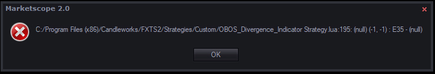

# OBOS_Divergence_Indicator Strategy

> Source: https://fxcodebase.com/code/viewtopic.php?f=31&t=63680  
> Forum: 31 · Topic 63680 · 19 post(s)

---

## OBOS_Divergence_Indicator Strategy

**Apprentice** · Sun Jul 17, 2016 1:57 pm

Based on request.
[viewtopic.php?f=27&t=63655#p107057](https://fxcodebase.com/code/viewtopic.php?f=27&t=63655#p107057)

 [OBOS_Divergence_Indicator Strategy.lua](files/107177/OBOS_Divergence_Indicator%20Strategy.lua)

OBOS_Indicator.lua & OBOS_Divergence_Indicator_Signal.lua are available here.
[viewtopic.php?f=17&t=63669](https://fxcodebase.com/code/viewtopic.php?f=17&t=63669)

---

## Re: OBOS_Divergence_Indicator Strategy

**7510109079** · Mon Jul 18, 2016 8:26 am

many thx for the strategy Apprentice.

It appears to hit a problem on my PC.

Enclosed is the screen shot of the log and a text file attached with the full line of the highlighted row.

Any idea how I can fix this?
thx

---

## Re: OBOS_Divergence_Indicator Strategy

**7510109079** · Mon Jul 25, 2016 4:35 am

did you manage to look at this?

---

## Re: OBOS_Divergence_Indicator Strategy

**7510109079** · Mon Aug 01, 2016 6:44 pm

bump post

---

## Re: OBOS_Divergence_Indicator Strategy

**Apprentice** · Mon Aug 08, 2016 6:26 am

Can you provide links for indicator in subject.
Have tested two of them, work without problems.

---

## Re: OBOS_Divergence_Indicator Strategy

**7510109079** · Mon Aug 15, 2016 5:22 am

> **Apprentice wrote:**
> links for indicator in subject.
> Have tested two of them, work without problems

can you clarify what you mean please?

---

## Re: OBOS_Divergence_Indicator Strategy

**7510109079** · Mon Aug 15, 2016 6:37 am

i was using the two indicators and strategy you posted without name changes

---

## Re: OBOS_Divergence_Indicator Strategy

**7510109079** · Mon Aug 15, 2016 6:57 am

if i take out the offending indicators mentioned in the log then the Strategy works!

do you know what the COT.bin file is used for?

---

## Re: OBOS_Divergence_Indicator Strategy

**7510109079** · Mon Aug 15, 2016 7:50 am

ok now i have got it working is it possible to modify the original indicator/s so they filter results according to the specified OB/OS value. e.g. OB/OS = +100/-100 will only consider >100 and <-100

---

## Re: OBOS_Divergence_Indicator Strategy

**7510109079** · Wed Aug 24, 2016 6:51 am

bumping this one

---

## Re: OBOS_Divergence_Indicator Strategy

**7510109079** · Fri Sep 02, 2016 11:30 am

Any chance of adding the OBOS filter to filter out unwanted results, thanks in advance

---

## Re: OBOS_Divergence_Indicator Strategy

**7510109079** · Mon Sep 12, 2016 7:34 am

bump

---

## Re: OBOS_Divergence_Indicator Strategy

**Apprentice** · Thu Sep 15, 2016 5:34 am

Your request is added to the development list, Under Id Number 3629
 If someone is interested to do this task, please contact me.

---

## Re: OBOS_Divergence_Indicator Strategy

**7510109079** · Tue Sep 20, 2016 5:18 am

Any chance of adding the OBOS filter to filter out unwanted results, thanks in advance

---

## Re: OBOS_Divergence_Indicator Strategy

**Apprentice** · Sat Dec 17, 2016 10:53 am

Strategy was revised and updated.

---

## Re: OBOS_Divergence_Indicator Strategy

**ORXXOR** · Sun Oct 08, 2017 4:29 pm

Any chance this bug can be fixed, started happening after a recent update. If you anyone can point me in the right direction, that would be useful. I get the following error:

It used to work just fine :/

 

---

## Re: OBOS_Divergence_Indicator Strategy

**Apprentice** · Wed Oct 11, 2017 7:08 am

Fixed.

---

## Re: OBOS_Divergence_Indicator Strategy

**Marcello** · Thu Oct 12, 2017 4:43 am

> **ORXXOR wrote:**
> Any chance this bug can be fixed, started happening after a recent update. If you anyone can point me in the right direction, that would be useful. I get the following error:
>
> It used to work just fine :/
>
>
>
> obos.jpg

ORXXOR refer to this link

Hope it helps

[viewtopic.php?f=25&t=40395&start=240#p115101](https://fxcodebase.com/code/viewtopic.php?f=25&t=40395&start=240#p115101)

---

## Re: OBOS_Divergence_Indicator Strategy

**Apprentice** · Fri Jan 26, 2018 12:17 pm

The strategy was revised and updated.
