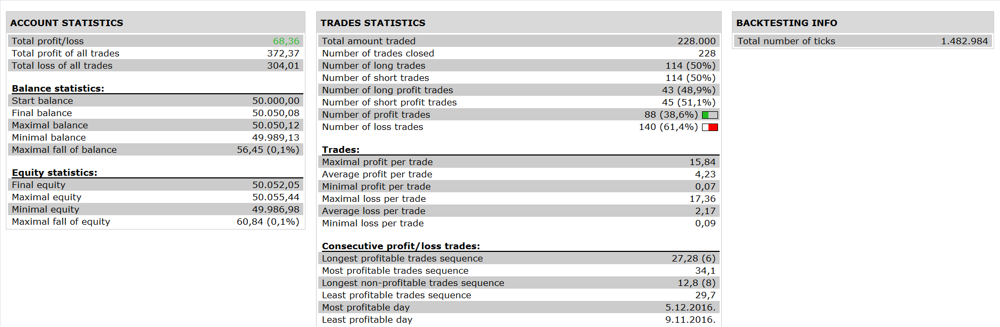

# OBOS MA Strategy

> Source: https://fxcodebase.com/code/viewtopic.php?f=31&t=64602  
> Forum: 31 · Topic 64602 · 2 post(s)

---

## OBOS MA Strategy

**Apprentice** · Tue Apr 18, 2017 9:52 am

 

Open Long
when OBOS cross and close up of the kama of OBOS
Open Short
when OBOS cross and close down of the kama of OBOS

 [OBOS MA Strategy.lua](files/112039/OBOS%20MA%20Strategy.lua)

OBOS Indicator.lua is available here.
[viewtopic.php?f=17&t=3664&p=8869#p8869](https://fxcodebase.com/code/viewtopic.php?f=17&t=3664&p=8869#p8869)

---

## Re: OBOS MA Strategy

**Apprentice** · Fri Jan 26, 2018 12:21 pm

The strategy was revised and updated.
