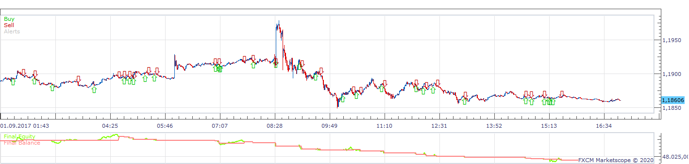
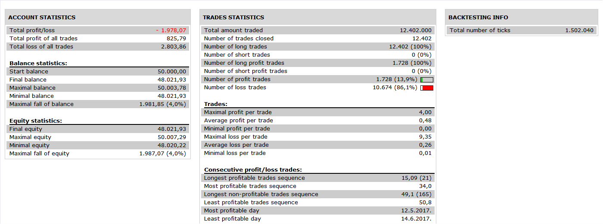

# Open Close Strategy

> Source: https://fxcodebase.com/code/viewtopic.php?f=31&t=69543  
> Forum: 31 · Topic 69543 · 13 post(s)

---

## Open Close Strategy

**Apprentice** · Tue Mar 17, 2020 12:33 pm

 

Based on request.
[viewtopic.php?f=27&t=69534](https://fxcodebase.com/code/viewtopic.php?f=27&t=69534)

Wilders_Trailing_Stop.lua is available here.
[viewtopic.php?f=17&t=60028&p=119817&hilit=Wilders+trailing+stop#p119817](https://fxcodebase.com/code/viewtopic.php?f=17&t=60028&p=119817&hilit=Wilders+trailing+stop#p119817)

 [Open Close Strategy.lua](files/132016/Open%20Close%20Strategy.lua)

---

## Re: Open Close Strategy

**Driss99** · Wed Mar 18, 2020 11:40 am

Hi Apprentice

I have tested the strategy and noticed a few problems. I have added my parameters in the first three pictures.
1. A lot of trades aren't executed because orders are placed as a limit order of the close price after crossover. I suggest to place buy limit orders at close price +4 pips and sell limit orders at close price -4 pips to make sure that the trades are executed.
2. The stop loss function is not functioning properly. As can be seen in the second picture (stop loss should already have been moved higher). Furthermore trades are closed to early (before fixed stop loss is hit). Maybe this has something to do with the trailing in pips parameter which I do not quite understand. In general I think there is something that should be modified in the stop loss function.
3.There is a problem when wilders is still above price and a buy order is triggered as can be seen in the last picture.
4. Last, when there are still positions open and a crossover happens, the open positions are closed however no new position is opened as can be seen in the last picture.

Thanks already for reviewing my previous proposal.
Kind regards

---

## Re: Open Close Strategy

**Apprentice** · Thu Mar 19, 2020 4:26 am

Your request is added to the development list.
Development reference 899.

---

## Re: Open Close Strategy

**Apprentice** · Thu Mar 19, 2020 6:18 am

Try this version.

---

## Re: Open Close Strategy

**Driss99** · Thu Mar 19, 2020 9:04 am

Hi apprentice

I reviewed the new version and it already works a lot better! However there are still a few problems.
1. There are still a lot of trades that are not executed I can not find the cause of this since we moved our limit entry orders +4 pips for buy orders and -4 pips for sell orders. I have given an example in the first picture, trade should be executed at the black cirkle.
2. If the first profit target is reached all three orders are closed however only the first order should be closed. (second picture) Second position should be closed after rsi crossover and we let the third position run. A friend of mine is using the same system but is not using the rsi. He closes his first position when first profit target is reached and moves stop loss for the two other positions to break even or to wilders stop loss depending on which is the closest to price. He has a second fixed profit target when this is reached he closes second position and moves stop loss for the third position to the first profit target or to wilders stop loss depending on which is the closest to price. He claims that this strategy is equally profitable (manually tested), if this seems easier to program you can apply his strategy.
3. Last there is still the problem that no new position is opened but only the existing positions are closed after a crossover. (third picture) If the strategy works properly we should always have open trades. After a sell crossover happens all remaining buy positions are closed and we open 3 new sell orders, same logic for buy crossover. And there are also cases where we are stopped out to early (fixed sl is at 60 pips) as can be seen in the last picture, however stop loss function is already working a lot better.

Thanks for taking the time to look at the problems and fix them.
Kind regards

---

## Re: Open Close Strategy

**Apprentice** · Thu Mar 19, 2020 9:25 am

Your request is added to the development list.
Development reference 907.

---

## Re: Open Close Strategy

**Apprentice** · Fri Mar 20, 2020 6:07 am

Try it now.

---

## Re: Open Close Strategy

**Driss99** · Fri Mar 20, 2020 9:05 am

Hi Apprentice

I tested the latest update and everything seems to work fine now. There remains one problem the strategy only opens long positions while strategy is allowed to trade in both sides. Maybe this is because it closes all buy positions after sell crossover but does not open an extra 3 positions?

Furthermore would it be possible to program a second variant of the strategy with the following trading rules: When a buy/sell crossover happens it opens 3 positions with a fixed stop loss, position one and two each have a profit target. If profit target of position 1 is reached we move sl to break even for the remaining two positions, if profit target of position 2 is reached we move sl to profit target 1 and let position 3 run till it's stopped out or till a crossover in the other direction happens. Then we close all remaining positions and open 3 extra positions . Here we do not use Wilders anymore, stop loss just moves when a target is reached.
I hope it is possible to program this other variant so I can compare both variants.
Kind regards

---

## Re: Open Close Strategy

**Apprentice** · Mon Mar 23, 2020 5:21 am

Your request is added to the development list.
Development reference 930.

---

## Re: Open Close Strategy

**Apprentice** · Thu Apr 02, 2020 6:47 am

[Open Close Strategy.lua](files/132512/Open%20Close%20Strategy.lua)

 [Open Close Strategy 2.lua](files/132512/Open%20Close%20Strategy%202.lua)

Try this versions.

---

## Re: Open Close Strategy

**Driss99** · Tue Apr 07, 2020 4:47 pm

Hi Apprentice

The strategy with Wilders and rsi is working perfectly. I thought that the Open Close Strategy 2 file was the second varaint I asked for. However this still has the rsi as a parameter and there is no second profit target. Would it be possible to also program this second variant, I have modified it a little bit further, and the rules are as following:

When a buy/sell crossover happens it opens 3 positions with a fixed stop loss, each position has its own profit target (position 1 lowest tp and position 3 highest tp). If profit target of position 1 is reached we move sl to break even for the remaining two positions, if profit target of position 2 is reached we move sl to profit target 1 for the last position and let it run till it's stopped out or till a crossover in the other direction happens or we hit profit target. Stop loss remains fixed till a profit target is hit, then it moves to the next level.
I hope it is possible to program this other variant so I can compare both variants.

---

## Re: Open Close Strategy

**Apprentice** · Thu Apr 09, 2020 5:26 am

Your request is added to the development list.
Development reference 1037.

---

## Re: Open Close Strategy

**Apprentice** · Fri May 08, 2020 6:09 am

Try this version.

 [Open Close Strategy 3.lua](files/133732/Open%20Close%20Strategy%203.lua)
