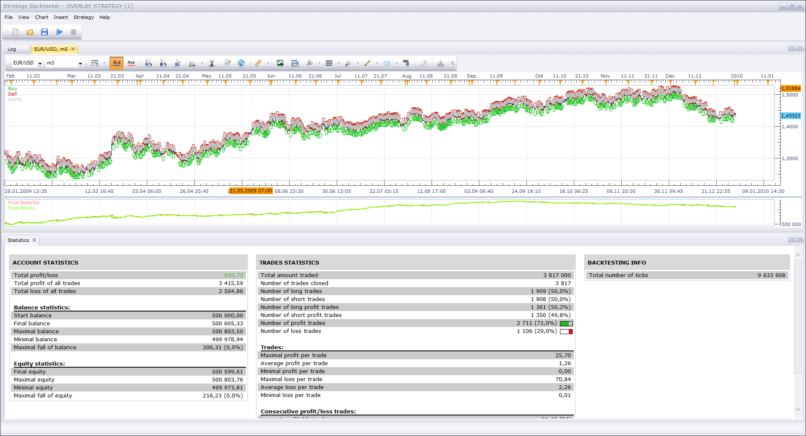

# overlay_strategy

> Source: https://fxcodebase.com/code/viewtopic.php?f=31&t=69244  
> Forum: 31 · Topic 69244 · 2 post(s)

---

## overlay_strategy

**Apprentice** · Wed Dec 18, 2019 4:41 pm

My own strategy.
Overlays two instruments on each other (like FXTS2 overlay) and buys/sell on price close.
Example of EUR/USD vs GER30. 1 year of backtesting.

 [overlay_strategy.lua](files/130322/overlay_strategy.lua)

---

## Re: overlay_strategy

**Sospool** · Wed Dec 18, 2019 6:56 pm

Thank you Apprentice for sharing
