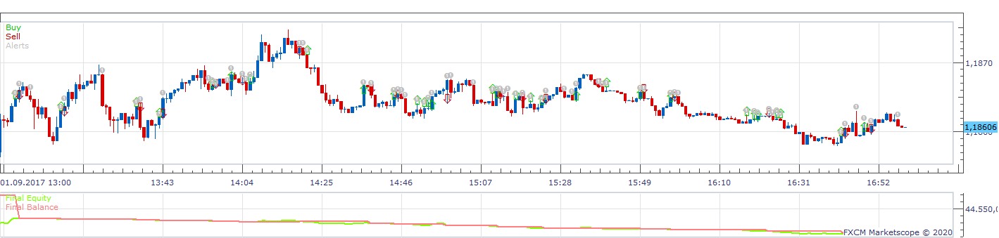
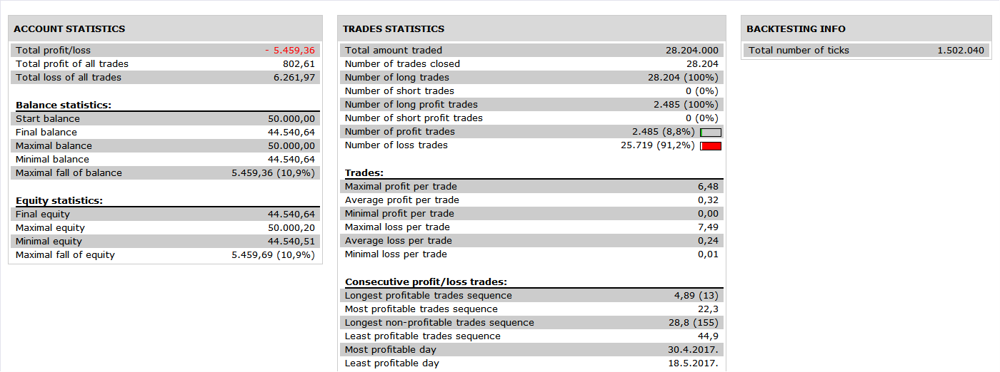
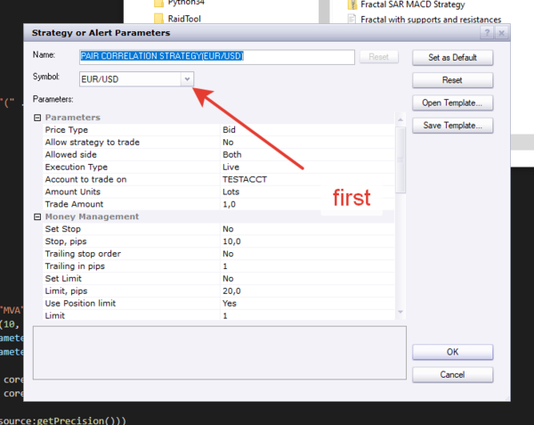

# Pair correlation strategy

> Source: https://fxcodebase.com/code/viewtopic.php?f=31&t=69920  
> Forum: 31 · Topic 69920 · 7 post(s)

---

## Pair correlation strategy

**Apprentice** · Tue May 26, 2020 9:27 am

 

Based on request.
[viewtopic.php?f=17&t=69912](https://fxcodebase.com/code/viewtopic.php?f=17&t=69912)

 [Pair correlation strategy.lua](files/134316/Pair%20correlation%20strategy.lua)

---

## Re: Pair correlation strategy

**fabio70** · Tue May 26, 2020 10:22 am

Dear Apprentice,
thank you for your work.
I tried the strategy, but it is missing the instrument 1, the first pair of currencies.

---

## Re: Pair correlation strategy

**Apprentice** · Wed May 27, 2020 5:26 am

Your request is added to the development list.
Development reference 1376.

---

## Re: Pair correlation strategy

**Apprentice** · Thu May 28, 2020 6:33 am

---

## Re: Pair correlation strategy

**fabio70** · Thu May 28, 2020 7:01 am

Dear apprentice,

the idea of the strategy is that to open a position on one pair, there must be a correlation with other two different pairs, as follow:
Open a long position**EURJPY** when:
Price>MA in**EURUSD** in a specific TF (i.e. H1)
and when
Price>MA in **USDJPY**in a specific TF (i.e. H1);

Close the position EURJPY when:
Price<MA in EURUSD in a specific TF (i.e. H1)
or Price touches the MA
and/or when
Price<MA in USDJPY in a specific TF (i.e. H1)
or pIrce touches the MA.

In the strategy created there is only one pair to correlate with. So, it 's missing the instrument 3.
If EUR/USD goes up and USD/JPY goes up, EURJPY should go up as well.

---

## Re: Pair correlation strategy

**Apprentice** · Tue Jun 02, 2020 6:24 am

Your request is added to the development list.
Development reference 1407.

---

## Re: Pair correlation strategy

**Apprentice** · Mon Jun 08, 2020 5:36 am

[Pair correlation strategy fabio70.lua](files/134663/Pair%20correlation%20strategy%20fabio70.lua)

Something like this?
