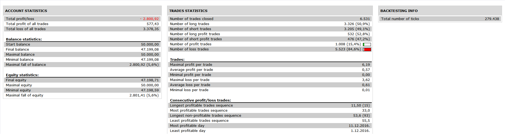

# Parabolic SAR strategy

> Source: https://fxcodebase.com/code/viewtopic.php?f=31&t=64669  
> Forum: 31 · Topic 64669 · 11 post(s)

---

## Parabolic SAR strategy

**Apprentice** · Tue May 23, 2017 5:02 am

 

Based on request.
[viewtopic.php?f=27&t=64668](https://fxcodebase.com/code/viewtopic.php?f=27&t=64668)

Enter long if the price cross over the previous sar up
Enter short if the price cross under the previous sar down

Filter Option
Open Long
Only if Close (chart time frame) > Filter MA
Opet Short
Only if Close (chart time frame) < Filter MA

 [Parabolic SAR strategy.lua](files/112493/Parabolic%20SAR%20strategy.lua)

---

## Re: Parabolic SAR strategy

**Apprentice** · Wed Jan 24, 2018 9:24 am

The strategy was revised and updated.

---

## Re: Parabolic SAR strategy

**RuptorGB** · Sat Jun 09, 2018 5:45 pm

Hi
 I am new to LUA based strategies but can program in MT4. I tried this strategy with and without trailing stop set to yes but there was no difference in the backtest results. Does this strategy have an active trailing stop and is there a pip value that will set the trail level? I am probably missing something stupid but can't check the LUA code for myself yet it looks double dutch to me.

---

## Re: Parabolic SAR strategy

**Reymondpolanco** · Tue Oct 16, 2018 12:07 am

> **Apprentice wrote:**
>
>
> EURUSD m1 (05-23-2017 1010).png
>
>
>
>
> 2.png
>
>
> Based on request.
> [viewtopic.php?f=27&t=64668](https://fxcodebase.com/code/viewtopic.php?f=27&t=64668)
>
> Enter long if the price cross over the previous sar up
> Enter short if the price cross under the previous sar down
>
> Filter Option
> Open Long
> Only if Close (chart time frame) > Filter MA
> Opet Short
> Only if Close (chart time frame) < Filter MA
>
>
> Parabolic SAR strategy.lua

Wich parameters did you use to get this results ? Stop Loss? Take Profit?

---

## Re: Parabolic SAR strategy

**Apprentice** · Fri Oct 26, 2018 5:05 am

While backtesting, I usually use the default parameter.

---

## Re: Parabolic SAR strategy

**traderms** · Mon Oct 29, 2018 2:36 pm

hello Apprentice,

where do i find the Parabolic SAR strategy.lua
using:

Enter long if the price cross over the previous sar up
Enter short if the price cross under the previous sar down
closing on opposite.

the one i got here: [download/file.php?id=18178](https://fxcodebase.com/code/download/file.php?id=18178)
does not work correctly,´cause it enters promptly when the price cross the sar, each time.

---

## Re: Parabolic SAR strategy

**Apprentice** · Tue Oct 30, 2018 5:07 pm

Try this version.
[viewtopic.php?f=31&t=11912&hilit=SAR+Strategy](http://www.fxcodebase.com/code/viewtopic.php?f=31&t=11912&hilit=SAR+Strategy)

---

## Re: Parabolic SAR strategy

**traderms** · Thu Nov 01, 2018 6:54 am

Hello Apprentice,

thank you for your note,
but this version doesn´t act in the right way, too.

it enter in "live" mode: when the price cross the current sar or
"end of turn" mode: when the next bar beginns and takes the current rate in that case, just like all other.

instead of this, it should start when the price cross the "previous sar", only
(comp.: [viewtopic.php?f=27&t=64668](https://fxcodebase.com/code/viewtopic.php?f=27&t=64668)).

do you know a working soluion in this case?

thank you very much.

---

## Re: Parabolic SAR strategy

**Apprentice** · Sat Nov 03, 2018 5:05 am

Your request is added to the development list under Id Number 4296

---

## Re: Parabolic SAR strategy

**traderms** · Sat Nov 03, 2018 3:26 pm

@Apprentice

...sorry, but where should i find this... (development list Id Number 4296)

---

## Re: Parabolic SAR strategy

**Apprentice** · Mon Nov 05, 2018 6:05 am

Something like this?

 [Parabolic SAR strategy.traderms.lua](files/121960/Parabolic%20SAR%20strategy.traderms.lua)
