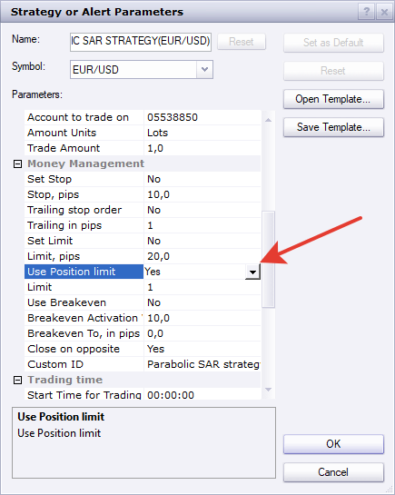

# Parabolic SAR Strategy

> Source: https://fxcodebase.com/code/viewtopic.php?f=31&t=11912  
> Forum: 31 · Topic 11912 · 87 post(s)

---

## Parabolic SAR Strategy

**Apprentice** · Wed Jan 18, 2012 5:33 am

This is a simple SAR strategy.
Long / Short orders are generated by SAR trend changes.

 [Parabolic SAR Strategy.lua](files/23780/Parabolic%20SAR%20Strategy.lua)

The Strategy was revised and updated on January 18, 2019.

---

## Re: Parabolic SAR Strategy

**ignacio_mella** · Wed Jan 18, 2012 6:18 am

Thanks Apprentice.

I am currently trying to filter this strategy with ADX and MVA indicators.

Here's a screenshot of what James Stanley achived on the GBPUSD. The [thread link is here](http://forexforums.dailyfx.com/free-trading-strategies/331463-indicator-entry-exit-parabolique-ii-2.html).

What I have been unable to achieve so far is to move the stop to break even when price moves above the breakevenflooramt.

---

## Re: Parabolic SAR Strategy

**spinemaligna** · Mon Jan 23, 2012 4:23 am

hi all,

You could someone show me where I am going wrong. In a similar vein to the Tick Sar Strategy, on my chart EUR/USD 15 min the strategy is acting one candle late. i.e it is closing and entering trades one candle after the SAR indicator has changed direction instead of at the changeover.
Would appreciate a response please.

Ross

---

## Re: Parabolic SAR Strategy

**Apprentice** · Tue Jan 24, 2012 3:31 am

This is normal and expected.
The reason, trade is generated at period end.
Beginning of the next one.

---

## Re: Parabolic SAR Strategy

**friedrio** · Mon Jan 30, 2012 8:49 am

I am looking for strategy "Parabolic SAR with ADX"
Can someone program it?

---

## Re: Parabolic SAR Strategy

**Apprentice** · Mon Jan 30, 2012 8:57 am

Yes, we can.
Can you give me more information.
This is too little information to start programming.

---

## Re: Parabolic SAR Strategy

**friedrio** · Mon Jan 30, 2012 9:17 am

I would like to complement the SAR strategy with ADX
BUY signal SAR = (0.02) Long + ADX> 15 (for example)
Short signal SAR = (0.02) Short + ADX> 15 (for example)

---

## Re: Parabolic SAR Strategy

**friedrio** · Mon Jan 30, 2012 10:38 am

You can program one more strategy?

Parabolic SAR - indication in combination with MACD - Histogram With Coloring - Indicator

I mean:

LONG signal when PSAR Long + MACD histogram green
SHORT signal when short PSAR + red MACD Histogram

---

## Re: Parabolic SAR Strategy

**Apprentice** · Tue Jan 31, 2012 4:11 am

Your request is added to the developmental cue.

---

## Re: Parabolic SAR Strategy

**Apprentice** · Tue Jan 31, 2012 5:41 am

SAR MACD Strategy can be found here.
[viewtopic.php?f=31&t=12527](https://fxcodebase.com/code/viewtopic.php?f=31&t=12527)

---

## Re: Parabolic SAR Strategy

**Apprentice** · Tue Jan 31, 2012 6:34 am

ADX Filter Added.
This Strategy takes only Sar trades if the ADX is greater than ADX Triger Level.

 [Parabolic SAR Strategy with ADX Filter.lua](files/24724/Parabolic%20SAR%20Strategy%20with%20ADX%20Filter.lua)

---

## Re: Parabolic SAR Strategy

**friedrio** · Thu Feb 09, 2012 5:50 am

Hi Apprentice,

Many thanks for your work. great.

Can you programming another strategy?

PSAR connect with averages indicator?

I mean:

Long tradesignal = + Averages long and PSAR indicator long.

thanks in advance

---

## Re: Parabolic SAR Strategy

**friedrio** · Thu Feb 09, 2012 6:06 am

one more question:

also can be programmed by an exit signal?

I mean:

BUY a LONG position = PSAR indicator = long and averages indicator = long
SELL this LONG position = PSAR unequal averages indicator

then wait until

BUY a short postion = PSAR short an indicator averages short

etc.

thanx

---

## Re: Parabolic SAR Strategy

**Apprentice** · Thu Feb 09, 2012 6:20 am

Your request is added to the development list.

---

## Re: Parabolic SAR Strategy

**Apprentice** · Tue Feb 14, 2012 2:59 pm

Requested can be found here.
[viewtopic.php?f=31&t=13376](https://fxcodebase.com/code/viewtopic.php?f=31&t=13376)

---

## Parabolic SAR and macd Strategy

**haji1982** · Thu Feb 23, 2012 4:59 pm

hi friend
thanks you for your good work you are really doing a good job for people like us how have no experience in this business.
im looking for a strategy based on parabolic sar and macd default setting..when they both confirm signal it takes trade,,also i need an option to turn off/on macd ..also i want it to work on anytime frame, automatic stop loss move based on parabolic sar dots, 10% to 90% profit lock option, start and stop time for trading, if new signal appears close previous order and reverse it, 1 order at a time..
thanks man if you can help me with that,

---

## Re: Parabolic SAR Strategy

**Apprentice** · Fri Feb 24, 2012 5:11 am

Your request is added to the development list.

---

## Parabolic SAR and macd Strategy

**haji1982** · Mon Feb 27, 2012 9:29 pm

hi again,
im looking for a strategy based on parabolic sar and macd default setting..when they both confirm signal it takes trade,,also i need an option to turn off/on macd ..also i want it to work on anytime frame, automatic stop loss move based on parabolic sar dots, 10% to 90% profit lock option, start and stop time for trading, if new signal appears close previous order and reverse it, 1 order at a time on 1 signal means if trade closes before it changes trend so it doesnt open any other trade till new dots or trend..
thanks

---

## Re: Parabolic SAR Strategy

**Taskryr** · Fri Jan 03, 2014 11:21 am

> **Apprentice wrote:**
> This is normal and expected.
> The reason, trade is generated at period end.
> Beginning of the next one.

Is it possible to augment this strategy so that the Buy/Sell is always on the PSAR level and follows it as it moves so that the trade is triggered when the PSAR level is broken instead of waiting to enter at the beginning of the next candle after the SAR has been broken?

---

## Re: Parabolic SAR Strategy

**Apprentice** · Fri Jan 03, 2014 3:27 pm

The exact price can not be guaranteed.

However, this delay can be greatly reduced,
it tick execution is applied.

Currently End of Turn is used.

---

## Re: Parabolic SAR Strategy

**TxChristopher** · Fri Feb 07, 2014 10:56 am

I tried changing the strategy to use the tick_sar indicator instead of the standard SAR so there would not be so much laggy slop in the entries, but when I try to back test it it gives me the error "...Strategies\Custom\Experimental tick sar strategy.lua:172: The indicator with id tick_sar is not found;02/07/2014 10:23:47"

The tick_sar indicator is installed .. . . . . so what is the problem?

---

## Re: Parabolic SAR Strategy

**Apprentice** · Sat Feb 08, 2014 2:56 am

Try This Line

Code: [Select all](https://fxcodebase.com/code/)
`Indicator[1] =    core.indicators:create("TICK_SAR", Source, Parameters["Step"],  Parameters["Max"] );`
Tip. Use the Caps, when calling external Indicators.

---

## Re: Parabolic SAR Strategy

**Scarletibis** · Fri Apr 04, 2014 7:30 pm

Would it be possible to make a strategy using the Parabolic SAR and the MTF MCP Heat Map(SuperTrend) indicator?

Buy as soon as both the Parabolic SAR and the Heat Map close bullish on a candle and sell as soon as both close Bearish.

For bullish limit i would like for the trade to stop when the Parabolic SAR reverses and that same candle closes and for Bearish i would like the same.

I dont know how possible this is, but i am really interested in it. Thanx

---

## Re: Parabolic SAR Strategy

**Apprentice** · Mon Apr 07, 2014 2:07 am

Your request is added to the development list.

---

## Re: Parabolic SAR Strategy

**rkverma1972** · Thu Apr 10, 2014 8:54 am

Can you add Stop as another sar. For example Main SAR is .02/.2 and stop may be .01/.1
Thanks

---

## Re: Parabolic SAR Strategy

**Apprentice** · Sat Apr 12, 2014 3:50 am

Your request is added to the development list.

---

## Re: Parabolic SAR Strategy

**spanizh_fly** · Tue Jun 09, 2015 5:18 am

I just tried on a 5 minutes chart.

It does fine but there is a problem with the entry time is not accurate.
It only opens a trade when the after the double dots.

Can you modify the entry immediately, when the double dots appear
for the entry and also the closing based on the double dots.

I've attach the picture of the double dots

Thanks guys

---

## Re: Parabolic SAR Strategy

**Apprentice** · Wed Jun 10, 2015 3:47 am

Try first/topmost post updated strategy.
 Will provide additional options.

Even now, if Live option is used,
on historical data, some delay is possible.

---

## Re: Parabolic SAR Strategy

**spanizh_fly** · Wed Jun 10, 2015 4:31 am

Alright I will try but where to add the code? at the bottom of the script?

---

## Re: Parabolic SAR Strategy

**spanizh_fly** · Wed Jun 10, 2015 4:37 am

but technically, if its possible,

-to open a new trade when the 2 dots appear
-close the existing trade which is open when the 2 dots are there.

Thank, that will be awesome

---

## Re: Parabolic SAR Strategy

**spanizh_fly** · Thu Jun 11, 2015 7:11 am

I've managed to try with the Tick Sar Indicator
but not much difference.

---

## Re: Parabolic SAR Strategy

**GregScuderia** · Fri Jun 12, 2015 2:56 am

Hi!

Can you do a strategy with these parameters -if this strategy is done, where can i find it?
Platform is Trading Station.

When daily chart has one full candlestick above (uptrend) or under (downtrend) EMA or SMA 200, the "origial" SAR (in 1 hour chart)buys when on daily chart is in uptrend and sells when daily chart is in downtrend.

Thank you.

---

## Re: Parabolic SAR Strategy

**Apprentice** · Mon Jun 15, 2015 3:17 am

Your request is added to the development list.

---

## Re: Parabolic SAR Strategy

**Jaeger99** · Wed Jan 27, 2016 4:03 pm

Does this strategy have the ability to be run on Renko?

---

## Re: Parabolic SAR Strategy

**dandee** · Fri Jan 29, 2016 5:36 am

The timing parameter doesnt seems to be working, I set it to open positions between 05:00-21:00 gmt but its opening positions right through the night, Can someone have a quit look please when you have some time, no rush
Thanks

---

## Re: Parabolic SAR Strategy

**Apprentice** · Fri Jan 29, 2016 5:45 am

Fixed.

---

## Re: Parabolic SAR Strategy

**dandee** · Sun Feb 07, 2016 3:28 pm

> **Apprentice wrote:**
> Fixed.

Thanks

---

## Re: Parabolic SAR Strategy

**cpc_cs** · Mon Feb 08, 2016 5:06 am

Hi Apprentice,

Can you do one modification? This modification will avoid having an open trade in the wrong direction and reduce draw downs.

**Current Behavior:**
Server time WITHIN time limits specified
Price > PSAR OR Price < PSAR
Close Short (if trade is open) and Open Long OR Close Long (if trade is open) and Open Short

Server time OUTSIDE time limits specified
Price > PSAR OR Price < PSAR
No Action Taken

**After Modification:**
Server time WITHIN time limits specified (Same as Current Behavior)
Price > PSAR OR Price < PSAR
Close Short (if trade is open) and Open Long OR Close Long (if trade is open) and Open Short

Server time OUTSIDE time limits specified
Price > PSAR OR Price < PSAR
**Close Short (if trade is open) OR Close Long (if trade is open)**

If needed a switch can be introduced to make this as an option.

Thanks and Regards

S. Joseph

---

## Re: Parabolic SAR Strategy

**dandee** · Mon Feb 08, 2016 9:00 am

If you are going to modify it please please please have it as an option since the strategy can already close on oposite, the description sounds more like a request to remove the capability to do hedging which some of us want that capability

---

## Re: Parabolic SAR Strategy

**cpc_cs** · Mon Feb 08, 2016 12:29 pm

Dear Dandee,

My intention is NOT to remove hedging option (I did not know there is one). Anyway, I will explain what happens in both cases with an example (see image).

**My Trade Settings are:**
Instrument: GER20
Time Frame: 15 Minutes
Start Trading: 03:00:00
Stop Trading: 11:59:59 (all times are UTC-5:00:00)

**Current Behavior:**
11-Dec-2015 @ 03:45 - Price < PSAR
11-Dec-2015 @ 04:00 - OPEN Short Trade @ 10,539
14-Dec-2015 @ 15:45 - Price > PSAR (last candle of the day)
15-Dec-2015 @02:00 - No Action as time is outside Time Limit
16-Dec-2015 @10:45 - Price < PSAR
16-Dec-2015 @11:00 - No Action as there is a Live Short Trade
16-Dec-2015 @14:00 - Price > PSAR
16-Dec-2015 @14:15 - No Action as time is outside Time Limit
17-Dec-2015 @15:45 - Price < PSAR (last candle of the day)
18-Dec-2015 @02:00 - No Action as time is outside Time Limit
21-Dec-2015 @03:15 - Price > PSAR
21-Dec-2015 @03:30 - CLOSE Short Trade @ 10,721 AND OPEN Long Trade @ 10,721

Number of Trades: 1
P/L: 10,539 - 10,721 = **-182pips (Loss)**

**Behavior Based on my suggestion:**
11-Dec-2015 @ 03:45 - Price < PSAR
11-Dec-2015 @ 04:00 - OPEN Short Trade @ 10,539
14-Dec-2015 @ 15:45 - Price > PSAR (last candle of the day)
15-Dec-2015 @02:00 - CLOSE Short Trade @ 10,285. No NEW trade as time is outside Time Limit
16-Dec-2015 @10:45 - Price < PSAR
16-Dec-2015 @11:00 - OPEN Short Trade @ 10,482
16-Dec-2015 @14:00 - Price > PSAR
16-Dec-2015 @14:15 - CLOSE Short Trade @ 10,547. No NEW trade as time is outside Time Limit
17-Dec-2015 @15:45 - Price < PSAR (last candle of the day)
18-Dec-2015 @02:00 - No Action as time is outside Time Limit
21-Dec-2015 @03:15 - Price > PSAR
21-Dec-2015 @03:30 - OPEN Long Trade @ 10,721

Number of Trades: 2
P/L-1: 10,539 -10,285 = 254pips (Profit); P/L-2: 10,482 - 10,547 = -65 (Loss)
**Overall P/L over the same period: 254 - 65 = 189 pips (Profit)**

If you analyze there are lots of situations where this happens (in all instruments and all time frames). Hence my request.

However, as suggested by you, it will be better to keep this as an option for those who do not want to use this.

S. Joseph

---

## Re: Parabolic SAR Strategy

**cpc_cs** · Mon Feb 08, 2016 7:48 pm

In short - Time Limit applies only to Trade Opening and does not apply to Trade Closing.

And please make it as an Option.

Thanks and Regards,

S. Joseph

---

## Re: Parabolic SAR Strategy

**Apprentice** · Wed Feb 10, 2016 5:39 am

Your request is added to the development list.

---

## Re: Parabolic SAR Strategy

**cpc_cs** · Wed Feb 10, 2016 8:36 am

Thanks Apprentice. Will wait for your update.

Thanks and Regards

S. Joseph

---

## Re: Parabolic SAR Strategy

**cpc_cs** · Sun Feb 14, 2016 2:15 pm

Apprentice, I am willing to pay for your time / your team's time to carry out this modification, if it will help in speed things up.

Please advice.

Thanks and Regards

S. Joseph

---

## Re: Parabolic SAR Strategy

**cpc_cs** · Sat Feb 20, 2016 4:09 am

Apprentice,

Any updates / advice.

Thanks and Regards

S. Joseph

---

## Re: Parabolic SAR Strategy

**Apprentice** · Thu Feb 25, 2016 1:38 pm

"Time Limit Applies to" parameter" Added.

---

## Re: Parabolic SAR Strategy

**dandee** · Fri Feb 26, 2016 5:15 am

Can you put an option so user can set minimum distance between s and r to open trade? Thanks

---

## Re: Parabolic SAR Strategy

**cpc_cs** · Mon Feb 29, 2016 11:49 am

Dear Apprentice,

Thanks for the modification. Sorry, I was in a place where I did not have internet access - hence the late response.

I tried back testing - if I choose "Entry" or "Exit" in the "Time Limit Applies to" parameter - no trades are getting executed.

With the same settings if I choose "Both" then trades are getting executed.

Can you please check? If needed I can attach screen shots.

Thanks and Regards

S. Joseph

---

## Re: Parabolic SAR Strategy

**Apprentice** · Tue Mar 01, 2016 3:26 pm

Try it now.

---

## Re: Parabolic SAR Strategy

**cpc_cs** · Wed Mar 02, 2016 9:54 am

Dear Apprentice,

Perfect. Thanks for the excellent work.

Dear Dandee,

Use "Both" - it will be equivalent to the previous version.

Thanks and Regards

S. Joseph

---

## Re: Parabolic SAR Strategy

**dandee** · Sat Mar 05, 2016 7:02 pm

> **cpc_cs wrote:**
> Dear Apprentice,
>
> Perfect. Thanks for the excellent work.
>
> Dear Dandee,
>
> Use "Both" - it will be equivalent to the previous version.
>
> Thanks and Regards
>
> S. Joseph

 sorry but I didnt understand what you meant by use both, what I wanted was an option so if the price is in a narrow range set by the user the strategy will not trade, eg if the user set the option to 10 pips then strategy will not open a position until the difference is more than 10 pips

---

## Re: Parabolic SAR Strategy

**stazitoforex** · Thu Mar 24, 2016 9:06 am

Sorry if I missed this, but is there a variation of the Parabolic SAR Strategy that only takes buy trades if candle close is above a user defined EMA and sell trades below the EMA?

I see variations using two EMA/MVA crossovers but nothing simply above or below one EMA. Can this please be added to the dev list if not already created?

Thank you so much!

---

## Re: Parabolic SAR Strategy

**Apprentice** · Fri Mar 25, 2016 4:40 am

> Can you put an option so user can set minimum distance between s and r to open trade? Thanks

Distance in time or in price?
Can you give a little more detailed description of the desired modifications.

---

## Re: Parabolic SAR Strategy

**stazitoforex** · Sat Mar 26, 2016 6:36 pm

Hi Apprentice,

No distance for time or price. Just bar close above or below the EMA. Below is more specifically what I am looking for. Thanks in advance:

If bar close is above the user defined EMA:
- Buy orders only allowed based on SAR buy signal (No Sells allowed, all Sell signals ignored)
- After initial Buy order executed, No new entries made if there are open positions so long as the candle closes remain above the EMA
- New entries on new Buy signal should be made only if there are no open positions
- Once bar closes below the EMA AND a Sell signal is generated, close long positions and open short position

If bar close is below the user defined EMA:
- Sell orders only allowed based on SAR sell signal (No Buys allowed, all Buy signals ignored)
- After initial Sell order executed, No new entries made if there are open positions so long as the candle closes remain below the EMA
- New entries on a new Sell should be made only if there are no open positions
- Once bar closes above the EMA AND a Buy signal is generated, close short positions and open long position

Stop and Limit allowed (trailing possible)
Sound and Display message on Buy and Sell signals possible

Thanks again.

---

## Re: Parabolic SAR Strategy

**traderms** · Fri Jun 03, 2016 1:01 pm

ello apprentice,

there already exists a good strategy/ indicator parabolic- sar.
but i am looking for some changing effects in this strategy:

1. all settings shoud be hold.

2. a third -trading parameter- should be add "last turn".

i.e. the trade will stop not until the price of the last parabolic-sar-market value
(not the current one) is hit.

if not, the trade must go on.
if the last parabolic-sar-market value is reached somtimes later, the trade stops and a new trade
will be opened such as in case of "live" setup.

if the market value isn´t reached and the parabolic-sar turns, it will be discount.

it would be nice if the market value of the "last turn" could be vary at about x-points.

how do you think about this?

thanks, ms

---

## Re: Parabolic SAR Strategy

**jaricarr** · Sat Oct 01, 2016 1:34 pm

> **Apprentice wrote:**
> ADX Filter Added.
> This Strategy takes only Sar trades if the ADX is greater than ADX Triger Level.
>
>
> Parabolic SAR Strategy with ADX Filter.lua

Hi Apprentice,

Can you please add an exit option to SAR with ADX filter strategy ?

Using the same entry parameters:

EXIT LONG when SAR turns red
EXIT SHORT when SAR turns green

---

## Re: Parabolic SAR Strategy

**Apprentice** · Tue Oct 04, 2016 3:42 am

Added.

---

## Re: Parabolic SAR Strategy

**Apprentice** · Sun Dec 18, 2016 5:59 am

Strategy was revised and updated.

---

## Re: Parabolic SAR Strategy

**chai88888** · Mon Oct 05, 2020 9:08 pm

hi there can you please add a breakeven trailing stop to this strategy.

thanks

---

## Re: Parabolic SAR Strategy

**Apprentice** · Tue Oct 06, 2020 2:28 am

Your request is added to the development list.
Development reference 2151.

---

## Re: Parabolic SAR Strategy

**chai88888** · Wed Oct 07, 2020 3:27 am

it does not have a position cap

and there a delay in taking the trades

---

## Re: Parabolic SAR Strategy

**chai88888** · Thu Oct 08, 2020 1:37 am

tried running it on simulation mode my stop moves to break even.but when i tried it on demo my stop didnt move to my breakeven value.

---

## Re: Parabolic SAR Strategy

**Apprentice** · Thu Oct 08, 2020 2:24 am

Your request is added to the development list.
Development reference 2163.

---

## Re: Parabolic SAR Strategy

**Apprentice** · Thu Oct 08, 2020 6:13 am

Make sure you have installed the proper version.

---

## Re: Parabolic SAR Strategy

**chai88888** · Thu Oct 08, 2020 9:15 am

yes it set to yes and limit to 1...
and still taking one or more trade in one direction

---

## Re: Parabolic SAR Strategy

**Apprentice** · Mon Oct 12, 2020 2:07 am

Your request is added to the development list.
Development reference 2171.

---

## Re: Parabolic SAR Strategy

**Apprentice** · Tue Oct 13, 2020 6:18 am

[Parabolic SAR strategy.lua](files/138252/Parabolic%20SAR%20strategy.lua)

Try this version.

---

## Re: Parabolic SAR Strategy

**chai88888** · Tue Oct 13, 2020 6:52 pm

hi there there is something terribly wrong with this strategy.

1st--- its not closing on opposite signal already set the setting to YES

2nd ---there a delay in taking the trades not like the on the first page on the forum version its taking trade like charm.

3rd ---can you please add trailing in pips

---

## Re: Parabolic SAR Strategy

**chai88888** · Tue Oct 13, 2020 6:57 pm

sorry didn't see it already has trailing limit thanks

---

## Re: Parabolic SAR Strategy

**chai88888** · Wed Oct 21, 2020 5:29 am

hi there i have a simple request

one position at time in one direction

example im long in a trade but the price hits my breakeven and still the SAR gives a buy signal on the next candle it should open a new buy. and still close on opposite signal.

thanks

---

## Re: Parabolic SAR Strategy

**Apprentice** · Thu Oct 22, 2020 2:07 am

Set "Use Position limit" to yes.

---

## Re: Parabolic SAR Strategy

**chai88888** · Thu Oct 22, 2020 3:27 am

what i mean your taking trades one at a time in a same direction..

because when you trade in a direction then your breakeven hits you will wait for opposite signal for the next trade.

i want is when your breakeven hits next candle still same signal will open a new trade in the same direction.

one trade at a time in the same direction

---

## Re: Parabolic SAR Strategy

**chai88888** · Thu Oct 22, 2020 3:55 am

sample trade pic

---

## Re: Parabolic SAR Strategy

**Apprentice** · Fri Oct 23, 2020 6:06 am

Your request is added to the development list.
Development reference 2216.

---

## Re: Parabolic SAR Strategy

**chai88888** · Sun Oct 25, 2020 7:47 pm

hi there it will not close on the opposite .

already set the setting to YES

thanks

---

## Re: Parabolic SAR Strategy

**omgepe** · Wed Nov 04, 2020 8:28 pm

Dear Apprentice,

Could you check this, close on the opposite is not working

---

## Re: Parabolic SAR Strategy

**Apprentice** · Thu Nov 05, 2020 3:43 am

Your request is added to the development list.
Development reference 2257.

---

## Re: Parabolic SAR Strategy

**Apprentice** · Fri Nov 06, 2020 3:40 am

[Parabolic SAR strategy.lua](files/138704/Parabolic%20SAR%20strategy.lua)

Try this version.

---

## Re: Parabolic SAR Strategy

**omgepe** · Fri Nov 06, 2020 10:50 am

hi Apprentice,

thanks for update,
still test this strategy,
will update to you in a few days

thanks

gp

---

## Re: Parabolic SAR Strategy

**omgepe** · Wed Nov 11, 2020 7:49 pm

Dear Apprentice,

close on the opposite is working now,
still try to find the best setup and combine with another indicator

thanks

gp

---

## Re: Parabolic SAR Strategy

**shaloiulabcde** · Wed Sep 22, 2021 4:57 pm

can you please add a condition to the 'Allow strategy to trade' setting. Instead of the manual 'yes' or 'no' options, can this be automated based on an indicator for example ADX so that it changes from yes to no or vice versa if a condition on the indicator is met or not?

> **Apprentice wrote:**
>
>
> Parabolic SAR strategy.lua
>
>
> Try this version.

---

## Re: Parabolic SAR Strategy

**Apprentice** · Fri Sep 24, 2021 6:47 am

We can implement this in the strategy logic,
not in the strategy parameters.

---

## Re: Parabolic SAR Strategy

**shaloiulabcde** · Wed Sep 29, 2021 6:13 am

> **Apprentice wrote:**
> We can implement this in the strategy logic,
> not in the strategy parameters.

Ok can you please add to the strategy logic...ADX in this case needs to be measured on the D1 (daily) time frame. ADX > 25 - trade, ADX < 25 - don't trade.

---

## Re: Parabolic SAR Strategy

**Apprentice** · Thu Sep 30, 2021 4:59 am

Your request is added to the development list.
Development reference 882.

---

## Re: Parabolic SAR Strategy

**Apprentice** · Thu Oct 07, 2021 12:14 pm

[Parabolic_SAR_Strategy_with_ADX_Filter.lua](files/143893/Parabolic_SAR_Strategy_with_ADX_Filter.lua)

Try this version.

---

## Re: Parabolic SAR Strategy

**chai88888** · Fri Nov 14, 2025 9:20 am

hello can you make me a new strategy based on psar

let say im on sell position and the psar dot is red dot above the price can you put a stop on the dot of the second to the last most recent dot so thats beside of the recent candle forming. and a buy order where the stop is. basically the stop and buy order is in the same dot

when the price and hit the stop and buy order at the same put a stop on the green dot and a sell order

---

## Re: Parabolic SAR Strategy

**Apprentice** · Sun Nov 16, 2025 3:17 pm

We have added your request to the development list.
Development reference 732
