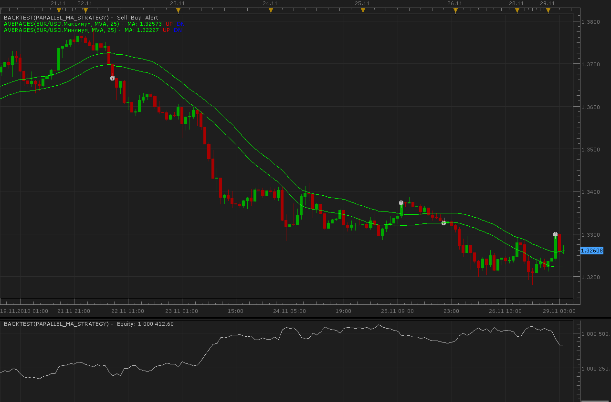

# Parallel MA strategy

> Source: https://fxcodebase.com/code/viewtopic.php?f=31&t=2821  
> Forum: 31 · Topic 2821 · 5 post(s)

---

## Parallel MA strategy

**Alexander.Gettinger** · Mon Nov 29, 2010 4:57 am

BUY condition.
Current price is up the MA on high price.

SELL condition.
Current price is down the MA on low price.

 

Download:

 [Parallel_MA_Strategy.lua](files/6432/Parallel_MA_Strategy.lua)

For this strategy must be installed AVERAGES indicator ([viewtopic.php?f=17&t=2430](https://fxcodebase.com/code/viewtopic.php?f=17&t=2430)).

The Strategy was revised and updated on December 18, 2018.

---

## Re: Parallel MA strategy

**MC. Trend Trader** · Tue Jun 14, 2016 5:38 am

Hi,
I have follofwing problem with this Strategy.

Strategy open with signal a position
if opposite signal is coming it is closing position and not open new position.
Strategy open only position if a position not exist.
It schould be closing existing position and open new position.
.
Best regards

---

## Re: Parallel MA strategy

**sho-me-pips** · Thu Sep 01, 2016 2:49 pm

Hi Alex,

Would you change this strategy or create a new one that creates OCO orders based on the high and low of a MVA.

Order creation would occur when tick price touches MVA (open, close, typical, median, weighted).

Example: User chooses 200MVA for strategy, when price touches 200 (close), OCO orders are created. This way the price will be very close to the middle of range.

MVA trailing stop as an option, would be 200(close).

---

## Re: Parallel MA strategy

**Apprentice** · Fri Sep 02, 2016 3:27 am

Your request is added to the development list, Under Id Number 3615
 If someone is interested to do this task, please contact me.

---

## Re: Parallel MA strategy

**Apprentice** · Sat Dec 17, 2016 10:37 am

Strategy was revised and updated.
