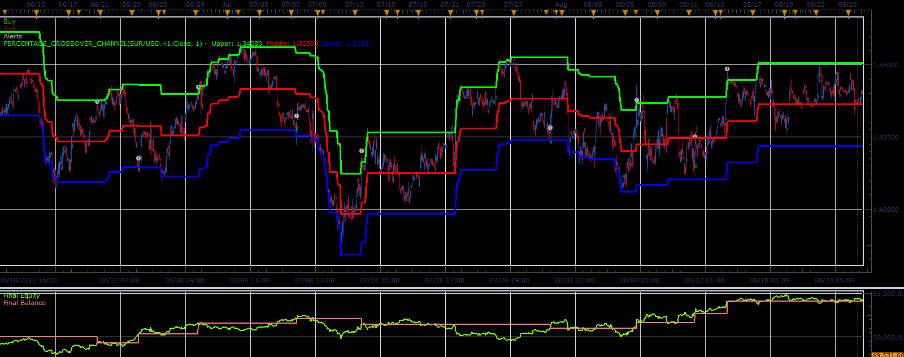

# Percentage Crossover Channel strategy

> Source: https://fxcodebase.com/code/viewtopic.php?f=31&t=10452  
> Forum: 31 · Topic 10452 · 3 post(s)

---

## Percentage Crossover Channel strategy

**Alexander.Gettinger** · Mon Dec 26, 2011 7:16 am

This strategy based on Percentage Crossover Channel indicator: [viewtopic.php?f=17&t=10402](https://fxcodebase.com/code/viewtopic.php?f=17&t=10402)

 

Download strategy:

 [Percentage_Crossover_Channel_Strategy.lua](files/21686/Percentage_Crossover_Channel_Strategy.lua)

For this strategy must be installed Percentage Crossover Channel indicator ([viewtopic.php?f=17&t=10402](https://fxcodebase.com/code/viewtopic.php?f=17&t=10402)).

---

## Re: Percentage Crossover Channel strategy

**Alexander.Gettinger** · Fri Jun 01, 2012 2:15 pm

Parameter [Cross] is added to the strategy. Strategy can work with middle line crossing.

Download:

 [Percentage_Crossover_Channel_Strategy2.lua](files/34749/Percentage_Crossover_Channel_Strategy2.lua)

---

## Re: Percentage Crossover Channel strategy

**Apprentice** · Mon Dec 05, 2016 5:10 am

Bump up.
