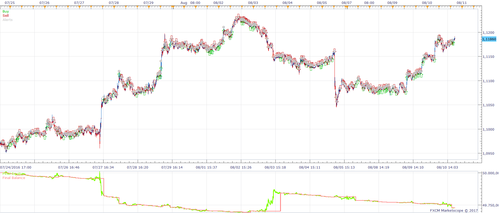
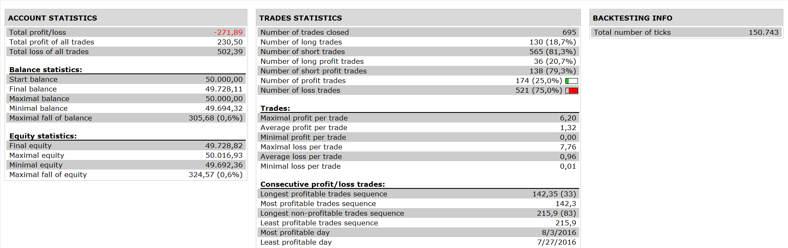

# Percentage Price Oscillator Strategy

> Source: https://fxcodebase.com/code/viewtopic.php?f=31&t=64384  
> Forum: 31 · Topic 64384 · 2 post(s)

---

## Percentage Price Oscillator Strategy

**Apprentice** · Fri Feb 03, 2017 12:19 pm

 

BUY;
Price PPO CROSS OVER Price PPO Signal
and Price POP > Buy Level
and Volume PPO > VolumeSignal
and PPO Volume > Buy Level

 Vice versa for a short

 [Percentage Price Oscillator Strategy.lua](files/110885/Percentage%20Price%20Oscillator%20Strategy.lua)

PPO is available here.
[viewtopic.php?f=17&t=2587](https://fxcodebase.com/code/viewtopic.php?f=17&t=2587)
Averages is available here.
[viewtopic.php?f=17&t=2430](https://fxcodebase.com/code/viewtopic.php?f=17&t=2430)

---

## Re: Percentage Price Oscillator Strategy

**Apprentice** · Wed Jan 24, 2018 9:19 am

The strategy was revised and updated.
