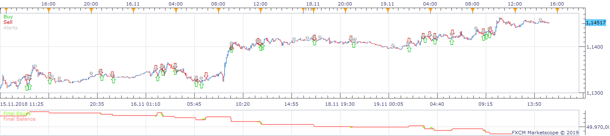
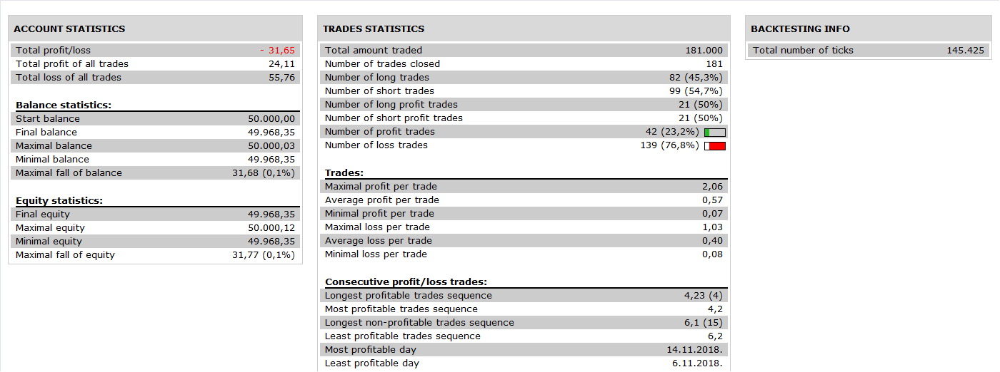

# Pinbar Strategy

> Source: https://fxcodebase.com/code/viewtopic.php?f=31&t=67301  
> Forum: 31 · Topic 67301 · 7 post(s)

---

## Pinbar Strategy

**Apprentice** · Sat Jan 26, 2019 5:24 am

 

Based on request.
[viewtopic.php?f=27&t=67285](https://fxcodebase.com/code/viewtopic.php?f=27&t=67285)

 [Pinbar Strategy.lua](files/123545/Pinbar%20Strategy.lua)

---

## Re: Pinbar Strategy

**Reymondpolanco** · Sat Jan 26, 2019 4:53 pm

The strategy is opening trades and putting entry order without pinbar

---

## Re: Pinbar Strategy

**Apprentice** · Fri Feb 08, 2019 8:31 am

Strategy doesn't open any trades, it creates entry orders lower/higher than low/high of the pinbar. This why trade was opened at that bar.

---

## Re: Pinbar Strategy

**Reymondpolanco** · Fri Feb 08, 2019 10:06 am

> **Apprentice wrote:**
> Strategy doesn't open any trades, it creates entry orders lower/higher than low/high of the pinbar. This why trade was opened at that bar.

Yes but there in the square is not a pinbar so is not a reason to put an entry order

---

## Re: Pinbar Strategy

**Reymondpolanco** · Sat Mar 09, 2019 8:45 pm

Any news about this ?

---

## Re: Pinbar Strategy

**Reymondpolanco** · Sat May 04, 2019 11:26 am

Any news about this ?

---

## Re: Pinbar Strategy

**7200100470** · Sat May 30, 2020 4:53 pm

Was this issue solved?
