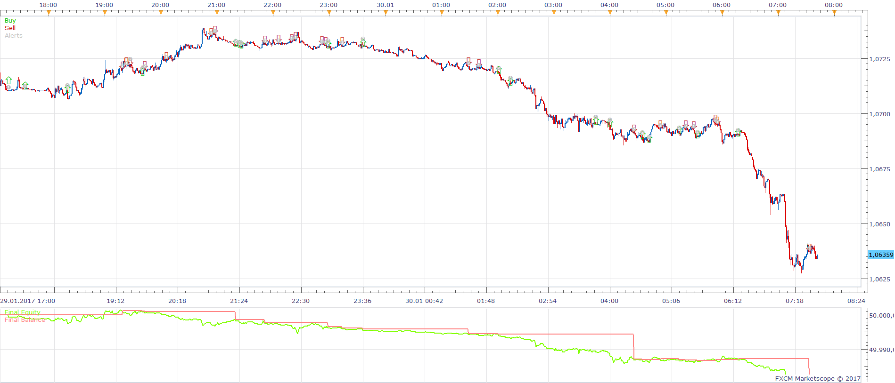
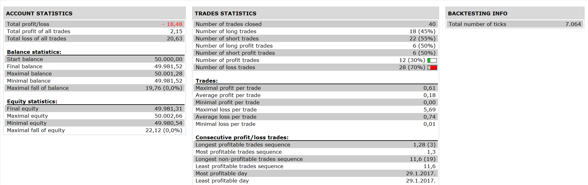
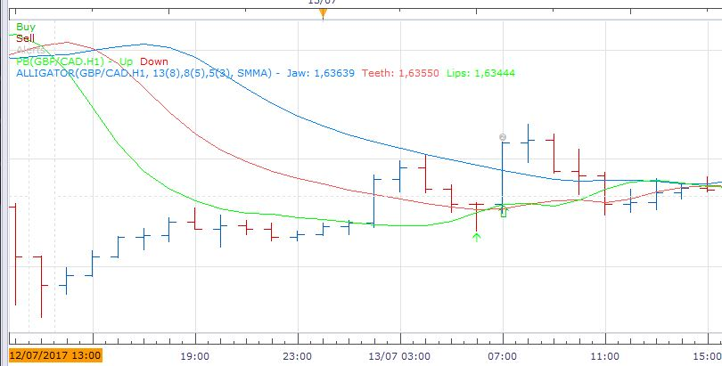
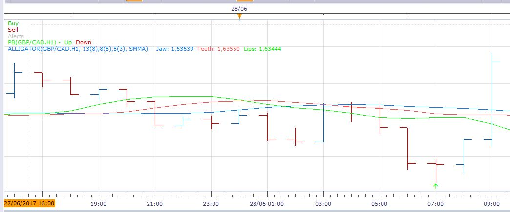
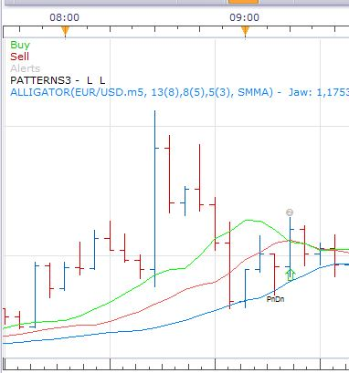
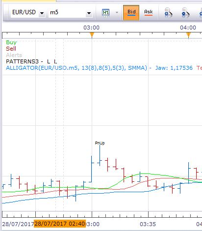

# Pinocchio Bar Strategy

> Source: https://fxcodebase.com/code/viewtopic.php?f=31&t=64966  
> Forum: 31 · Topic 64966 · 11 post(s)

---

## Pinocchio Bar Strategy

**Apprentice** · Sat Aug 05, 2017 8:26 am

 

Based on the request.
[viewtopic.php?f=27&t=64962](https://fxcodebase.com/code/viewtopic.php?f=27&t=64962)

If there is a Pin Up pattern
and the close of last bar is above Alligator teeth
then give a signal to SELL?
or
If there is a Pin Down pattern
and the close of last bar is bellow Alligator teeth
then give a signal to BUY?

 [Pinocchio Bar Strategy.lua](files/114005/Pinocchio%20Bar%20Strategy.lua)

in Bar a.k.a. "Pinocchio Bar" indicator is available here.
[viewtopic.php?f=17&t=1459&hilit=pin+bar](https://fxcodebase.com/code/viewtopic.php?f=17&t=1459&hilit=pin+bar)

The Strategy was revised and updated on January 21, 2019.

---

## Re: Pinocchio Bar Strategy

**conjure** · Sat Aug 05, 2017 11:07 am

It doesn't do what i need to do.
As you see in the picture

 

 there is a Pin Up pattern
BUT the close of last bar is above Alligator teeth.
It shouldn't do anything.

In the second Picture

 

there is a Pin Up pattern
and the close of last bar is bellow Alligator teeth.

It should give a signal for Buy

Is it possible to be done?
Thank you for your help

---

## Re: Pinocchio Bar Strategy

**conjure** · Sat Aug 05, 2017 11:23 am

on my request i did a mistake..
Here is my request fixed

If there is a Pin Up pattern
and the close of last bar is BELLOW Alligator teeth
then give a signal to BUY?
or
If there is a Pin Down pattern
and the close of last bar is ABOVE Alligator teeth
then give a signal to SELL?

---

## Re: Pinocchio Bar Strategy

**Apprentice** · Sun Aug 06, 2017 3:34 am

Try it now.

---

## Re: Pinocchio Bar Strategy

**conjure** · Sun Aug 06, 2017 4:12 am

Apprentice Thank you for your time you spend..
I did try it but i still have some problems..

In the first picture
 the close of last bar is above Alligator teeth.
It shouldn't do anything.

 

In the second picture i load Patterns3.lua by Alexander.Gettinger
to compare the pin ups and downs and i found that there are differences.
Is it possible to use Alexanders indicator for pin ups and downs?

 

I m sorry if i ask too much.

---

## Re: Pinocchio Bar Strategy

**Apprentice** · Tue Aug 08, 2017 3:03 am

No problem.
PB.lua was used.
Can u use this Notation, reference to PB.lua
Up Arrow and close {< or >} teeth ... {Buy or Sell}
Down Arrow and close {< or >} teeth ... {Buy or Sell}

---

## Re: Pinocchio Bar Strategy

**conjure** · Tue Aug 08, 2017 4:08 am

Up Arrow and close bellow teeth ... Buy
Down Arrow and close above teeth ...Sell

---

## Re: Pinocchio Bar Strategy

**Apprentice** · Tue Aug 08, 2017 4:22 am

Try it now.

---

## Re: Pinocchio Bar Strategy

**conjure** · Wed Aug 09, 2017 6:25 am

Yeap. Thank you!

---

## Re: Pinocchio Bar Strategy

**Reymondpolanco** · Sun Sep 24, 2017 11:52 pm

can you put an option to chose an specific form to close the trade for example:

For the long trades:
when the price is under the minimun of the pinbar close the trade.
When the trade have X pips in profit close the trade.

For short trades:
when the price is upper the maximun of the pinbar close the trade.
When the trade have X pips in profit close the trade.

---

## Re: Pinocchio Bar Strategy

**Apprentice** · Fri Sep 29, 2017 7:26 am

Your request is added to the development list under Id Number 3906
