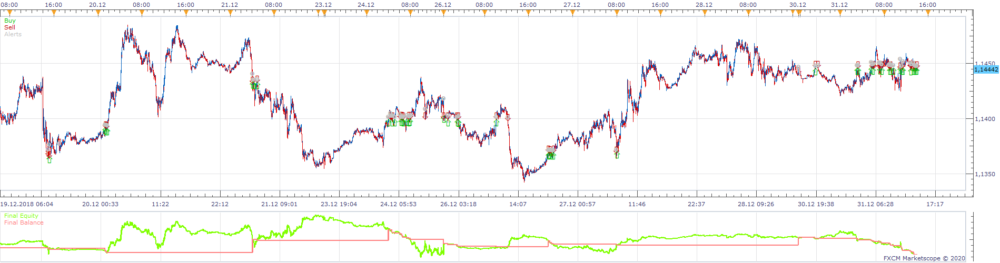
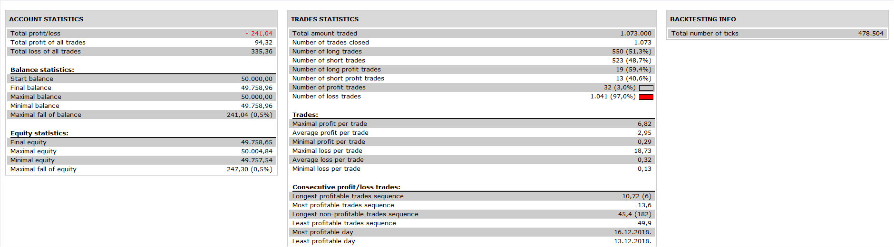
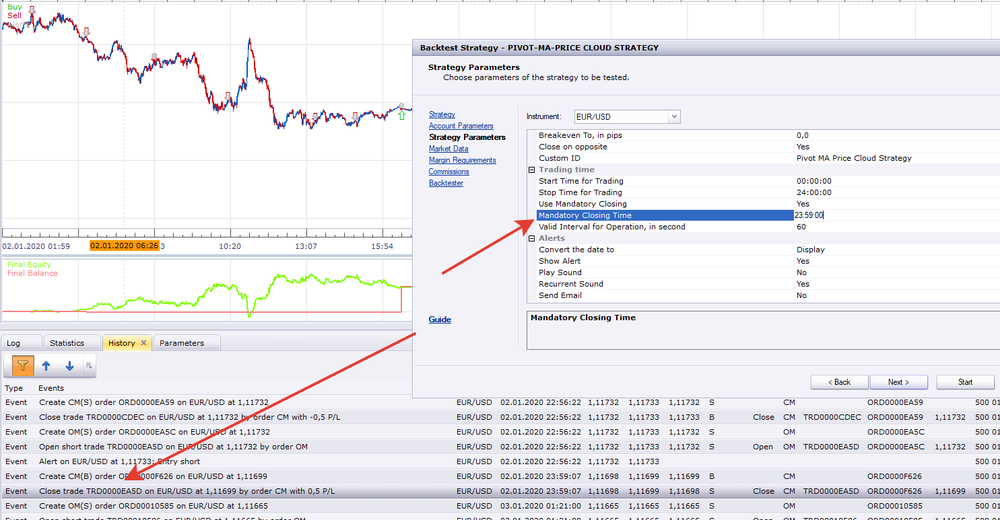

# pivot-ma-price cloud strategy

> Source: https://fxcodebase.com/code/viewtopic.php?f=31&t=70445  
> Forum: 31 · Topic 70445 · 20 post(s)

---

## pivot-ma-price cloud strategy

**Apprentice** · Thu Sep 17, 2020 3:23 am

 

Based on indicator
[viewtopic.php?f=17&t=69723](https://fxcodebase.com/code/viewtopic.php?f=17&t=69723)
Open long when it's green and open short when it's red.
Close on opposite or with position limit.

 [pivot-ma-price cloud strategy.lua](files/137668/pivot-ma-price%20cloud%20strategy.lua)

MT4/MQ4 version.
[viewtopic.php?f=38&t=70609&p=138767#p138767](https://fxcodebase.com/code/viewtopic.php?f=38&t=70609&p=138767#p138767)

---

## Re: pivot-ma-price cloud strategy

**Infime** · Mon Sep 21, 2020 3:08 pm

Hello,
Nice thanks ! Can you add breakeven please ?
Thanks

---

## Re: pivot-ma-price cloud strategy

**Apprentice** · Tue Sep 22, 2020 2:42 am

Your request is added to the development list.
Development reference 2079.

---

## Re: pivot-ma-price cloud strategy

**Apprentice** · Tue Sep 22, 2020 5:24 am

[pivot-ma-price cloud strategy.lua](files/137814/pivot-ma-price%20cloud%20strategy.lua)

Try this version.

---

## Re: pivot-ma-price cloud strategy

**Infime** · Wed Sep 23, 2020 11:20 am

Nice !
But I have a one more suggestion.
Can you add a max Drawdown % for all opened positions - close the position(s) when the drawdown is dropping below a % level.

Thanks a lot !

---

## Re: pivot-ma-price cloud strategy

**Infime** · Mon Oct 05, 2020 8:51 am

Do you have some news about my request ?
Thanks

---

## Re: pivot-ma-price cloud strategy

**Apprentice** · Tue Oct 06, 2020 3:21 am

[pivot-ma-price cloud strategy.lua](files/138106/pivot-ma-price%20cloud%20strategy.lua)

Try this vesion.

---

## Re: pivot-ma-price cloud strategy

**Infime** · Thu Oct 08, 2020 2:12 am

The last version is not what I exactly asked.
I explain : On the strategy I have a big drowdown and I want to limit this.
Delete the last request and fix the daily closing positions. Because it doesn't work. So my new request is : Fix or add a option to close all positions at the end of the day.
Thanks. I hope it will work.

---

## Re: pivot-ma-price cloud strategy

**Apprentice** · Thu Oct 08, 2020 2:22 am

Your request is added to the development list.
Development reference 2162.

---

## Re: pivot-ma-price cloud strategy

**Apprentice** · Thu Oct 08, 2020 6:12 am

Such option already exists: "Use Mandatory Closing"

---

## Re: pivot-ma-price cloud strategy

**Infime** · Thu Oct 08, 2020 6:13 am

Yes but it doesn't work

---

## Re: pivot-ma-price cloud strategy

**Infime** · Mon Oct 12, 2020 4:41 am

Anyway, can you add this option ?

Choose which day and which hour for close all trade opened.
I want close trades every friday afternoon.

Let's try like this. Thanks

---

## Re: pivot-ma-price cloud strategy

**Apprentice** · Tue Oct 13, 2020 6:09 am

Your request is added to the development list.
Development reference 2184.

---

## Re: pivot-ma-price cloud strategy

**Apprentice** · Fri Nov 06, 2020 3:18 am

I don't have any issues. The mandatory closing works. Try to increase the Valid interval.

---

## Re: pivot-ma-price cloud strategy

**yolerap** · Fri Nov 06, 2020 6:07 am

Please, could you translate this strategy to MT4 ?

Thank you,

---

## Re: pivot-ma-price cloud strategy

**Apprentice** · Sat Nov 07, 2020 6:45 am

Your request is added to the development list.
Development reference 2272.

---

## Re: pivot-ma-price cloud strategy

**Apprentice** · Mon Nov 09, 2020 5:09 pm

MT4/MQ4 version.
[viewtopic.php?f=38&t=70609&p=138767#p138767](https://fxcodebase.com/code/viewtopic.php?f=38&t=70609&p=138767#p138767)

---

## Re: pivot-ma-price cloud strategy

**Infime** · Fri Oct 22, 2021 10:55 am

Hello Apprentice,

Is it to possible to add an option for the strategy close the loss positions after X candles of the current timeframe on the lua strategy ?
Thanks

---

## Re: pivot-ma-price cloud strategy

**Apprentice** · Tue Oct 26, 2021 4:19 am

Your request is added to the development list.
Development reference 944.

---

## Re: pivot-ma-price cloud strategy

**Apprentice** · Fri Nov 05, 2021 8:47 am

[pivot-ma-price_cloud_strategy.lua](files/144183/pivot-ma-price_cloud_strategy.lua)

Try this version.
