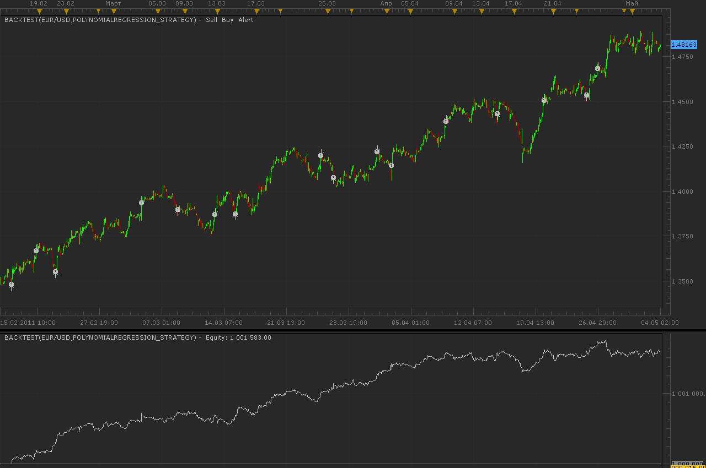
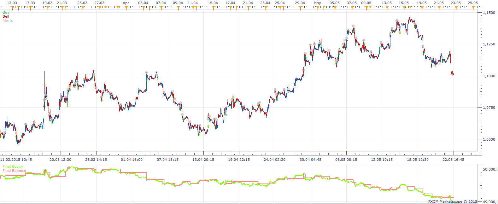
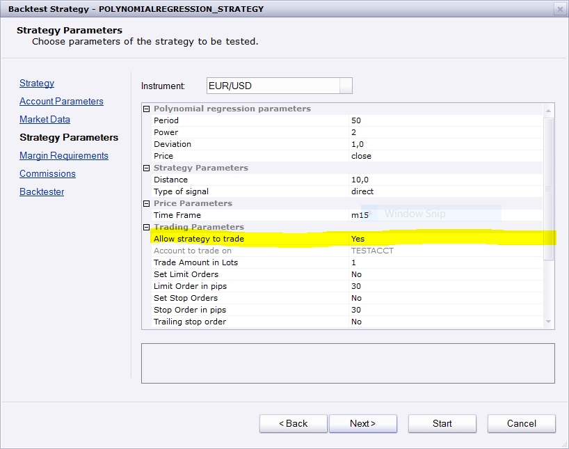

# Polynomial regression strategy

> Source: https://fxcodebase.com/code/viewtopic.php?f=31&t=4105  
> Forum: 31 · Topic 4105 · 32 post(s)

---

## Polynomial regression strategy

**Alexander.Gettinger** · Wed May 04, 2011 1:39 am

Strategy based on the polynomial regression indicator ([viewtopic.php?f=17&t=3715](https://fxcodebase.com/code/viewtopic.php?f=17&t=3715)).

BUY condition:
Price moves below the bottom line more than [Distance] pips.

SELL condition:
Price moves above the top line more than [Distance] pips.

 

Download strategy:

 [PolynomialRegression_Strategy.lua](files/10290/PolynomialRegression_Strategy.lua)

For this strategy must be installed polynomial regression indicator ([viewtopic.php?f=17&t=3715](https://fxcodebase.com/code/viewtopic.php?f=17&t=3715)).

The Strategy was revised and updated on January 18, 2019.

---

## Re: Polynomial regression strategy

**lisa_baby_xx** · Wed May 04, 2011 4:55 am

Hi Alex,

I absolutly love this stratagy!

Can you add the following two parameters to this excellent stratagy please:

1) "Allow Multiple Positions in the same direction", and:
2) "Allow Short/Long/Both Positions"

 Is this stratagy automated?

 Many thanks and much love to all those at fxcodebase!
lisa_baby_xx

---

## Re: Polynomial regression strategy

**mfoste1** · Wed May 04, 2011 12:23 pm

ahh yes fantastic work alexander!!

i agree with lisa, it does needs trend filter and allow multiple pos.

---

## Re: Polynomial regression strategy

**mfoste1** · Wed May 04, 2011 12:30 pm

also, could it be added that for entry criteria (close, high, low, open, typical, weighted) could tick also be one of the options?

thanks, much appreciated!

---

## Re: Polynomial regression strategy

**Apprentice** · Wed May 04, 2011 12:31 pm

Request added to list.

---

## Re: Polynomial regression strategy

**Exolon** · Thu Jul 07, 2011 10:34 pm

Apparently it also needs a "Logarithmic Regression" indicator.

---

## Re: Polynomial regression strategy

**Apprentice** · Fri Jul 08, 2011 3:36 am

You can find it here
[viewtopic.php?f=17&t=3716&p=11717&hilit=Logarithmic#p11717](https://fxcodebase.com/code/viewtopic.php?f=17&t=3716&p=11717&hilit=Logarithmic#p11717)

---

## Re: Polynomial regression strategy

**Alexander.Gettinger** · Fri Jul 22, 2011 3:55 am

In strategy added parameter "Allow Short/Long/Both Positions".

Download:

 [PolynomialRegression_Strategy2.lua](files/12990/PolynomialRegression_Strategy2.lua)

---

## Re: Polynomial regression strategy

**Alexander.Gettinger** · Fri Jul 22, 2011 4:00 am

> **lisa_baby_xx wrote:**
> Can you add the following two parameters to this excellent stratagy please:
>
> 1) "Allow Multiple Positions in the same direction", and:
> 2) "Allow Short/Long/Both Positions"

I don't understand what add parameter "Allow Multiple Positions ...", because polynomial regression is based on each bar on the new and will be a lot of unnecessary orders.

---

## Re: Polynomial regression strategy

**lisa_baby_xx** · Sun Jul 24, 2011 7:21 am

Hi Alex,

> I don't understand what add parameter "Allow Multiple Positions ...", because polynomial regression is based on each bar on the new and will be a lot of unnecessary orders.

Yeah, thats my fault. I am seven months pregnant.. I must have got over emotional and/or enthusiastic at the time of writing my last post on this page. A rush of blood to the head, probably.

Much love to everyone and happy pipping. X-X.
lisa_baby_xx

---

## Re: Polynomial regression strategy

**Alexander.Gettinger** · Mon Jul 25, 2011 10:19 pm

> **lisa_baby_xx wrote:**
> Yeah, thats my fault. I am seven months pregnant.. I must have got over emotional and/or enthusiastic at the time of writing my last post on this page. A rush of blood to the head, probably.
>
> Much love to everyone and happy pipping. X-X.
> lisa_baby_xx

I wish good health to you and your child.

---

## Re: Polynomial regression strategy

**mfoste1** · Wed Aug 10, 2011 12:47 pm

Hello , hope everyone is well! I was wondering if someone could add these modifications to this strategy:

1. Allow multiple positions in the same direction
2. entry orders triggered(with user specified stops and limits) based on tick(at the user specified distance in pips outside of the upper(sell)or lower(buy) bands)

*or this could substitute for number 2(whichever is easier to code)

3. This one might be hard, but it will work extremely well. It would be something like this: A) Constant trailing buy orders(with user specified stops and limits) at the user specified distance outside of the lower band. Constant trailing sell orders(with user specified stops and limits) at the user specified distance outside of the upper band.

This would be much appreciated as it would give much more accurate and profitable entries instead of having to wait for the candle to close.

Thanks,
Mfoste1

---

## Re: Polynomial regression strategy

**zmender** · Sat Dec 10, 2011 10:06 am

Ladies and Gents,

I'm doing some more back testing on this strategy and I'm having some great results. This strategy is capable of identifying great entry points but exits are a bit more clumsy.

Would it be possible for you guys to add in an ATR range / deviation as a variable limit / stop order?

---

## Re: Polynomial regression strategy

**zmender** · Sat Dec 10, 2011 11:39 am

Here's a summary of my backtesting results. All of these have starting balance of $200USD. It's still ongoing and not yet complete (stop loss not complete). However a few trends are clear.

Limit orders are very profitable but under same conditions are not. Reason is that although entry points are good, positions are not exited quick enough by strategy to maintain profits.

---

## Re: Polynomial regression strategy

**Apprentice** · Sun Dec 11, 2011 5:47 am

Added to developers cue.

---

## Re: Polynomial regression strategy

**mfoste1** · Fri Dec 23, 2011 11:14 pm

could someone please change this to a "tick based" order triggering method rather than the candle close?

so for example it would trigger an order when price goes X number of pips outside the upper or lower bands

---

## Re: Polynomial regression strategy

**zmender** · Fri Dec 30, 2011 2:26 pm

I am still working on improving my setting. I'm gauging my results based on Final Balance, PL Ratio (winning / losing), and Max fall equity.

Apprentice, have you had a chance to worked on adding a variable take profit / stop loss? If not, I think a better variable would be stop loss at a preset standard deviation... basically the same as my request in the "redrawn channel strategy".

Cheers to new year!

---

## Re: Polynomial regression strategy

**Apprentice** · Mon Jan 02, 2012 4:43 am

Unfortunately not.

---

## Re: Polynomial regression strategy

**easytrading** · Mon Jul 06, 2015 2:37 pm

kindly Apprentice,

PolynomialRegression_Strategy2.lua is not opening any positions even the sound alert is not. i set allow to trade to yes with all original settings. could you review and fix it please ?? with my appreciation in advance.

---

## Re: Polynomial regression strategy

**Apprentice** · Mon Jul 13, 2015 4:44 am

Tested in Backtester, everything is as expected.
How / where you have done your testing.

---

## Re: Polynomial regression strategy

**abhishekc05** · Thu Dec 24, 2015 3:48 am

Hi,

Am trying to learn Lua. Have a few doubts if you could help me out with this strategy:

Is it possible to set the alerts based on ticks [or a smaller time-frame] instead of candles like requested above in lua?
Also, when I back test any strategy, does the backtester also take into account transaction costs in the FXCM platform?

Any guidance would be very helpful.

Thanks,
Abhishek

---

## Re: Polynomial regression strategy

**Julia CJ** · Tue Dec 29, 2015 2:52 am

Hi Abhishekc,

> Is it possible to set the alerts based on ticks [or a smaller time-frame] instead of candles like requested above in lua?

Your code should contain a snip like this: 
ExtSubscribe(1, nil, instance.parameters.Period, instance.parameters.Type == "Bid", "bar");

The strategy will work with the specified periodicity. For ticks should contain the following code snip: ExtSubscribe(1, nil, "t1", instance.parameters.Type == "Bid", "tick").

> Also, when I back test any strategy, does the backtester also take into account transaction costs in the FXCM platform?

Unfortunately, currently there is no such a function.
It is added to the development wish-list.

---

## Re: Polynomial regression strategy

**abhishekc05** · Wed Jun 22, 2016 4:30 pm

Thanks. I am trying to write a script for trading at tick data while the channels are being formed based on bar data ...Could you please have a look and advise if this looks ok? I am basically subscribing to both tick and bar data, forming the channels on bar data while the comparison for trade entry and exit is being done on tick data.

Thanks,Abhishek

---

## Re: Polynomial regression strategy

**abhishekc05** · Thu Jun 23, 2016 12:09 pm

Guys, I am very new to Lua ... this is not taking any trades FYI

Thanks,
Abhishek

---

## Re: Polynomial regression strategy

**Apprentice** · Fri Jun 24, 2016 4:54 am

Set "Allow Strategy to trade" to Yes

---

## Re: Polynomial regression strategy

**abhishekc05** · Fri Jun 24, 2016 12:37 pm

I meant it is not showing any alerts - the version which I uploaded... If someone could help out - would be great!

---

## Re: Polynomial regression strategy

**FusterCluck** · Fri Sep 30, 2016 8:06 am

> **easytrading wrote:**
> kindly Apprentice,
>
> PolynomialRegression_Strategy2.lua is not opening any positions even the sound alert is not. i set allow to trade to yes with all original settings. could you review and fix it please ?? with my appreciation in advance.

I'm having the same issue. Strategy is set to allow trading but no trades are being executed. Everything else seems to be in order.

easytrading, Any luck finding a solution?

Apprentice, do you have a potential cause/fix for this? Any advice where we might look?

I'm using FXCM Trading Station

---

## Re: Polynomial regression strategy

**jaricarr** · Tue Oct 04, 2016 12:12 am

Hi Apprentice,

I'm getting the error below when optimizing both Polynomial Regression strategies.

Error occurred while backtest run. Description: attempt to index upvalue 'PR' (a nil value)	10/03/2016 23:17:24

---

## Re: Polynomial regression strategy

**Apprentice** · Tue Oct 04, 2016 4:05 am

Please re-download.

For this strategy please installed polynomial regression indicator. ([viewtopic.php?f=17&t=3715](https://fxcodebase.com/code/viewtopic.php?f=17&t=3715)).

---

## Re: Polynomial regression strategy

**Apprentice** · Sun Dec 18, 2016 5:18 am

Strategy was revised and updated.

---

## Re: Polynomial regression strategy

**AEKARAOLE** · Thu Apr 18, 2019 8:08 am

Hi Apprentice
Can we make a change to the strategy?

BUY condition:
Price cross and back inside the bottom line

SELL condition:
Price cross and back inside the top line

Thank you

---

## Re: Polynomial regression strategy

**vasudev.gupta** · Thu Apr 25, 2019 11:30 pm

What is the best setting for this strategy? I'm trying to forward test this.
