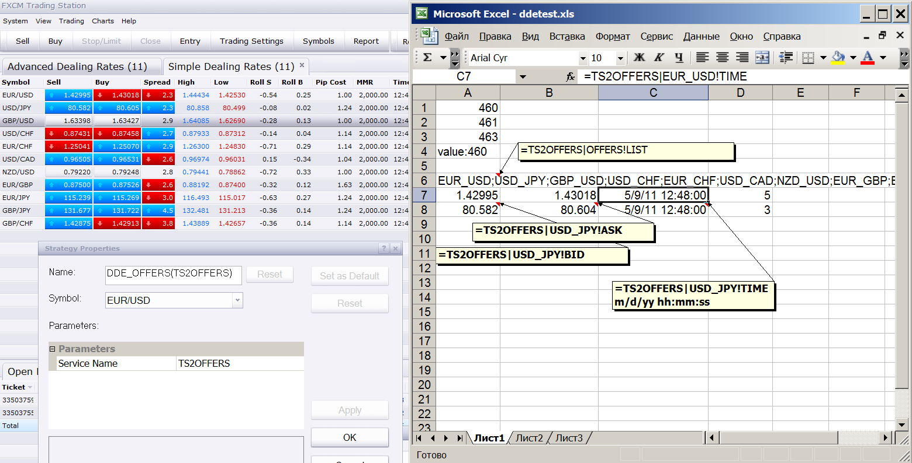

# Populate the current offers from TS into Excel using DDE

> Source: https://fxcodebase.com/code/viewtopic.php?f=31&t=4159  
> Forum: 31 · Topic 4159 · 44 post(s)

---

## Populate the current offers from TS into Excel using DDE

**Nikolay.Gekht** · Mon May 09, 2011 12:19 pm

The DDE (Dynamic Data Exchange) is a windows service, which helps to populate the data from one application into another.

To put data via DDE in excel, all you need is to enter the following formula into the excel cell:
=A|B!C
where
A is a service name
B is a topic
and
C is a value.

So, all you need is a service which publish the current offer data via DDE.

The Trading Station or Lua themselves do not support DDE, so you need an **extension module** for Lua which provides DDE services.

I developed such extension, you must download and install it before using the DDE offers publishing strategy:

 [ddeserver_lua.dll](files/10451/ddeserver_lua.dll)

To install the extension module:
1) Save the ddeserver_lua.dll file to your computer.
2) Copy the file into:
* `"C:\Program Files\Candleworks\FXTS2\"` folder if you use a 32 bit operating system
or
* `"C:\Program Files (x86)\Candleworks\FXTS2\"` folder if you use a 64 operating system

That's all, the extension is ready to be used in this or other strategies.

Now download and install (as described here on wiki: [http://fxcodebase.com/wiki/index.php/Cu ... arketscope](https://fxcodebase.com/wiki/index.php/Custom_Strategies:_How_To_Install_in_Marketscope)) the DDE_Offers.lua strategy:

 [dde_offers.lua](files/10451/dde_offers.lua)

Now you can launch DDE_Offers strategy and just watch the data in Excel (click on the image to see it in full size):

 



Note 1: The strategy has just one parameter - the name of the service. Each DDE publishing strategy you are executing must have its unique name. However, you can run as many DDE publishing strategies as you need, just put the new service name every time when you start another one strategy.

Note 2: The strategy populates the following data:

1) =TS2OFFERS|OFFERS!LIST
(if you changed the name of the service, use it instead of TS2OFFERS in the formulas!, for example is the service name you entered in the strategy parameters is MYOFFERS, the formula must be =MYOFFERS|OFFERS!LIST).

The semicolon-separated list of the topics. A topic is created for each instrument you are subscribed. The non-character symbols (such as / (slash)) are replaced with an underscore. So, for example EUR/USD offer will be translated as EUR_USD topic.

2) Each offer's topic has the following values:
BID - current bid price
ASK - current ask price
TIME - date and time of the last price change.
DIGITS - precision of the offer's prices.

For example to get a bid price of the EUR/USD, you must enter:
=TS2OFFERS|EUR_USD!BID

3) Please note, that the date and time is populated as a number. But, Trading Station and Excel uses exactly the same date/time format, so all you need is to change the cell format to date/time (for example to m/d/yy hh:mm:ss), and the date/time will be displayed properly.

4) The date/time is always in EST/EDT (New York) time zone

5) The prices are updated every second.

Additional Material:

1) Source code of the strategy:

```lua
function Init()
    strategy:name("DDE Offer")
    strategy:description("Publishes Offers via DDE")

    strategy.parameters:addString("SRV", "Service Name", "The service name must be unique amoung all running instances of the strategy", "TS2OFFERS");
end

require("ddeserver_lua");

local dde_server;
local ids = {};
local timeid;

function Prepare(onlyName)
    instance:name(profile:id() .. "(" .. instance.parameters.SRV .. ")");
    if onlyName then
        return ;
    end

    -- start dde server
    dde_server = ddeserver_lua.new(instance.parameters.SRV);
   
    local enum = core.host:findTable("offers"):enumerator();
    local row, topic;
    local offers, offer;
    -- create topics
    offers = "";
    local ofr, val;
    while true do
        row = enum:next();
        if row == nil then
            break ;
        end
        topic = {};
        offer = string.gsub(row.Instrument, "([^A-Za-z0-9])", "_");
        offers = offers .. offer .. ";";

        topic.id = dde_server:addTopic(offer);

        topic.bid = dde_server:addValue(topic.id, "Bid");
        topic.ask = dde_server:addValue(topic.id, "Ask");
        topic.time = dde_server:addValue(topic.id, "Time");

        val = dde_server:addValue(topic.id, "Digits");
        dde_server:set(topic.id, val, row.Digits);
        ids[row.Instrument] = topic;
    end

    ofr = dde_server:addTopic("OFFERS");
    val = dde_server:addValue(ofr, "LIST");
    dde_server:set(ofr, val, offers);

    timerid = core.host:execute("setTimer", 1, 1);

end

function Update()
end

function AsyncOperationFinished(cookie, success, msg)
    if cookie == 1 then
        local enum = core.host:findTable("offers"):enumerator();
        local row, topic;
        -- create topics
        while true do
            row = enum:next();
            if row == nil then
                return ;
            end
            topic = ids[row.Instrument];
            if topic ~= nil then
                dde_server:set(topic.id, topic.bid, row.Bid);
                dde_server:set(topic.id, topic.ask, row.Ask);
                dde_server:set(topic.id, topic.time, row.Time);
            end
        end
    end
end

function ReleaseInstance()
    core.host:execute("killTimer", timerid);
    dde_server:close();
end
```

2) the source code of ddeserver_lua extension (Visual C++). Please note that you will need Indicore Integration SDK (see here: [http://fxcodebase.com/wiki/index.php/Ca ... grationSDK](https://fxcodebase.com/wiki/index.php/Category:IndicoreIntegrationSDK)) to compile that code.

 [luadde.zip](files/10451/luadde.zip)

3) How to use ddeserver_lua in your own strategy (or indicator)

Step 1) Deploy ddeserver_lua.dll into the same folder where the application is deployed (for TS see instruction above, for Indicore SDK - deploy to `C:\Gehtsoft\IndicoreSDK\`, for your own application - put into the same folder where lua5.1.dll is located).

Step 2) Add `require("ddeserver_lua");` before `Prepare()` function.

Step 3) Declare a global variable for the server, e.g. local `dde_server` before `Prepare()` function.

Step 4) In the `Prepare()` function, when `onlyName` parameter is `false`:
a) create an instance of the dde server and give the service an unique name. This value shall be used as first part of the DDE reference, e.g. for the code below, all DDE references will be started with `MYSERVICENAME`.

`dde_server = ddeserver_lua.new("MYSERVICE");`

b) Register topic and value inside the topic, keep the identifiers of the topic and value for further usage:

`topic = dde_server:addTopic("MYTOPIC");`
`value = dde_server:addValue(topic, "MYVALUE");`

where topic and value are global variables.

Now, your value is available from Excel as =MYSERVICE|MYTOPIC!MYVALUE.

Step 5). Set the value whereever you need.

dde_server:set(topic, value, 12345);

The value can be either a number or a string.

Step 6) Implement `ReleaseInstance()` function and call `dde_server:close()` in this function.

---

## Re: Populate the current offers from TS into Excel using DDE

**ancient-school** · Thu Jun 02, 2011 7:08 am

Could you please provide for Access to the following Info:

 1 - MMR
 2 - Pip Cost
 3 - High
 4 - Low
 5 - Account
 6 - Balance
 7 - Equity
 8 - Used Margin
 9 - Usable Margin
10 - Gross P/L

Thank You ...

---

## Re: Populate the current offers from TS into Excel using DDE

**luigifx** · Tue Jun 14, 2011 2:16 pm

It would be really great if we can access to this information asked by ancient-school.

Thanks

---

## Re: Populate the current offers from TS into Excel using DDE

**sunshine** · Sun Jul 17, 2011 8:18 am

> **luigifx wrote:**
> It would be really great if we can access to this information asked by ancient-school.
>
> Thanks

You can access to the accounts through the dde_accounts strategy (see the attachment).
The strategy populates the following data:

1) =TS2ACCOUNTS|ACCOUNTS!LIST
The semicolon-separated list of the topics. A topic is created for each account.

2) Each account's topic has the following values:
BALANCE - account balance
EQUITY - account equity balance
USEDMARGIN - account used margin
USABLEMARGIN - account usable margin
GROSSPL - account gross P/L

For example to get a Gross P/L for account 01380757, you must enter:
=TS2ACCOUNTS|01380757!GROSSPL

Also in the attachment you can find the modified "dde_offers.lua" which provides access to pip cost, high and low.

---

## Re: Populate the current offers from TS into Excel using DDE

**BlueBloodedTrader** · Sun Sep 18, 2011 5:40 pm

This is an absolutely awesome tool, but it would be far more powerful tool if it allowed more detailed information to be grabbed from the trading station or better still from the charting software.

For example, if I want to run algorithms in Excel for the purpose of trading then information that would be useful would include:

OPEN PRICE
CLOSE PRICE
MOVING AVERAGE
HIGHS AND LOWS USING DNC CHANNELS
ATR
etc.

Is there anyway of further developing this tool in order to allow data to be grabbed from the charting package Marketscope 2.0 ? This would allow you to grab data from any indicator installed on the charting package.

Thanks for the great work guys!

---

## Re: Populate the current offers from TS into Excel using DDE

**sunshine** · Tue Sep 20, 2011 7:12 am

> **BlueBloodedTrader wrote:**
> information that would be useful would include:
>
> OPEN PRICE
> CLOSE PRICE

Could you please explain what do you mean by Open/Close prices?
As far as I understand, the strategy could have the parameter 'Timeframe'. 'Open' price is the open price of the current period for the selected timeframe. 'Close' is the current Bid/Ask price. Is that correct?
By the way, currently Bid/Ask prices are available through the dde_offers.lua strategy.

> **BlueBloodedTrader wrote:**
>
> MOVING AVERAGE
> HIGHS AND LOWS USING DNC CHANNELS
> ATR
> etc.

Please explain which data you would like to get. Is this just current indicator value or the last N indicator values?

---

## Re: Populate the current offers from TS into Excel using DDE

**zmender** · Sat Dec 10, 2011 11:36 am

Would it also be possible to do the reverse?

More specifically, I want to maintain historical database of SSI that is published on dailyfx+. Have tradestation pull in the data from excel and plot it up as an indicator.

---

## Re: Populate the current offers from TS into Excel using DDE

**alpha_bravo** · Wed Oct 24, 2012 7:17 am

Could anyone give me an example of how to populate data from excel into Merketscope. For example, if i had a live bid in excel, and i wanted that price denoted by a horizontal line in marketscope? Any chance? Just one line into marketscope?

cheers.

---

## Re: Populate the current offers from TS into Excel using DDE

**ddrrbb** · Sun Mar 24, 2013 9:02 pm

Is it possible to load historical prices into excel with this strategy? Right now, I manually load prices into excel at the end of the day.

---

## Re: Populate the current offers from TS into Excel using DDE

**sunshine** · Tue Mar 26, 2013 8:25 am

Yes, it should be possible. I have forwarded the issue to the developers. I hope they will prepare the example.

---

## Re: Populate the current offers from TS into Excel using DDE

**Victor.Tereschenko** · Fri Mar 29, 2013 7:08 am

> **ddrrbb wrote:**
> Is it possible to load historical prices into excel with this strategy? Right now, I manually load prices into excel at the end of the day.

This sample will write "yyyy-m-d.csv" file into the TS folder daily (not DDE is needed).

---

## Re: Populate the current offers from TS into Excel using DDE

**jsotor** · Wed Jul 31, 2013 1:36 pm

> To put data via DDE in excel, all you need is to enter the following formula into the excel cell:
> =A|B!C
> where
> A is a service name
> B is a topic
> and
> C is a value.

Is there a way to get values from marketscope charts?

At least it would be nice to get Open price.

> topic.bid = dde_server:addValue(topic.id, "Bid");
> topic.ask = dde_server:addValue(topic.id, "Ask");
> topic.high = dde_server:addValue(topic.id, "High");
> topic.low = dde_server:addValue(topic.id, "Low");
> topic.pipcost = dde_server:addValue(topic.id, "PipCost");
> topic.time = dde_server:addValue(topic.id, "Time");
> -- topic.mmr = dde_server:addValue(topic.id, "MMR");

I've noticed that in dde_offers_adv.lua, the line that refers to "MMR" is commented. So it's not returning that value.

Question: Is ddeserver_lua.dll the same file or is it an updated version?

I ask this because dde_offers.lua returnes fewer values. (BID, ASK, TIME, DIGITS)

And dde_offers_adv.lua has more values.

If I add a line:
 topic.time = dde_server:addValue(topic.id, "Open");
will it work?

I removed the -- coment in
-- topic.mmr = dde_server:addValue(topic.id, "MMR");
and it didn't work.

So are there other topics and values available, or we can only access the ones in dde_offers_adv.lua and in dde_accounts.lua?

---

## Re: Populate the current offers from TS into Excel using DDE

**davidfromkent** · Fri May 16, 2014 9:16 am

I know it's an old thread but this has given me some brilliant information and resource - thank you!
It's great to be able to access live Account and Offers data directly in Excel.
The only thing I'm missing is the ability to get information from the TS2 Orders into Excel - can anyone help with that? My programming skills don't include the ability I'm afraid.

---

## Re: Populate the current offers from TS into Excel using DDE

**Alexey.Pechurin** · Mon May 19, 2014 7:34 am

Hello, davidfromkent

Could you please explain what do you want to get in Excel for Orders? Using this technique you should define by yourself for each Excel cell which data it contains. Accounts and Offers have known ids and names but Orders are created and removed dynamically and we cannot add rows to Excel when a new Order is created.

Alexey

---

## Re: Populate the current offers from TS into Excel using DDE

**congok** · Tue Apr 14, 2015 10:05 am

Hi
I understand that this is an old threat...but this is NIZE.
I was just wondering how can the above be used to get OHLC for 5 min bars?
Can this be done and how...thanks

---

## Re: Populate the current offers from TS into Excel using DDE

**Alexey.Pechurin** · Wed Apr 15, 2015 1:47 am

Hi, congok

Sorry but I don't understand what do want to get. Do you want to get a file with m5 bars OHLC? Or do you want to use DDE somehow? Please clarify your needs.

---

## Re: Populate the current offers from TS into Excel using DDE

**congok** · Sun Apr 19, 2015 1:42 pm

What i would like to have is the following:
having excel printing OHLC every 5 min during live market...Maybe this might not be possible via DDE...not very familiar...or you may guide me how to record the data coming in and then getting the High and Low of the last 5 min...i hope this is clearer.

---

## Re: Populate the current offers from TS into Excel using DDE

**Alexey.Pechurin** · Tue May 05, 2015 9:28 am

Hi, congok

Sorry for delay. I missed your post. There are more questions.

1) Do you need to get a log of High/Low values of m5 bars in real time. Or do you need to see these values for the last (current) m5 bar only?

2) Do you need to update High/Low values when m5 bar is closed (High/Low of the last closed bar) or to update them dynamically when the current bar is not closed yet?

Alexey

---

## Re: Populate the current offers from TS into Excel using DDE

**Apprentice** · Mon Dec 12, 2016 3:51 pm

Strategy was revised and updated.

---

## Re: Populate the current offers from TS into Excel using DDE

**freirefx** · Thu Dec 29, 2016 5:50 pm

Hello there guys, I'm having some trouble to connect DDE with FXCM Trading Station in Windows 10. Apparently the Trading Station do not serve the DDE. I have tried on Excel and .NET. Didn't get any answer.

do you guys know how to fix that?
my best regards

---

## Re: Populate the current offers from TS into Excel using DDE

**steveped** · Fri Sep 21, 2018 9:47 am

Hi guys, what's the code for getting Rollover values? I mean, =TS2OFFERS|EUR_USD!??? Thanks

---

## Re: Populate the current offers from TS into Excel using DDE

**Apprentice** · Thu Sep 27, 2018 2:48 am

IntrS = core.host:findTable("offers"):find("Instrument", source:instrument()).IntrS;
 IntrB = core.host:findTable("offers"):find("Instrument", source:instrument()).IntrB;

---

## Re: Populate the current offers from TS into Excel using DDE

**steveped** · Fri Nov 16, 2018 1:35 pm

Unfortunately If I enter =TS2OFFERS|EUR_USD!IntrS or =TS2OFFERS|EUR_USD!IntrB I receive an errore message: #name? Any suggestions?

---

## Re: Populate the current offers from TS into Excel using DDE

**Apprentice** · Sat Nov 17, 2018 5:31 am

Try this version.
local InstrumentName="EUR/USD"
IntrS = core.host:findTable("offers"):find("Instrument", InstrumentName).IntrS;
IntrB = core.host:findTable("offers"):find("Instrument", InstrumentName).IntrB;

---

## Re: Populate the current offers from TS into Excel using DDE

**SANTOSH** · Sat Nov 24, 2018 11:25 pm

Hello Everyone ..

Is there a way to export Live trade-station strategy alerts to excel ?

Regards,
Santosh.

---

## Re: Populate the current offers from TS into Excel using DDE

**Apprentice** · Sun Nov 25, 2018 5:46 am

Try these versions.
[viewtopic.php?f=17&t=66854](https://fxcodebase.com/code/viewtopic.php?f=17&t=66854)
[viewtopic.php?f=17&t=4685&hilit=csv&start=110](https://fxcodebase.com/code/viewtopic.php?f=17&t=4685&hilit=csv&start=110)

---

## Re: Populate the current offers from TS into Excel using DDE

**SANTOSH** · Sun Nov 25, 2018 8:51 am

Ya ,
But this is data recording for the indicators to excel .
Can we export Live text alerts from a strategy.lua file which is running in tradestation ?

Regards,
Santosh.

---

## Re: Populate the current offers from TS into Excel using DDE

**SANTOSH** · Mon Nov 26, 2018 8:38 am

Hello Everyone ,
Awaiting reply ,
Because i am to trying export all live tradestation alerts of the strategy that i have made to excel .

Is there anyone who can help me in this task ?

---

## Re: Populate the current offers from TS into Excel using DDE

**Apprentice** · Wed Nov 28, 2018 5:30 am

Sure.
Can you give me an actual example, so we can code this for you?

---

## Re: Populate the current offers from TS into Excel using DDE

**SANTOSH** · Wed Nov 28, 2018 7:10 am

Sure ,
Just an example below .
Suppose have a reverse div strategy with following code :

**terminal:alertMessage(instance.ask:instrument(), instance.ask[NOW], "|BUY| reverse divergence |"..curr-prev,instance.ask:date(NOW));**

Now , the text alert which comes in trade station , that needs to live exported to excel .

In simpler terms , just want to export tradestation live strategy alerts to excel .

Hope its clear now ?

Regards ,
SANTOSH.

---

## Re: Populate the current offers from TS into Excel using DDE

**Apprentice** · Wed Nov 28, 2018 7:58 am

Your request is added to the development list under Id Number 4335

---

## Re: Populate the current offers from TS into Excel using DDE

**SANTOSH** · Sun Dec 02, 2018 5:18 am

Any Progress?

---

## Re: Populate the current offers from TS into Excel using DDE

**Apprentice** · Tue Dec 04, 2018 7:06 am

Try this version.
[viewtopic.php?f=17&t=67053](https://fxcodebase.com/code/viewtopic.php?f=17&t=67053)

---

## Re: Populate the current offers from TS into Excel using DDE

**SANTOSH** · Tue Dec 04, 2018 7:22 am

Hi ,
Can it be made for any strategy (universal) ?

---

## Re: Populate the current offers from TS into Excel using DDE

**Apprentice** · Fri Dec 07, 2018 6:25 am

Will suggest it to TS development team.
For now, it will have to be added, coded in a particular strategy.

---

## Re: Populate the current offers from TS into Excel using DDE

**SANTOSH** · Wed Oct 23, 2019 10:49 pm

> **Apprentice wrote:**
> Will suggest it to TS development team.
> For now, it will have to be added, coded in a particular strategy.

Any work on this ?

Like,just import the strategy that we want , and will spit out all the strategy alerts to excel file!
Will be nice to see all alerts in excel

Regards,
Santosh.

---

## Re: Populate the current offers from TS into Excel using DDE

**SANTOSH** · Mon Oct 28, 2019 5:45 pm

> **SANTOSH wrote:**
>
>
> > **Apprentice wrote:**
> > Will suggest it to TS development team.
> > For now, it will have to be added, coded in a particular strategy.
>
>
>
> Any work on this ?
>
> Like,just import the strategy that we want , and will spit out all the strategy alerts to excel file!
> Will be nice to see all alerts in excel
>
> Regards,
> Santosh.

Still awaiting?

---

## Re: Populate the current offers from TS into Excel using DDE

**SANTOSH** · Sat Dec 07, 2019 3:45 pm

> **SANTOSH wrote:**
> Hi ,
> Can it be made for any strategy (universal) ?

Hello Apprentice,
I am still awaiting it from 2018.
Kindly help !

Like just a provision to add any strategy in the menu option , then it's alerts will be directly exported to excel with logging one above the other as they come similar in trade station.

Regards ,
Santosh Sahu.

---

## Re: Populate the current offers from TS into Excel using DDE

**SANTOSH** · Sat Dec 07, 2019 3:50 pm

> **SANTOSH wrote:**
> Hi ,
> Can it be made for any strategy (universal) ?

Dear Apprentice ,
I am still awaiting.it from 2018.
Kindly help.

It's like the menu should have an option to import any strategy file , so that that respective strategy file alerts are imported directly to excel.

Regards ,
Santosh Sahu.

---

## Re: Populate the current offers from TS into Excel using DDE

**fortesan9** · Thu Apr 08, 2021 7:45 pm

Dearest FXCodebase & Co

This integration is a great development for mankind.

Blessed is the Apprentice,

---

## Re: Populate the current offers from TS into Excel using DDE

**fortesan9** · Fri Apr 09, 2021 2:23 pm

My apologies,

Here is the attachment.

---

## Re: Populate the current offers from TS into Excel using DDE

**fortesan9** · Mon Apr 12, 2021 11:20 am

> **fortesan9 wrote:**
> My apologies,
>
> Here is the attachment.

This comment was supposed to be on the topic [https://fxcodebase.com/code/viewtopic.php?f=17&t=34200](https://fxcodebase.com/code/viewtopic.php?f=17&t=34200)

---

## Re: Populate the current offers from TS into Excel using DDE

**SANTOSH** · Tue May 02, 2023 12:33 am

Dear Mario ,
I am still waiting for this development , Can it be done ?

**It's like the menu should have an option to import any strategy file , so that that respective strategy file alerts are imported directly to excel.**

Regards ,
Santosh .

> **SANTOSH wrote:**
>
>
> > **SANTOSH wrote:**
> > Hi ,
> > Can it be made for any strategy (universal) ?
>
>
>
> Dear Apprentice ,
> I am still awaiting.it from 2018.
> Kindly help.
>
> It's like the menu should have an option to import any strategy file , so that that respective strategy file alerts are imported directly to excel.
>
> Regards ,
> Santosh Sahu.

---

## Re: Populate the current offers from TS into Excel using DDE

**SANTOSH** · Thu Nov 30, 2023 1:37 pm

Dear team ,
Is there a way to export this live DDE DATA from fxcm to python?
If yes , can you know me the way to achieve this ?

Thanks and Regards,
Santosh .
