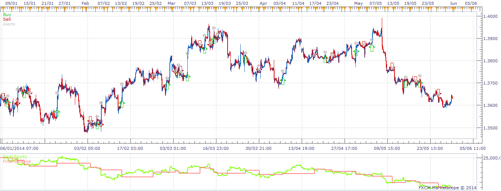

# Power move Strategy

> Source: https://fxcodebase.com/code/viewtopic.php?f=31&t=60752  
> Forum: 31 · Topic 60752 · 7 post(s)

---

## Power move Strategy

**moomoofx** · Sun Jun 01, 2014 4:50 am

Hi,

As requested here: [viewtopic.php?f=27&t=60269](https://fxcodebase.com/code/viewtopic.php?f=27&t=60269)

 

Added an additional parameter 'Check Closed Bar' to toggle if it should check the bar direction for the current bar or the previous (closed) bar.

Cheers,
MooMooFX

The Strategy was revised and updated on December 11, 2018.

---

## Re: Power move Strategy

**poriyavt** · Mon Dec 08, 2014 2:41 am

Hello Sir

 Can You Make same indicator OVERLAY on Candle plz

Regards

---

## Re: Power move Strategy

**moomoofx** · Mon Dec 08, 2014 3:13 am

Sorry I don't understand.

This is a strategy not an indicator. It doesn't draw anything.

Regards,
MMFX

---

## Re: Power move Strategy

**Apprentice** · Mon Dec 08, 2014 3:17 am

U can use MA position Overlay.lua
[viewtopic.php?f=17&t=61569](https://fxcodebase.com/code/viewtopic.php?f=17&t=61569)

Green
MA1> MA2 and MA2> MA3
Red
MA1< MA2 and MA2< MA3

---

## Re: Power move Strategy

**poriyavt** · Mon Dec 08, 2014 3:25 am

Hi

 Both Calculation Are Different But I want Same Indicator But In Your Format I Checked In Back-test
In Your Calculation Show Profit And MA POSITION Show Loss

---

## Re: Power move Strategy

**Apprentice** · Tue Dec 09, 2014 4:55 am

3 EMA is above 7 EMA
7 EMA is above 50 EMA

Same as
MA1> MA2
MA2> MA3

You need to change the MA periods.

---

## Re: Power move Strategy

**Apprentice** · Sun Dec 11, 2016 12:38 pm

Strategy was revised and updated.
