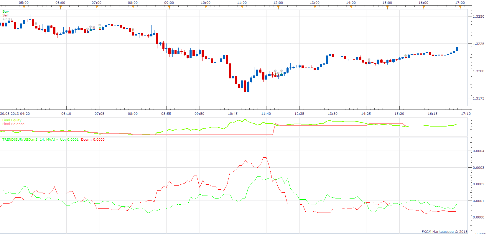

# Prevailing Trend Strategy

> Source: https://fxcodebase.com/code/viewtopic.php?f=31&t=59426  
> Forum: 31 · Topic 59426 · 11 post(s)

---

## Prevailing Trend Strategy

**Apprentice** · Sun Sep 08, 2013 5:06 am

Long Position
Up/Down Line CrossOver
Short Position
Up/Down Line CrossUnder

 [Prevailing Trend Strategy.lua](files/89256/Prevailing%20Trend%20Strategy.lua)

Please install Prevailing Trend indicator
[viewtopic.php?f=17&t=59402&p=89183#p89183](https://fxcodebase.com/code/viewtopic.php?f=17&t=59402&p=89183#p89183)

---

## Re: Prevailing Trend Strategy

**speakinmymind** · Sun Sep 08, 2013 8:49 am

Could you please add period distance between orders and period distance after cross for optimal entry?

Thanks

---

## Re: Prevailing Trend Strategy

**Apprentice** · Mon Sep 09, 2013 2:08 am

Your request is added to the development list.

---

## Re: Prevailing Trend Strategy

**speakinmymind** · Tue Nov 05, 2013 10:18 pm

Along with the distance between orders, can you please update this strategy to allow for trade execution at the cross of the difference line as well?

Thanks!

---

## Re: Prevailing Trend Strategy

**Apprentice** · Wed Jan 24, 2018 9:11 am

The strategy was revised and updated.

---

## Re: Prevailing Trend Strategy

**AEKARAOLE** · Mon Jun 24, 2019 4:04 am

Hi apprentice,

Can you add the following options to this strategy:
Entry and exit: Live/ end of turn
Use break even
Trailing after break even

Thank you

---

## Re: Prevailing Trend Strategy

**Apprentice** · Sun Jun 30, 2019 6:12 pm

Your request is added to the development list under Id Number 4760

---

## Re: Prevailing Trend Strategy

**Apprentice** · Mon Jul 01, 2019 12:37 pm

Try it now.

---

## Re: Prevailing Trend Strategy

**AEKARAOLE** · Mon Jul 01, 2019 4:06 pm

Hi apprentice,

i do not see where is the difference in strategy? The new options does not seems to have added.

Thank you

---

## Re: Prevailing Trend Strategy

**Apprentice** · Sun Jul 14, 2019 5:00 am

It should be there.
Check it on a different computer or browser,
old file has been probably saved in your browser buffer.

---

## Re: Prevailing Trend Strategy

**AEKARAOLE** · Sun Jul 14, 2019 5:48 am

it' s ok now.

thank you
