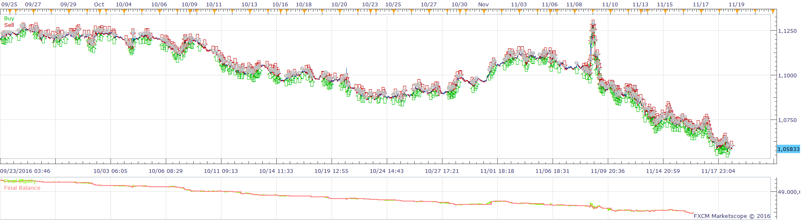
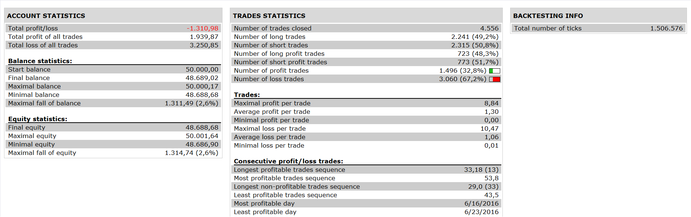

# Previous Bar Closing Entry Strategy

> Source: https://fxcodebase.com/code/viewtopic.php?f=31&t=64166  
> Forum: 31 · Topic 64166 · 1 post(s)

---

## Previous Bar Closing Entry Strategy

**Apprentice** · Fri Dec 02, 2016 7:00 am

 

Open Long
Previous bar close higher than open price
Current bar close is Delta Pips above the previous bar close
Vice versa for short.

 [Previous Bar Closing Entry Strategy.lua](files/109383/Previous%20Bar%20Closing%20Entry%20Strategy.lua)

The Strategy was revised and updated on November 19, 2018.
