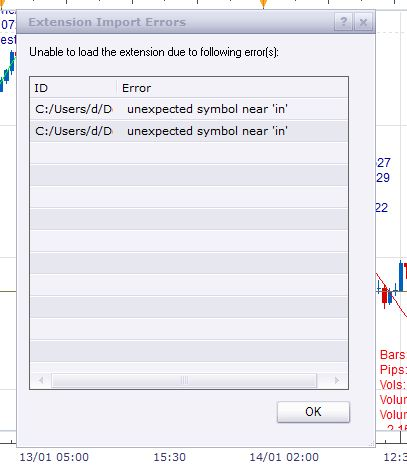

# Price action strategy

> Source: https://fxcodebase.com/code/viewtopic.php?f=31&t=62109  
> Forum: 31 · Topic 62109 · 12 post(s)

---

## Price action strategy

**Apprentice** · Tue Apr 14, 2015 12:44 pm

[price_action_strategy.lua](files/99799/price_action_strategy.lua)

Based on request.
[viewtopic.php?f=27&t=62041](https://fxcodebase.com/code/viewtopic.php?f=27&t=62041)

The Strategy was revised and updated on December 18, 2018.

---

## Re: Price action strategy

**daniel.kovacik** · Wed Apr 15, 2015 12:30 pm

Hello,

**first of all, thank you very much for your effort. This strategy really looks awesome.**

**I have found some bugs:**
- strategy doesnt open positions everytime on close of candles on lower timeframes (when we have active postion, strategy will stop open another positions...
-------------------------------------------------------------------------------------------------------------------
- risk calculation isnt very good (different amount of pips but same size of position) example: if risk is 1% it cant have same size for 100 pips and 50 pips (short and long position in this case)
-------------------------------------------------------------------------------------------------------------------
- definitely there is needed trailing stop after breakeven which will trigger when SL and profit is 1:x for short and long positions.
-------------------------------------------------------------------------------------------------------------------
- could you add moving average which will change risk per long and short positions. Example: if close is above moving average there will be higher risk per long position and lower risk per short positions.
-------------------------------------------------------------------------------------------------------------------
- also possibility to have fixed profit for positons according to SL (1:x) per short and long positions... but better partial sell with at least 2 TP's for short or long positions
-------------------------------------------------------------------------------------------------------------------
- this breakeven seems to be inefficient on lower timeframes and for scalping (so, if possible another modification wehre will breakeven always cover commisional fees for long and short postions) if there will be volatility we can definitely find window for opportunity to get profit...
**But also please let the old breakeven rules possible for higher timeframes**
-------------------------------------------------------------------------------------------------------------------
**So, definitely this strategy need more parameters... but this is a good beginning...**
- risk per short and long postion according to moving average or other trend direction identifier
- limit orders (parital sell) for short and long positions (example: if close of candle is above moving average we definitely dont want hold short positons longer than long positions)... according to SL (1:x) (loss:profit)
- trigger for trailing stop after breakeven according to SL (1:x) for short and long position when close is above or below moving average. Or without considering of moving average.

Thanks
Regards,
DK

---

## Re: Price action strategy

**Stance** · Mon Aug 17, 2015 4:50 pm

Hi,

I'm getting this error when trying to run this strategy.

"...ks\FXTS2\Strategies\Custom\price_action_strategy.lua:200: attempt to index local 'sell_position' (a nil value)"

---

## Re: Price action strategy

**Apprentice** · Thu Aug 27, 2015 2:18 am

Updeted.

---

## Re: Price action strategy

**dandee** · Tue Jan 12, 2016 9:40 am

> **Apprentice wrote:**
> Updeted.

I tried this program and got this error "C:/Program Files (x86)/Candleworks/FXTS2/Strategies/Custom/price_action_strategy.lua:107: attempt to index field 'close' (a nil value)" trading station version 01.14.112415

---

## Re: Price action strategy

**dandee** · Tue Jan 12, 2016 9:51 am

this strategy has a few bugs in there, If I run the program with the option to trade set to no it still opens positions, see attachment

---

## Re: Price action strategy

**Apprentice** · Wed Jan 13, 2016 2:48 pm

Will fix this by the end of the week.

---

## Re: Price action strategy

**Apprentice** · Sun Jan 17, 2016 6:49 am

Try it now.

---

## Re: Price action strategy

**dandee** · Sun Jan 17, 2016 5:45 pm

> **Apprentice wrote:**
> Try it now.

I cant get it to load, I get an error "unexpected symbol near 'in'"

---

## Re: Price action strategy

**Apprentice** · Wed Jan 20, 2016 6:40 am

Fixed.

---

## Re: Price action strategy

**lancelune** · Thu Jan 21, 2016 5:19 am

This is an alternative.
Amount is equal each side, include Limit, and trailing stop.
To create Stop order the price must move at the price where the loss is null (this include Interest and Commission). You can add a distance to don't be Stop quickly.
Before that, the Stop is made by close market order.
I think the code must be optimize because Close market order is a little slow.

What is your advice Apprentice ?

---

## Re: Price action strategy

**Apprentice** · Wed Dec 14, 2016 5:04 am

Strategy was revised and updated.
