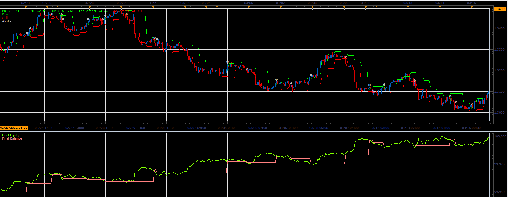

# Price extreme strategy

> Source: https://fxcodebase.com/code/viewtopic.php?f=31&t=18865  
> Forum: 31 · Topic 18865 · 2 post(s)

---

## Price extreme strategy

**Alexander.Gettinger** · Mon May 21, 2012 3:19 pm

Strategy based on Price extreme indicator ([viewtopic.php?f=17&t=18852](https://fxcodebase.com/code/viewtopic.php?f=17&t=18852)).

Orders open/close at the intersection of price (close or high/low) and border of indicator.

 

Download strategy:

 [Price_Extreme_Strategy.lua](files/33689/Price_Extreme_Strategy.lua)

For strategy must be installed Price extreme indicator ([viewtopic.php?f=17&t=18852](https://fxcodebase.com/code/viewtopic.php?f=17&t=18852)).

---

## Re: Price extreme strategy

**Apprentice** · Mon Dec 05, 2016 5:14 am

Bump up.
