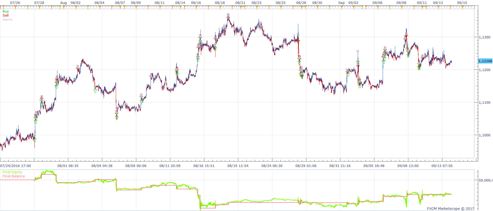
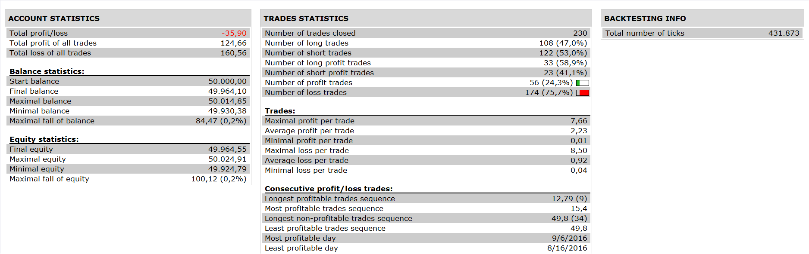

# Price MA Cross Strategy with sideways market filter

> Source: https://fxcodebase.com/code/viewtopic.php?f=31&t=64331  
> Forum: 31 · Topic 64331 · 2 post(s)

---

## Price MA Cross Strategy with sideways market filter

**Apprentice** · Wed Jan 25, 2017 6:04 am

 

Open Long
Price / MA CrossOver
Open Short
Price / MA CrossUnder

Trade only if
sideways market filter > Top Level
or sideways market filter< Bottom Level

 [Price MA Cross Strategy with sideways market filter.lua](files/110692/Price%20MA%20Cross%20Strategy%20with%20sideways%20market%20filter.lua)

Sideways Market Filter.lua is available here.
[viewtopic.php?f=17&t=64325&p=110676#p110676](https://fxcodebase.com/code/viewtopic.php?f=17&t=64325&p=110676#p110676)

---

## Re: Price MA Cross Strategy with sideways market filter

**Apprentice** · Mon Jan 22, 2018 8:50 am

The strategy was revised and updated.
