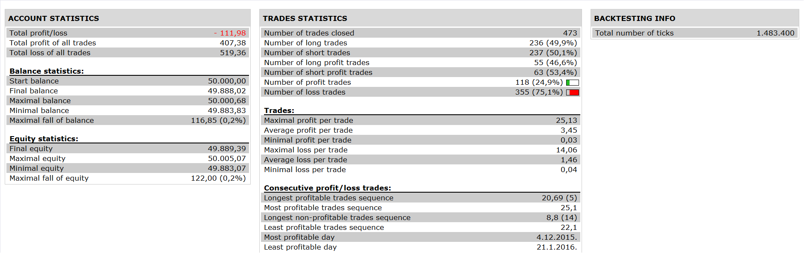

# Price MA Cross with Disparity Index Confirmation Strategy

> Source: https://fxcodebase.com/code/viewtopic.php?f=31&t=63393  
> Forum: 31 · Topic 63393 · 5 post(s)

---

## Price MA Cross with Disparity Index Confirmation Strategy

**Apprentice** · Tue Apr 19, 2016 5:06 am

Based on request.
[viewtopic.php?f=27&t=63391&p=105859#p105859](https://fxcodebase.com/code/viewtopic.php?f=27&t=63391&p=105859#p105859)
Open Long
Close CrossOver MA1
Close > MA2
Open Short
Close CrossUnder MA1
Close < MA2

Exit (Optinal)
EXIT LONG when MA2 (Disparity line) crosses under "0".
EXIT SHORTwhen MA2 (Disparity line) crosses over "0".

 

 [Price MA Cross with Disparity Index Confirmation Strategy.lua](files/105858/Price%20MA%20Cross%20with%20Disparity%20Index%20Confirmation%20Strategy.lua)

---

## Re: Price MA Cross with Disparity Index Confirmation Strateg

**jaricarr** · Tue Sep 13, 2016 11:11 pm

Hi Apprentice,
Can you please add this Exit logic.

EXIT LONG when MA2 (Disparity line) crosses under "0".
EXIT SHORTwhen MA2 (Disparity line) crosses over "0".

---

## Re: Price MA Cross with Disparity Index Confirmation Strateg

**Apprentice** · Thu Sep 15, 2016 5:44 am

Exit Logic Added.

---

## Re: Price MA Cross with Disparity Index Confirmation Strateg

**jaricarr** · Thu Sep 22, 2016 8:18 pm

Many thanks Apprentice,

Is it possible to make a new strategy using the ADX and Disparity Index please
(Disparity Index with ADX confirmation).
The Disparity Index would be the directional and exit indicator and the ADX would trigger the trade.

LONG:
DI is above "0" (adjustable level)
ADX is above "20" (adjustable level)

SHORT:
DI is below "0" (adjustable level)
ADX is above "20" (adjustable level)

EXIT LONG: DI crosses under "0"
EXIT SHORT: DI crosses over "0"

---

## Re: Price MA Cross with Disparity Index Confirmation Strateg

**Apprentice** · Mon Jan 22, 2018 8:48 am

The strategy was revised and updated.
