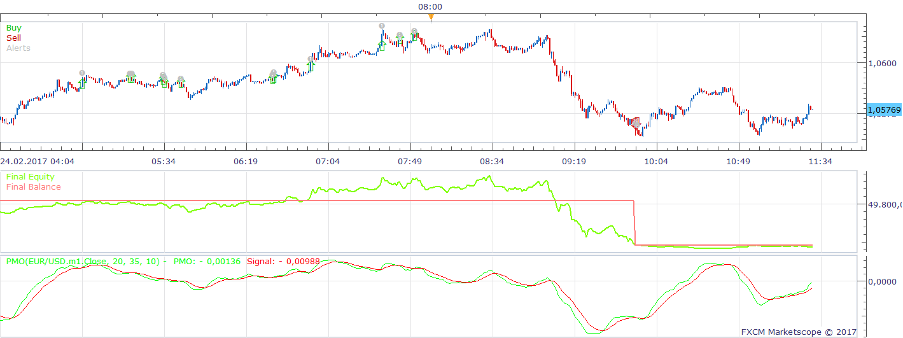
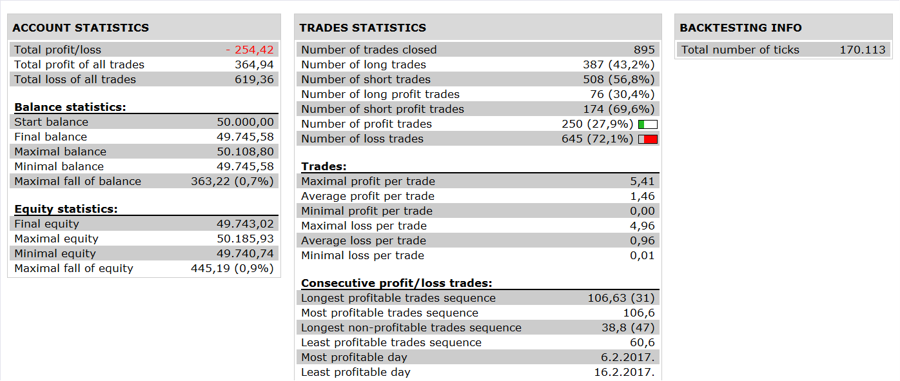

# Price Momentum Oscillator Strategy

> Source: https://fxcodebase.com/code/viewtopic.php?f=31&t=65039  
> Forum: 31 · Topic 65039 · 1 post(s)

---

## Price Momentum Oscillator Strategy

**Apprentice** · Wed Aug 30, 2017 6:38 am

 

Based on PMO.lua
[viewtopic.php?f=17&t=61209](https://fxcodebase.com/code/viewtopic.php?f=17&t=61209)

buy level:0
sell level:0

buy : signal>buy level and pmo cross over signal
sell: signal< sell level and pmo cross under signal.

 [Price Momentum Oscillator Strategy.lua](files/114568/Price%20Momentum%20Oscillator%20Strategy.lua)

The Strategy was revised and updated on January 21, 2019.
