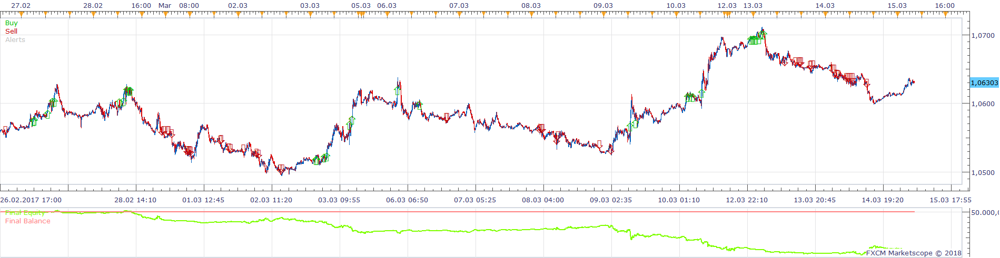
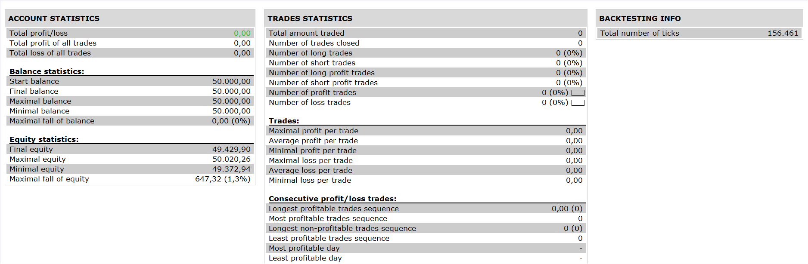

# Pullback strategy

> Source: https://fxcodebase.com/code/viewtopic.php?f=31&t=65822  
> Forum: 31 · Topic 65822 · 4 post(s)

---

## Pullback strategy

**Apprentice** · Sun Mar 11, 2018 5:40 am

 

Based on the request.
 [viewtopic.php?f=27&t=65809](https://fxcodebase.com/code/viewtopic.php?f=27&t=65809)

 [Pullback strategy.lua](files/118133/Pullback%20strategy.lua)

---

## Re: Pullback strategy

**fxcyberman** · Wed May 09, 2018 2:09 pm

would you kindly add the options MaxNumberOfPositionInAnyDirection and MaxNumberOfPosition ) please.

---

## Re: Pullback strategy

**Apprentice** · Fri May 18, 2018 6:10 am

Your request is added to the development list under Id Number 4146

---

## Re: Pullback strategy

**Apprentice** · Sun May 20, 2018 11:31 am

Try this version.

 [Pullback strategy.lua](files/119313/Pullback%20strategy.lua)
