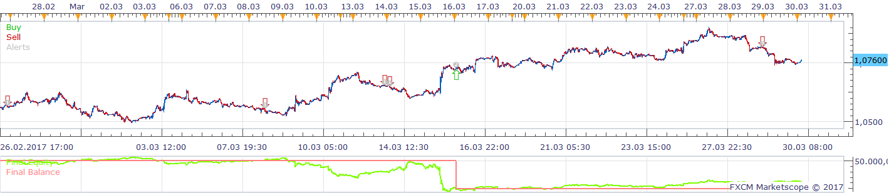
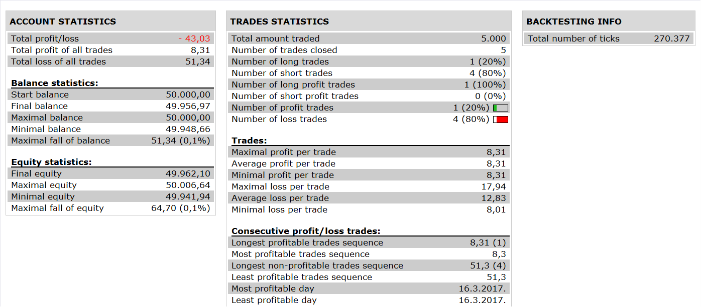

# QQE CCI STRATEGY

> Source: https://fxcodebase.com/code/viewtopic.php?f=31&t=65378  
> Forum: 31 · Topic 65378 · 3 post(s)

---

## QQE CCI STRATEGY

**Apprentice** · Sun Nov 19, 2017 5:11 pm

 

Based on the request.
[viewtopic.php?f=27&t=65374](https://fxcodebase.com/code/viewtopic.php?f=27&t=65374)

BUY:

1.TS SLOW > BUY LEVEL AND QQE > TS FAST AND TS FAST > TS SLOW
2. ZIG ZAG ==DOWN
3. CCI CROSS OVER BUY LEVEL

SELL:
1. TS SLOW < SELL LEVEL AND QQE < TS FAST AND TS FAST < TS SLOW
2.ZIG ZAG == UP
3. CCI CROSS UNDER SELL LEVEL

 [QQE CCI STRATEGY.lua](files/116117/QQE%20CCI%20STRATEGY.lua)

QQE is available here.
[viewtopic.php?f=17&t=1347&hilit=QQE](https://fxcodebase.com/code/viewtopic.php?f=17&t=1347&hilit=QQE)

The Strategy was revised and updated on January 21, 2019.

---

## Re: QQE CCI STRATEGY

**transformer** · Tue Nov 21, 2017 12:38 pm

hi apprendice,

i am getting following error:

AUD/CAD	QQE CCI STRATEGY, AUD/CAD, QQECCIS	C:/Program Files/Candleworks/FXTS2/strategies/standard/include/helperAlert.lua:86: attempt to index local 'source' (a nil value)	11/21/2017 10:40:00

---

## Re: QQE CCI STRATEGY

**Apprentice** · Wed Nov 22, 2017 6:27 am

Hmm helperAlert.lua line 86 suggests the use of ExtSignal function.
ExtSignal is NOT used in QQE CCI STRATEGY.lua or QQE.lua
