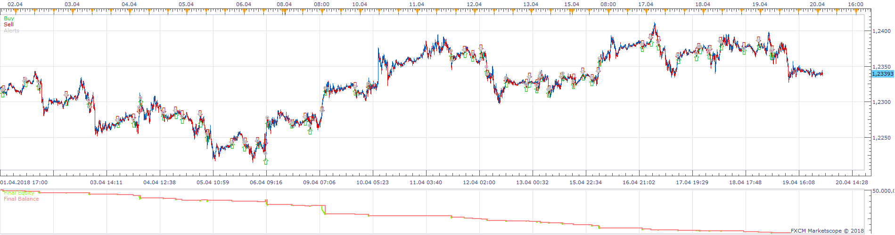
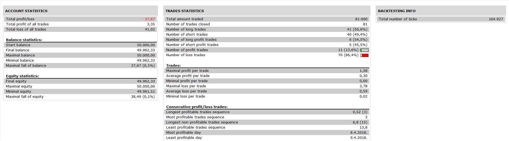

# Quantum Donchian Channel Strategy.chai88888

> Source: https://fxcodebase.com/code/viewtopic.php?f=31&t=67010  
> Forum: 31 · Topic 67010 · 21 post(s)

---

## Quantum Donchian Channel Strategy.chai88888

**Apprentice** · Mon Nov 26, 2018 6:00 am

 

Based on request.
[viewtopic.php?f=28&t=66943](https://fxcodebase.com/code/viewtopic.php?f=28&t=66943)

 [Quantum Donchian Channel Strategy.chai88888.lua](files/122356/Quantum%20Donchian%20Channel%20Strategy.chai88888.lua)

Indicator used.
DNC.lua
[viewtopic.php?f=17&t=20](https://fxcodebase.com/code/viewtopic.php?f=17&t=20)
Quantum.lua
[viewtopic.php?f=17&t=62888](https://fxcodebase.com/code/viewtopic.php?f=17&t=62888)

---

## Re: Quantum Donchian Channel Strategy.chai88888

**chai88888** · Mon Nov 26, 2018 1:06 pm

thanks apprentice

but another problem i encounter with this is that when the strategy already take a number of position then i enter a position manually. the strategy will only close what he open. meaning not all position will be close

can you do close all position regardless when i add a position manually.

thanks

---

## Re: Quantum Donchian Channel Strategy.chai88888

**Apprentice** · Wed Nov 28, 2018 5:34 am

This isolation is usually considered a good thing.
You should consider using other strategies to control other positions.
Will include this functionality in future versions and templates.

---

## Re: Quantum Donchian Channel Strategy.chai88888

**chai88888** · Tue Dec 11, 2018 6:06 am

the lot lot size wont reset on the open of the opposite position...

example
the last open position is long with 5k lot and close on the opposite the short will open with 5k lot it should open on the initial lot size

---

## Re: Quantum Donchian Channel Strategy.chai88888

**Apprentice** · Thu Dec 20, 2018 2:08 pm

Try it now.

---

## Re: Quantum Donchian Channel Strategy.chai88888

**chai88888** · Wed Jan 09, 2019 8:24 am

why is that... when the strategy already running and taking trades.. and somehow i want to change the parameters the strategy wont take any trades.

example i set the quantum to 100 and the dnc also 100 and already has taken open position and in between i want to change it to 200. and run it again but now it wont take trades...

thanks

---

## Re: Quantum Donchian Channel Strategy.chai88888

**Daveatt** · Mon Jan 21, 2019 12:50 pm

Hi

I think we can't run strategies with parameters > 200 by design
I had the same issue with other strategies based on MACD, EMA etc.

---

## Re: Quantum Donchian Channel Strategy.chai88888

**chai88888** · Thu Jan 24, 2019 12:34 pm

hi apprentice

can you add a Multi time frame for this

example my entry is at m15 and exit at m30

thanks

---

## Re: Quantum Donchian Channel Strategy.chai88888

**chai88888** · Sun Feb 03, 2019 12:40 am

hi there

is there a strategy that put my stop loss on one price

example

if may first trade is 100 pips stop loss and my second trade will place the stop loss on the first stop loss third trade stop loss will put at the price of the first stop loss so on....

basically all trades will have the same stop loss base on the first trade stop loss

thanks

---

## Re: Quantum Donchian Channel Strategy.chai88888

**Apprentice** · Fri Feb 08, 2019 6:27 am

Your request is added to the development list under Id Number 4464

> is there a strategy that put my stop loss on one price

Can you provide complete strategy logic?

---

## Re: Quantum Donchian Channel Strategy.chai88888

**Apprentice** · Sat Feb 09, 2019 4:54 am

[Quantum Donchian Channel Strategy.chai88888.v4.lua](files/123798/Quantum%20Donchian%20Channel%20Strategy.chai88888.v4.lua)

Try this version.

---

## Re: Quantum Donchian Channel Strategy.chai88888

**chai88888** · Fri Feb 15, 2019 1:49 pm

dear apprentice

thanks for all efforts.

can you add an option where if a run the strategy. what first side it takes that the only side it will take..

for example i run the strategy not knowing what side it will take. then it take the sell side, the strategy will only take sell side and close the opposite position it will not take the buy.

thanks

---

## Re: Quantum Donchian Channel Strategy.chai88888

**Apprentice** · Sun Feb 17, 2019 8:08 am

Your request is added to the development list under Id Number 4484

---

## Re: Quantum Donchian Channel Strategy.chai88888

**Apprentice** · Mon Feb 18, 2019 5:52 am

Try this version.

 [Quantum Donchian Channel Strategy.chai88888.v5.lua](files/123982/Quantum%20Donchian%20Channel%20Strategy.chai88888.v5.lua)

---

## Re: Quantum Donchian Channel Strategy.chai88888

**chai88888** · Thu Nov 28, 2019 5:09 am

hi there

can you make instead of taking trade on every signal. it only take a trade on X amount of pips.

example it take a trade on the first signal the second trade should be a X distance in pips before the next trade.

thanks

---

## Re: Quantum Donchian Channel Strategy.chai88888

**Apprentice** · Fri Dec 13, 2019 1:40 pm

Your request is added to the development list.
Development reference 439.

---

## Re: Quantum Donchian Channel Strategy.chai88888

**Apprentice** · Mon Dec 16, 2019 6:52 am

[Quantum_Donchian_Channel_Strategy.chai88888.lua](files/130290/Quantum_Donchian_Channel_Strategy.chai88888.lua)

Try this version.

---

## Re: Quantum Donchian Channel Strategy.chai88888

**chai88888** · Mon Dec 16, 2019 9:57 pm

thanks apprentice

---

## Re: Quantum Donchian Channel Strategy.chai88888

**chai88888** · Sun Jan 05, 2020 11:35 am

hi there apprentice

can you add option if the all net long price line hits the upper line of the DNC it will close all trades

vice versa

thanks again apprentice

---

## Re: Quantum Donchian Channel Strategy.chai88888

**Apprentice** · Tue Jan 07, 2020 8:35 am

Your request is added to the development list.
Development reference 528.

---

## Re: Quantum Donchian Channel Strategy.chai88888

**Apprentice** · Wed Jan 08, 2020 6:56 am

[Quantum_Donchian_Channel_Strategy.chai88888.lua](files/130629/Quantum_Donchian_Channel_Strategy.chai88888.lua)

Try this version.
