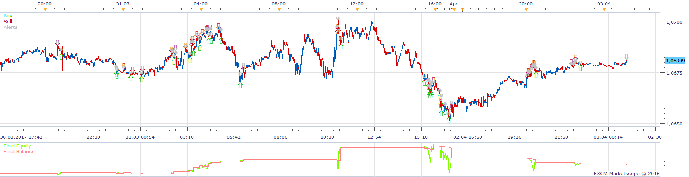
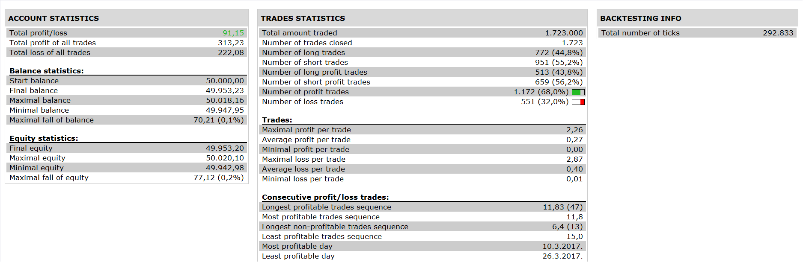
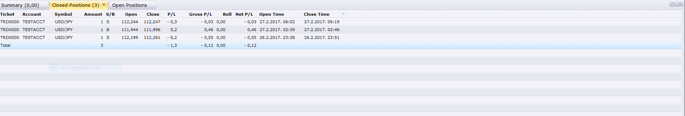

# Quantum Donchian Channel Strategy

> Source: https://fxcodebase.com/code/viewtopic.php?f=31&t=65964  
> Forum: 31 · Topic 65964 · 27 post(s)

---

## Quantum Donchian Channel Strategy

**Apprentice** · Wed Apr 25, 2018 3:41 pm

 

Open Long
Close < DNC Central Line
Up Quantum
Exit Long
Close > DNC Central Line

Vice Versa for Short.

 [Quantum Donchian Channel Strategy.lua](files/118821/Quantum%20Donchian%20Channel%20Strategy.lua)

DNC.lua is available here.
[viewtopic.php?f=17&t=20](https://fxcodebase.com/code/viewtopic.php?f=17&t=20)

Quantum.lua is available here.
[viewtopic.php?f=17&t=62888](https://fxcodebase.com/code/viewtopic.php?f=17&t=62888)

---

## Re: Quantum Donchian Channel Strategy

**chai88888** · Thu Apr 26, 2018 2:49 am

THANKS !!!!! great work

can you please add an option for exit on center line or the upper and lower line of the dnc?

many thanks again

---

## Re: Quantum Donchian Channel Strategy

**Apprentice** · Thu Apr 26, 2018 5:06 am

[Quantum Donchian Channel Strategy.lua](files/118826/Quantum%20Donchian%20Channel%20Strategy.lua)

Try this version.

If Central in NOT used we will have
Exit Long
Close > DNC Top Line

Vice versa for Short

---

## Re: Quantum Donchian Channel Strategy

**chai88888** · Fri Apr 27, 2018 1:32 am

hi there why its that its not opening a trade in any direction?
allow it to trade is already yes and the time duration is correct.

---

## Re: Quantum Donchian Channel Strategy

**chai88888** · Fri Apr 27, 2018 4:45 am

can you explain to the difference of the convert to date to

est
local
display
finincial
server
utc

thanks

---

## Re: Quantum Donchian Channel Strategy

**chai88888** · Fri Apr 27, 2018 4:48 am

its normal for the strategy to stop working when i edit something?

thats what i noticed its running ok then when i edit something it will stop working

---

## Re: Quantum Donchian Channel Strategy

**chai88888** · Fri Apr 27, 2018 8:10 am

im running it on a 1min chart on usd jpy and its not running

---

## Re: Quantum Donchian Channel Strategy

**chai88888** · Fri Apr 27, 2018 8:11 am

here the setting dont know if somethings wrong

---

## Re: Quantum Donchian Channel Strategy

**chai88888** · Fri Apr 27, 2018 1:49 pm

trying to backtest nothing happen

---

## Re: Quantum Donchian Channel Strategy

**Apprentice** · Fri May 18, 2018 5:45 am

Trades simulated in simulation mode.

---

## Re: Quantum Donchian Channel Strategy

**chai88888** · Fri May 18, 2018 9:41 pm

hi thanks for testing it. appreciate it

can you edit the execution of trades. only take a trade if the quantum is higher on the previous end of turn, and vice versa

thanks

---

## Re: Quantum Donchian Channel Strategy

**chai88888** · Thu Jun 14, 2018 2:03 pm

dear apprentice

can you an option for the quantum buy or sell on the break out of the upper band

because right now its sell only on the break out of the upper band

its nice to have an option to choose buy or sell

many thanks

---

## Re: Quantum Donchian Channel Strategy

**chai88888** · Thu Jun 14, 2018 7:52 pm

my bad did not notice the type of signal

sorry

---

## Re: Quantum Donchian Channel Strategy

**chai88888** · Wed Aug 08, 2018 4:29 am

hi apprentice

thanks for all effort you put in but
can you edit the execution of trades. only take a trade if the quantum is higher on the previous end of turn, and vice versa

thanks

---

## Re: Quantum Donchian Channel Strategy

**Apprentice** · Sat Aug 11, 2018 5:13 am

quantum is higher on the previous end of turn **close**, and vice versa?
Or?

---

## Re: Quantum Donchian Channel Strategy

**chai88888** · Sun Aug 12, 2018 7:15 pm

yes apprentice

only open a trade if the latest candle end of turn close is higher of the previous candle high and vice versa

thanks

---

## Re: Quantum Donchian Channel Strategy

**chai88888** · Wed Aug 15, 2018 7:57 pm

heres a another sample thanks cheers

---

## Re: Quantum Donchian Channel Strategy

**Apprentice** · Tue Aug 21, 2018 7:00 am

Try this version.

 [Quantum Donchian Channel Strategy.chai88888.lua](files/120722/Quantum%20Donchian%20Channel%20Strategy.chai88888.lua)

---

## Re: Quantum Donchian Channel Strategy

**chai88888** · Tue Aug 21, 2018 9:32 am

hi apprentice thanks for the effort but i notice that when i test run it it only take the first trade it will not follow up a another trade higher or lower of the previous candle end of turn close that has quantum signal

cheers thanks

---

## Re: Quantum Donchian Channel Strategy

**chai88888** · Tue Aug 21, 2018 10:58 pm

and apprentice i notice that when i put the exit type to LIVE the strategy wont work. exit on the center line

thanks

---

## Re: Quantum Donchian Channel Strategy

**chai88888** · Mon Aug 27, 2018 12:03 pm

hi apprentice can you test the latest version it seems mine wont work it only take the first trade i already set the reversal to NO.. thanks

---

## Re: Quantum Donchian Channel Strategy

**chai88888** · Tue Sep 11, 2018 8:29 pm

bump up

---

## Re: Quantum Donchian Channel Strategy

**Apprentice** · Thu Sep 27, 2018 2:56 am

Can you please post strategy version used?

---

## Re: Quantum Donchian Channel Strategy

**chai88888** · Thu Sep 27, 2018 9:15 pm

Try this version.
 Quantum Donchian Channel Strategy.chai88888.lua
(35.05 KiB) Downloaded 56 times

---

## Re: Quantum Donchian Channel Strategy

**chai88888** · Mon Oct 15, 2018 11:27 am

bump

---

## Re: Quantum Donchian Channel Strategy

**Apprentice** · Fri Oct 26, 2018 5:12 am

Will re-view the code.
I have multiple positions in the backtester, truth sporadic.

---

## Re: Quantum Donchian Channel Strategy

**Apprentice** · Wed Nov 07, 2018 6:05 am

I think we figure out what you have asked. We have changed the logic.

 [Quantum Donchian Channel Strategy.chai88888.lua](files/121989/Quantum%20Donchian%20Channel%20Strategy.chai88888.lua)
