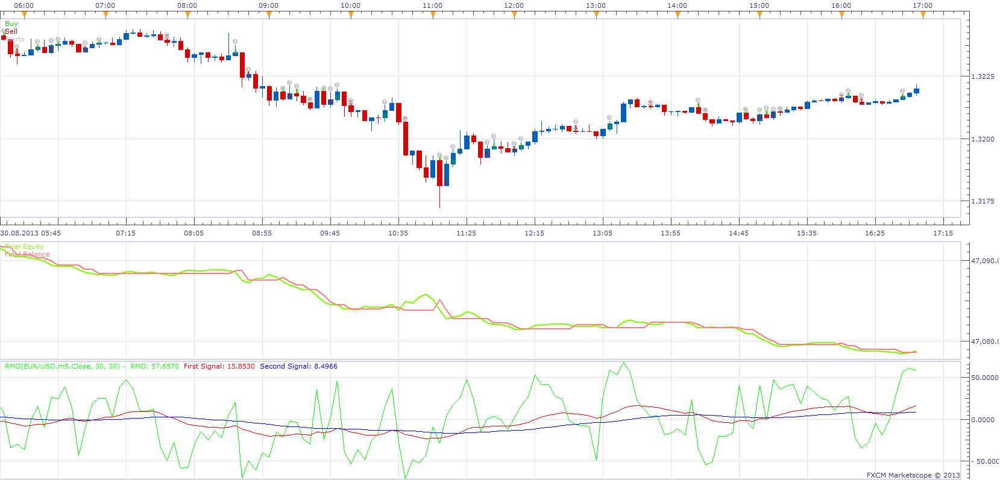

# Rahul Mohindar Oscillator Strategy

> Source: https://fxcodebase.com/code/viewtopic.php?f=31&t=59451  
> Forum: 31 · Topic 59451 · 2 post(s)

---

## Rahul Mohindar Oscillator Strategy

**Apprentice** · Tue Sep 10, 2013 11:48 am

Although this strategy has Trading functionality,
its primary role is to provide Trading Alerts on RMO / Signal Lines Crossover.

 [Rahul Mohindar Oscillator Strategy.lua](files/89335/Rahul%20Mohindar%20Oscillator%20Strategy.lua)

RMO is available here.
[viewtopic.php?f=17&t=41106&p=67247&hilit=RMO#p67247](https://fxcodebase.com/code/viewtopic.php?f=17&t=41106&p=67247&hilit=RMO#p67247)

---

## Re: Rahul Mohindar Oscillator Strategy

**Apprentice** · Sat Jan 27, 2018 6:09 am

The strategy was revised and updated.
