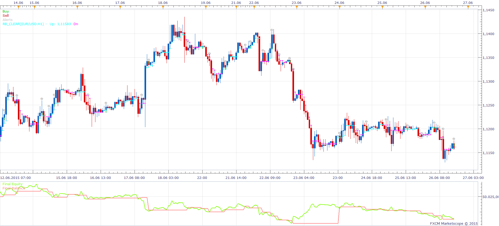

# RB_Clear_Strategy

> Source: https://fxcodebase.com/code/viewtopic.php?f=31&t=62793  
> Forum: 31 · Topic 62793 · 2 post(s)

---

## RB_Clear_Strategy

**Apprentice** · Mon Oct 19, 2015 2:59 am

Based on Ron Black's 'Getting Clear With Short-Term Swings' indicator.
[viewtopic.php?f=17&t=2107](https://fxcodebase.com/code/viewtopic.php?f=17&t=2107)

 [RB_Clear_Strategy.lua](files/102900/RB_Clear_Strategy.lua)

The Strategy was revised and updated on December 18, 2018.

---

## Re: RB_Clear_Strategy

**Apprentice** · Wed Dec 14, 2016 4:10 am

Strategy was revised and updated.
