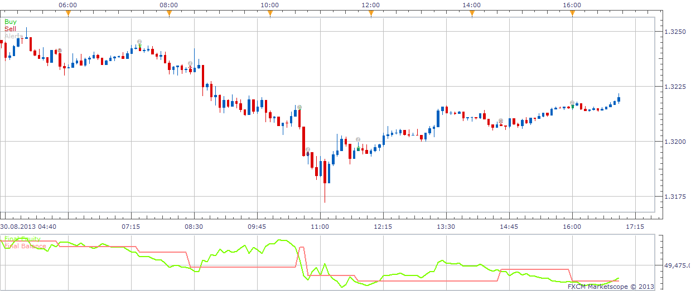

# Regression Strategy

> Source: https://fxcodebase.com/code/viewtopic.php?f=31&t=59570  
> Forum: 31 · Topic 59570 · 6 post(s)

---

## Regression Strategy

**Apprentice** · Wed Sep 25, 2013 3:06 am

Although it is called Regression, in fact, supports other moving averages as well.

Long
 Price/Short MA CrossOver
Price/Long MA CrossOver
Short MA/Long MA CrossOver

Short
 Price/Short MA CrossUnder
Price/Long MA CrossUnder
Short MA/Long MA CrossUnder

Exit Long(Optinal)
 Price/Short MA CrossUnder
Price/Long MA CrossUnder
Price/Exit MA CrossUnder

Exit Short(Optinal)
 Price/Short MA CrossUnder
Price/Long MA CrossUnder
Price/Exit MA CrossUnder

 [Regression Strategy.lua](files/89673/Regression%20Strategy.lua)

---

## Re: Regression Strategy

**4x4partners** · Fri May 08, 2015 8:42 am

Hi Apprentice,

Thanks for this one, really like it.

Might it be possible to add another Exit Long option:
CrossUnder of Fast MA/Exit MA
and Exit Short option:
CrossOver of Fast MA/Exit Ma

Also would be great to have an option for MTF's. So TF for each MA can be user-specified.

Thanks a lot, really appreciate it.

Best
4x4

---

## Re: Regression Strategy

**Apprentice** · Tue May 12, 2015 4:12 am

Your request is added to the development list.

---

## Re: Regression Strategy

**xpertizetrading** · Fri Jul 10, 2015 12:19 am

Is it possible to create a much simpler version of this strategy?

Price CrossOver Regression: Buy
Price CrossOver Regression: Sell

Regression setting: (open,high,low,close)

Thanks and Regards,
Xpertize Trading

---

## Re: Regression Strategy

**Apprentice** · Mon Jul 13, 2015 4:47 am

Try this version.
[viewtopic.php?f=31&t=23741&p=41069&hilit=Regression#p41069](https://fxcodebase.com/code/viewtopic.php?f=31&t=23741&p=41069&hilit=Regression#p41069)

---

## Re: Regression Strategy

**Apprentice** · Mon Jan 15, 2018 8:12 am

The strategy was revised and updated.
