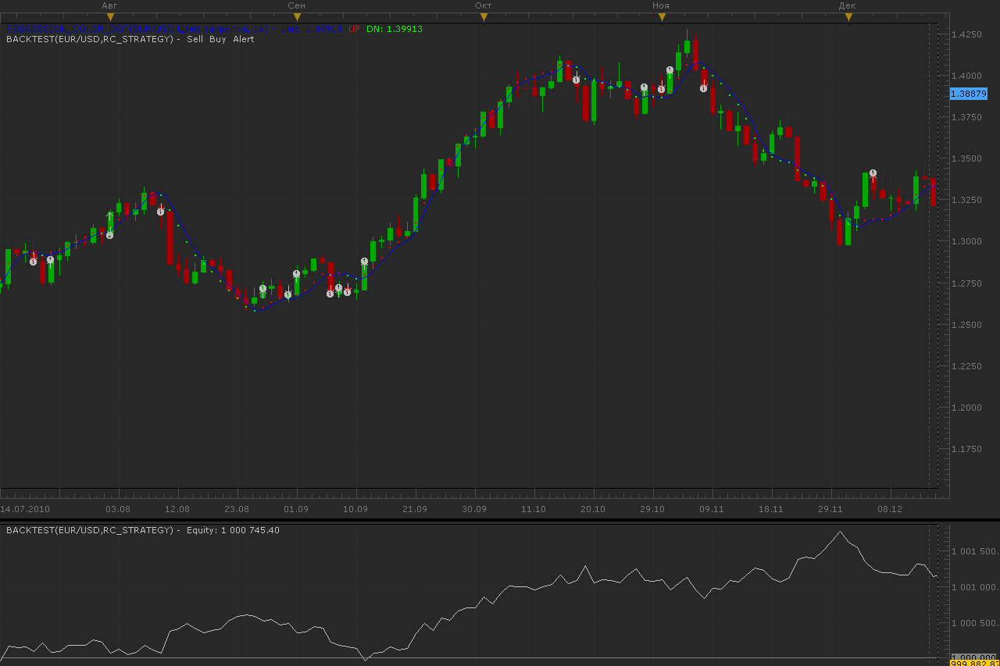

# Regression strategy

> Source: https://fxcodebase.com/code/viewtopic.php?f=31&t=3622  
> Forum: 31 · Topic 3622 · 16 post(s)

---

## Regression strategy

**Alexander.Gettinger** · Wed Mar 09, 2011 4:15 am

Strategy based on Color Regression line ([viewtopic.php?f=17&t=2342](https://fxcodebase.com/code/viewtopic.php?f=17&t=2342)).
Open/close orders at change color.

 

Download:

For strategy must be installed Regression_Color_Dot.lua ([viewtopic.php?f=17&t=2342](https://fxcodebase.com/code/viewtopic.php?f=17&t=2342)).

---

## Re: Regression strategy

**sunshine** · Mon Apr 25, 2011 4:20 am

I've added the "Allowed side" (Both/Sell/Buy) parameter. The top post has been updated.

---

## Re: Regression strategy

**mfoste1** · Mon Apr 25, 2011 8:36 pm

there seems to be a problem with setting stops and limits. I was using this on a demo today and it didnt initiate the stop or limit . Has anyone else tried this with the same result?

---

## Re: Regression strategy

**sunshine** · Tue Apr 26, 2011 9:36 am

Hi,
I've updated the top post. Please reinstall the strategy.

---

## Re: Regression strategy

**mfoste1** · Tue Apr 26, 2011 10:54 am

Unfortunately, im still having problems with this strategy It is not triggering any orders when it should.

---

## Re: Regression strategy

**sunshine** · Tue Apr 26, 2011 2:00 pm

> **mfoste1 wrote:**
> Unfortunately, im still having problems with this strategy It is not triggering any orders when it should.

I've just checked the strategy and for me it creates stops and limits. Could you please make sure that the Allow Trading parameters is set to "Yes"?
Is your account US based?

---

## Re: Regression strategy

**mfoste1** · Tue Apr 26, 2011 6:16 pm

> **sunshine wrote:**
>
>
> > **mfoste1 wrote:**
> > Unfortunately, im still having problems with this strategy It is not triggering any orders when it should.
>
>
> I've just checked the strategy and for me it creates stops and limits. Could you please make sure that the Allow Trading parameters is set to "Yes"?
> Is your account US based?

yea i had it set to yes. So if I had the allowed side to buy only, it should have created a market order long on the candle close when the first dot that changed from blue to white? if this was what it should have done, it failed to trigger 4 trades today. I"m just trying to think of why it wouldn't be triggering orders

yes it is US based account

---

## Re: Regression strategy

**mfoste1** · Wed Apr 27, 2011 12:12 am

i dunno, there must be something wrong with this or fxcm Ive tried everything i can think of, ive even reinstalled the platform. i tried to run other strategies and they work fine. this one just wont open any positions. this is becoming extremely frustrating lol

---

## Re: Regression strategy

**sunshine** · Wed Apr 27, 2011 3:25 am

Hi,
Note that is you have opened at least one position, the strategy won't open positions on the same direction.
I've added exit rules since if the AllowedSide parameter is set to Buy/Sell, the strategy didn't close trades. Please reinstall the strategy.

---

## Re: Regression strategy

**mfoste1** · Wed Apr 27, 2011 7:02 pm

this is triggering orders now, but it is closing positions before they even hit the stop....it shouldnt be doing this. it needs to keep the position open till it either hits the stop or limit. I really appreciate all of your help that youve been giving on this strategy sunshine

---

## Re: Regression strategy

**sunshine** · Thu Apr 28, 2011 8:13 am

Hi Matthew,
I've added the new parameter "Close positions by reversal signal". The default value is "No".
Just leave the parameter as default to close positions by stops/limits only. The top post has been updated.

---

## Re: Regression strategy

**virgilio** · Mon Sep 12, 2011 8:53 pm

I am trying to download the Regression Strategy but I can't find the Regression_Color_Dot.lua file anywhere. The only file available is the Regression_Color.lua

Any help will be appreciated.

---

## Re: Regression strategy

**Apprentice** · Tue Sep 13, 2011 4:30 am

On topmost post you can find whis link.

[viewtopic.php?f=17&t=2342](https://fxcodebase.com/code/viewtopic.php?f=17&t=2342)

Once you are on this page.
Scroll down to find the required indicator.

---

## Re: Regression strategy

**Apprentice** · Fri Dec 02, 2016 7:17 am

Bump up.

---

## Re: Regression strategy

**moneyman** · Wed Apr 05, 2017 4:40 am

Hey...i already set parameter Allow trade-Yes. but on the the marketscope 2.0 dashboard it says trading not allowed. thus wont open any positions, kindly help.

---

## Re: Regression strategy

**Apprentice** · Mon Jan 15, 2018 8:09 am

The strategy was revised and updated.
