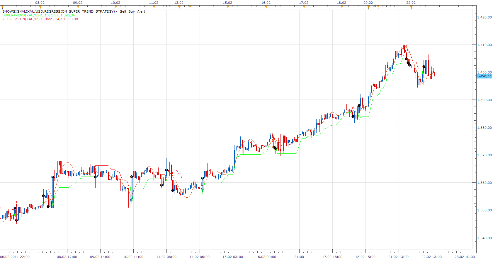

# Regression Super Trend Strategy

> Source: https://fxcodebase.com/code/viewtopic.php?f=31&t=3507  
> Forum: 31 · Topic 3507 · 14 post(s)

---

## Regression Super Trend Strategy

**Apprentice** · Tue Feb 22, 2011 3:24 pm

The signal is generated by crossover of two lines.

 [Regression_Super_Trend_Strategy.lua](files/8362/Regression_Super_Trend_Strategy.lua)

To work download Super Trend Indicator (New Single Stream Version).
[viewtopic.php?f=17&t=605](https://fxcodebase.com/code/viewtopic.php?f=17&t=605)

---

## Re: Regression Super Trend Strategy

**forexdezert** · Tue Mar 01, 2011 11:32 am

Good work here guys!
Could the settings be changed to allow for different user input-able time frames?
(For example - m2?)

---

## Re: Regression Super Trend Strategy

**kstickler** · Tue Mar 01, 2011 7:34 pm

I originall requested this strategy. In applying what has been done, I have noticed that there are some false positives. Can this be eliminated? Also there are instances when the regression line crosses the super trend and no signal is generated. I have several ideas on how to correct. Please advise.

---

## Re: Regression Super Trend Strategy

**forexdezert** · Thu Apr 21, 2011 11:34 am

Please add the following parameters to this strategy:

TF - m2
Act on Close/Break out

Thanks

---

## Re: Regression Super Trend Strategy

**Apprentice** · Thu Apr 21, 2011 2:18 pm

I'm not sure whether I understand your request.
Act, two minutes before the end of Time frame?
Fot if Time frame is 1m?

---

## Re: Regression Super Trend Strategy

**forexdezert** · Thu Apr 21, 2011 3:07 pm

1. Please add the option for the strategy to trade on a 2 minute time frame.

2. Also please add the parameter Option "Act on Close/Break Out" The option determines should the strategy opens new position when candle closes after the two indicators cross, or upon the instant of cross (or breakout). (See the trading parameters of ATRStrategy for example. [http://www.fxcodebase.com/code/viewtopi ... =31&t=3861](http://www.fxcodebase.com/code/viewtopic.php?f=31&t=3861))

Right now when trading on shorter time spans the indicator waits for another candle to close, and by that time it has missed the window of profitability.

---

## Re: Regression Super Trend Strategy

**forexdezert** · Tue Apr 26, 2011 10:24 am

Did the explanation above answer your question.

Will you update this please?

---

## Re: Regression Super Trend Strategy

**bluepip** · Mon Jun 13, 2011 8:11 am

Hello,

Positions are not closed automatically when the Supertrend indicator change direction.

Thanks Bluepip

---

## Re: Regression Super Trend Strategy

**Apprentice** · Mon Jun 13, 2011 12:15 pm

I suppose you use the Allow Multiple Positions in the same direction and Allow Short / Long / Both Positions option.

This is the version with which you should be satisfied.

---

## Re: Regression Super Trend Strategy

**forexdezert** · Tue Jun 14, 2011 8:30 am

Thanks Guys, but for this strategy to work on a short time frame, minute to minute basis the strategy needs to be able to open/close positions instantly when the two indicators cross. Please see below

Please add the option for the strategy to trade on a 2 minute time frame.

2. Also please add the parameter Option "Act on Close/Break Out" The option determines should the strategy opens new position when candle closes after the two indicators cross, or upon the instant of cross (or breakout). (See the trading parameters of ATRStrategy for example. [viewtopi](http://www.fxcodebase.com/code/viewtopi) ... =31&t=3861)

Right now when trading on shorter time spans the indicator waits for a second candle to close, and by that time it has missed the window of profitability.

Thank you.

---

## Re: Regression Super Trend Strategy

**Gregopat** · Sun Sep 25, 2011 10:53 pm

hello apprentice
can you change the super trend indicator by the CCI_trend indicator only in this strategy
thank you so much...

---

## Re: Regression Super Trend Strategy

**Apprentice** · Mon Sep 26, 2011 3:52 pm

The request is added to the developmental cue.

---

## Re: Regression Super Trend Strategy

**Apprentice** · Wed Sep 28, 2011 3:57 am

Requested can be found here.
[viewtopic.php?f=31&t=6910](https://fxcodebase.com/code/viewtopic.php?f=31&t=6910)

---

## Re: Regression Super Trend Strategy

**Apprentice** · Sun Jan 14, 2018 7:23 am

The strategy was revised and updated.
