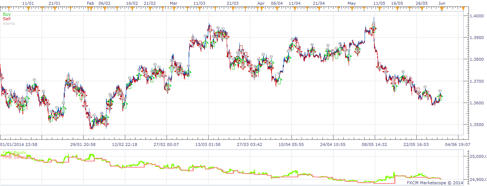

# Renko Bars Strategy

> Source: https://fxcodebase.com/code/viewtopic.php?f=31&t=60750  
> Forum: 31 · Topic 60750 · 43 post(s)

---

## Renko Bars Strategy

**moomoofx** · Sun Jun 01, 2014 4:09 am

Hi all,

A strategy that enters positions when the Renko chart changes direction by 3 bars, originally requested here: [viewtopic.php?f=27&t=27836](https://fxcodebase.com/code/viewtopic.php?f=27&t=27836)

The strategy uses the Renko Chart New view so please make sure this is installed ([viewtopic.php?f=17&t=60748](https://fxcodebase.com/code/viewtopic.php?f=17&t=60748))

 

Strategy contains a parameter called "Number of Bars" that can be used to control how many bars are required for a change of direction. If this value is 1, then a new signal will be generated each time the renko changes direction.

Cheers,
MooMooFX

---

## Re: Renko Bars Strategy

**Ramos04** · Tue Jun 03, 2014 3:31 pm

Thanks moomoofx,
I wish to bother you asking for a favor, am not sure this is the right place to request but I tested your new renko and liked it. Is it possible to do a strategy for the new renko view (interested in its signals) which shows stochastic %k crossing user defined ob & os levels plus %k%d crosses with a user defined ma filter (I use 50 sma), the signal alerts only appear when for e.g in the case of longs, the ma is pointing up and stoch drops to os or %k%d cross to the upside and vice verser for shorts, then when the ma is flat, it alerts for any cross ie ob & os and %k%d.

---

## Re: Renko Bars Strategy

**Apprentice** · Wed Jun 04, 2014 5:14 am

Your request is added to the development list.

---

## Re: Renko Bars Strategy

**7510109079** · Mon Oct 06, 2014 8:44 am

i get the following error msg. Any idea why this is?

---

## Re: Renko Bars Strategy

**7510109079** · Mon Oct 06, 2014 8:49 am

ignore last question. Hadnt properly installed the first part.

Now that the integrated Renko has been around a while would there be any advanttage getting the strategy to work with it?

---

## Re: Renko Bars Strategy

**easytrading** · Mon Oct 13, 2014 9:11 pm

thank u moomoofx for this strategy.the only thing that i have it now is that when u keep the trading station open for more than 5 minutes,it freezed and doesnt generate a new renko bar when the price changed in either directions up or down more than the bar preset brick size (i am using the new view renko indicator as u adviced us ).is it possible to fix that please? with many thanks in advance.cheers.

---

## Re: Renko Bars Strategy

**easytrading** · Sun Oct 19, 2014 5:44 pm

Hi moomoofx,
I'll be so..so..so..grateful if you cauld, re-develop this strategy but with the option to set the timeframe of Renko bars new veiw indicator to different times not only 1m as it is now ,if it is not possible to do that ,could you please re-develop it to 2Hr timeframe,that will be great help to me.
thanks very much for the great job done.cheers

---

## Re: Renko Bars Strategy

**easytrading** · Wed Oct 22, 2014 9:34 pm

hello Apprentice,
could you please fix the error that is exist in (Renko bar new view indicator) that is using the defult timeframe 1min ,but when you change that time period to (say 2H for example) it doesn't work properly and the indicator do not refresh its values to create a new Renko candles that reflect the price action when it goes up or down more than the preset brick size of candle (like 5 pips for example).your help is much much appreciated.

---

## Re: Renko Bars Strategy

**7510109079** · Tue Oct 28, 2014 12:54 pm

easytrading,
your view IS refreshing - it just refreshes every 2 hours! During which time any number of bricks could have formed which are then painted on the chart all at once when a new H2 segment begins.

This is a limitation. If you want live updating you have to use the Mean Renko Bar view and set timeframe to T for Tick

hope this helps

---

## Re: Renko Bars Strategy

**easytrading** · Tue Oct 28, 2014 9:12 pm

thank you 7510109079 for the help .

---

## Re: Renko Bars Strategy

**7510109079** · Mon Nov 03, 2014 4:19 am

no probs

---

## Re: Renko Bars Strategy

**Kyriakos** · Sun Nov 09, 2014 4:36 pm

Hi,

I would like to request, if it is possible, a mod of this strategy so it can run with the mean renko view and therefore to be able to use it in tick charts as it is supposed to be used. Thanks

---

## Re: Renko Bars Strategy

**7510109079** · Mon Nov 10, 2014 5:07 am

thx Kyriakos. I have also put a similar request in for this on this thread:

[viewtopic.php?f=17&t=60743&start=10](https://fxcodebase.com/code/viewtopic.php?f=17&t=60743&start=10)

---

## Re: Renko Bars Strategy

**fxcyberman** · Mon Nov 10, 2014 11:11 am

Is it possible to change the indicator from Renko Chart New to Tick_Renko_Candles.lua used in this strategy ? As Tick Renko Candles is more faster than Renko Chart New.
Thanks in advance.

---

## Re: Renko Bars Strategy

**easytrading** · Mon Nov 10, 2014 3:47 pm

me also very much share my friends "fxcyberman ,7510109079 and Kyriakos" the same request i.e. to replace the indicator used in this strategy from Renko Chart New view to Tick_Renko_Candles.lua which is already exist just bring them to work togather in this strategy and the problem will be solved i mean we guna have a Renko Bars Strategy that supported tick data .and it will be very very useful for all of us (traders in this forum) to benefit from it. we all waiting from our great development team the time in seconds to announce the birth of this new strategy "Renko Bars Strategy with Tick Data".with my much appreciation to our Development team. thank you.

---

## Re: Renko Bars Strategy

**7510109079** · Tue Nov 11, 2014 9:01 am

I agree easytrading, Renko Strategy using Tick data will excel!

---

## Re: Renko Bars Strategy

**fxcyberman** · Wed Nov 19, 2014 1:48 pm

I look forward to the great response from the development team.

---

## Re: Renko Bars Strategy

**davidnwatson** · Fri Jan 23, 2015 10:32 am

Is it possible to add a Trend confirmation to the Renko Bars Strategy? with the option it use it or not.

The following Moving averages options as the trend
 MVA, EWA, LWMA, KAMA, PPMA, SMMA, TMA, VIDYA, and WMA

So if buy renko bar is above the Moving average it will open a buy trade,
if the Buy renko is below the trend it will not open a trade

If the sell renko is below the moving average trend it will open a sell trade,
if the sell renko is above the MA then it will not open a trade.

Option to close a trade when it crosses the Moving average would be nice also...

Thank you.

---

## Re: Renko Bars Strategy

**Apprentice** · Sun Jan 25, 2015 6:42 am

Your request is added to the development list.

---

## Re: Renko Bars Strategy

**davidnwatson** · Thu Feb 05, 2015 9:03 pm

I think it would better to have a renko strategy that opened a trade (buy or sell) when the brick crosses above or below a chosen moving average. I think that might be an easier strategy to build then the one I requested above..

---

## Re: Renko Bars Strategy

**fxcyberman** · Sun May 24, 2015 9:58 am

any good news about the progresss ?
Thanks in advance.

---

## Re: Renko Bars Strategy

**IQFX36** · Sat Jan 02, 2016 2:54 pm

Hi,
Can you create an alert when the bar reaches a certain LEVEL?. Like Price alert.
Thx a lot

---

## Re: Renko Bars Strategy

**SenseClash** · Fri Feb 26, 2016 12:48 pm

Love this idea!

---

## Re: Renko Bars Strategy

**Apprentice** · Tue Mar 01, 2016 3:06 pm

Your request is added to the development list.

---

## Re: Renko Bars Strategy

**4xtr8r** · Fri Apr 22, 2016 6:22 pm

Hi Apprentice,

Can you create a simple renko strategy where it buys when bar closes up and sells when bar closes down?

so if green bar then buy at open of next bar. if red bar, sell at open of next bar.

Simple.

Thank you,

4xtr8r

---

## Re: Renko Bars Strategy

**fxretro** · Tue May 31, 2016 4:37 pm

> **7510109079 wrote:**
> i get the following error msg. Any idea why this is?

Hi, Question, How do I fix the same error?

---

## Re: Renko Bars Strategy

**Victor.Tereschenko** · Thu Jun 02, 2016 3:15 am

> **fxretro wrote:**
>
>
> > **7510109079 wrote:**
> > i get the following error msg. Any idea why this is?
>
>
> Hi, Question, How do I fix the same error?

You should install [Renko_candles_New](https://fxcodebase.com/code/viewtopic.php?f=17&t=60748&p=94387) which is used by this strategy

---

## Re: Renko Bars Strategy

**fxretro** · Mon Jun 06, 2016 2:46 pm

The Renko indicator is instaled but when I try to make de backtest either message apear on the log.

---

## Re: Renko Bars Strategy

**RebeccaH** · Fri Jun 17, 2016 6:42 pm

There is a lot to read on this forum to come up to speed. But I'm getting the same error. When I try to drag and drop the link above (candles) I get another error. Has anyone gotten this to work and could you help me get the issues resolved?
Thank you

---

## Re: Renko Bars Strategy

**chebyrashka** · Mon Jul 04, 2016 11:37 am

I'm looking for a simple strategy that where I can choose a pair, a number of pips and when the Renko Bars create a new bar in the opposite direction (and the number of pips are >= than what was entered) it will close the trade.

---

## Re: Renko Bars Strategy

**Golani** · Wed Jul 06, 2016 12:24 pm

Hi all,

is it possible to integrate an STOP by trailling with indicator like EMA ?

Thanks in advance.

---

## Re: Renko Bars Strategy

**Apprentice** · Mon Aug 08, 2016 6:04 am

Your request is added to the development list, Under Id Number 3592
 If someone is interested to do this or any task other from list please contact me.

---

## Re: Renko Bars Strategy

**Apprentice** · Sat Dec 17, 2016 7:42 am

Strategy was revised and updated.

---

## Re: Renko Bars Strategy

**ef_forex** · Tue Dec 20, 2016 8:51 pm

First, i would like to thank you for your valuable strategy, i searched it for a while

The script don't open the opposite trade ... Sometime the opposite is opened ... sometimes is not

log :

Code: [Select all](https://fxcodebase.com/code/)
`Symbol   Strategy/Indicator   Message   Time
USOil   RENKOSTRATEGY( USOil,10,2 )   Close All Positions for Symbol (53.586, USOil, ). Successful.   12/20/2016 19:00:12

Actions   Sent Time   Completed Time   Comments   
Failed   Market Order (53.586, USOil, Bought 1)   12/20/2016 19:00   The account is locked. Trading is not available`

But the account is not locked, i opened a trade manually

"Contacted the fxcm support, they said there is no problem with my account, please contact the developer"

Any help please?
Thanks a lot

---

## Re: Renko Bars Strategy

**panos59** · Fri Dec 23, 2016 11:47 am

I'm wondering if its possible to get an option to close on the first opposite brick..fx. to open a bullish trade on the third green brick but to close the trade after the first red brick..

---

## Re: Renko Bars Strategy

**DAVIDR** · Wed Jan 04, 2017 8:13 am

Hi, I have the Sub Minute Renko Charts which work perfectly, but when I loaded this Renko Bars Strategy with allow live trading, it does not open any trades. I have the timeframe set to 1 minute.

Any suggestions?

---

## Re: Renko Bars Strategy

**youdig** · Wed Jan 25, 2017 9:35 am

I love this strategy, thank you! I've found a bug however:

See my attached screenshot. I've set the strategy up to enter on every new bar in a new direction (1 bar minimum). All the three red bars have been added at 12:00pm. This trade was entered at 142,495. As you see, the next candle is a green one. However, the trade didn't close as it should. I'm guessing the bug has something to do with the fact that 3 red bars opened at once instead of one. If only one bar opens, the strategy closes fine. This way however, my loss should've been ~20 pips but is now over 40 pips. It'd be awesome if someone can fix this! Thanks again.

---

## Re: Renko Bars Strategy

**jakk816** · Mon Jan 30, 2017 2:42 pm

@youdig

Renko charts only populate when it's met your brick size criteria at the interval of your selected time frame. It can drop 100 bricks but the chart doesn't take that into consideration until a full cycle of your time frame has been completed. In your case, you need to set your loss amount.

---

## Re: Renko Bars Strategy

**Alexander.Gettinger** · Fri Oct 20, 2017 10:05 am

> **panos59 wrote:**
> I'm wondering if its possible to get an option to close on the first opposite brick..fx. to open a bullish trade on the third green brick but to close the trade after the first red brick..

Please, try this version of the strategy:

 [RenkoStrategy2.lua](files/115520/RenkoStrategy2.lua)

---

## Re: Renko Bars Strategy

**Apprentice** · Sun Jan 14, 2018 7:21 am

The strategy was revised and updated.

---

## Re: Renko Bars Strategy

**belfagor1** · Mon Jan 22, 2018 1:12 pm

> **Apprentice wrote:**
> The strategy was revised and updated.

A question : The strategy works only with blocks of fixed length (in pips) or even with RENKO ATR blocks ?

---

## Re: Renko Bars Strategy

**Apprentice** · Wed Jan 24, 2018 7:19 am

Fix size of bricks in pips.

---

## Re: Renko Bars Strategy

**Baystorm82** · Thu Feb 01, 2018 4:58 am

Would it be possible at all to have the “ amount in lots “ input changed to a “ percentage of equity “, or “ risk percentage “, similar to that of TradingView. In turn would require no further input of strategy risk management, if it were calculated that of equity percentage, rather than re calculating lot size each time manually?

Thanks
