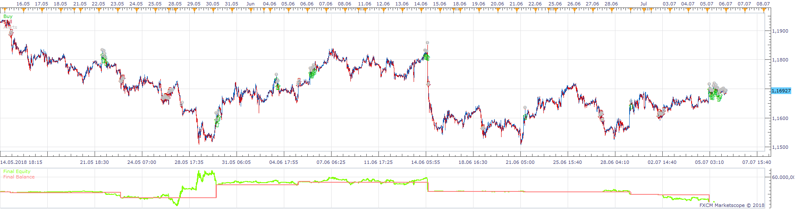
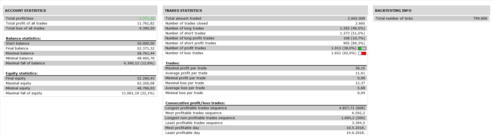

# Renko MA Strategy

> Source: https://fxcodebase.com/code/viewtopic.php?f=31&t=66935  
> Forum: 31 · Topic 66935 · 22 post(s)

---

## Renko MA Strategy

**Apprentice** · Sat Nov 17, 2018 5:26 am

 

Based on request.
[viewtopic.php?f=27&t=66922](https://fxcodebase.com/code/viewtopic.php?f=27&t=66922)

 [Renko MA Strategy.lua](files/122158/Renko%20MA%20Strategy.lua)

---

## Re: Renko MA Strategy

**eijicrown** · Mon Nov 19, 2018 3:53 pm

Dear apprentice,

First of all, thank you for the strategy, and sorry it seems i haven't upload the correct photo for you to understand my strategy

1- the graph is not in Renko view so it's difficult for me to analyse, but I did add the moving average to try the backtesting.

It seems that there is a trade open every minute when the strategy should be:
opening only 1 trade at 2 bars renko (or more) over moving average - closing the trade when 2 bars renko (or more).

Attached the screenshot explained.
Thank you for your help and support.

---

## Re: Renko MA Strategy

**Apprentice** · Wed Nov 21, 2018 9:01 am

Fixed.

---

## Re: Renko MA Strategy

**eijicrown** · Wed Nov 21, 2018 7:40 pm

Thanks apprentice,

It's a good improvement. Here is my feedback after the new backtesting of NAS100 on 20/11/2018 - time between 06:00 and 10:00

1) it seems that some signals are missing in the backtesting (06:26, 07:02, 08:39, 09:31) ??? issues with the backtesting software ?

2) it seems that the strategy is opening another position (08:16 and 09:00) after a brick cross over then later 2 bricks under MA.
I would rather have only 1 trade going on, as in time of noise having another position would increase the risk. So if one trade is already open, it should be impossible to open a new one.

Attached the graph renko analysed.

Thanks again, I will try live the next version and see how it goes. Hope you will enjoy that strategy as well.

---

## Re: Renko MA Strategy

**Apprentice** · Thu Nov 22, 2018 9:51 am

To limit the number of positions, set Position Cap to yes, value 1.

---

## Re: Renko MA Strategy

**eijicrown** · Fri Nov 23, 2018 10:14 am

Dear Apprentice,

I tested it in backtesting but some entry/ closing are not happening so I did test it live on Demo account.
first trade: open correctly but closed randomly at -4.7 pips
2nd trade on nasdaq: did open correctly but didn't close properly (position in the circle) and then didn't open another position.
3rd trade on Dax: open properly, didn't close properly (arrow) and then open new position.

Attached the Nasdaq setting (they are the same for Dax except different brick size).

Can you let me know your thoughts.
Thank you.

---

## Re: Renko MA Strategy

**Apprentice** · Sun Nov 25, 2018 5:36 am

With Renko this is best we can do.
Renko bricks can vary based on histogram start.

---

## Re: Renko MA Strategy

**eijicrown** · Sun Nov 25, 2018 7:54 pm

Oh too bad because I recalculate and the strategy will bring 504 pips in the last 3 days.

Do you think you can convert it as a signal or alert then I apply manually the strategy.

Set up:
- Renko brick size
- Ma period
- Min bricks (over the MA to apply the signal).

I can set my trailing, take profit and stop using the strategies you guys already developed.

Do you think it would be possible to develop it as private strategy (paid) or it's just not possible to do this strategy ?

Thanks again for you time and effort. Will definitely donate

---

## Re: Renko MA Strategy

**Apprentice** · Sat Dec 01, 2018 5:14 am

[Renko MA Strategy v4.lua](files/122440/Renko%20MA%20Strategy%20v4.lua)

I've changed it, so it'll not skip trades of fast movements. But it'll
look like a late open

Renko is a bit problematic.
Not sure if we can fix this.

---

## Re: Renko MA Strategy

**eijicrown** · Fri Dec 14, 2018 11:00 am

Sorry haven't seen this message earlier,

Thanks for it, it still does missing some signals but thanks for trying.

I will ask in the indicator forum to have a signal for this indicator and try manually
Thanks for the strategy and help.

regards

---

## Re: Renko MA Strategy

**eijicrown** · Fri Feb 01, 2019 6:05 am

Dear Apprentice,

The strategy is working well and is successful except that the trailing stop doesn't seem to work.
This is my following settings: Can you tell me where I m wrong or is it something wrong in the code.

I wanna set the trailing 15 pips per example following the price.

Thanks for your support.

---

## Re: Renko MA Strategy

**eijicrown** · Thu Feb 07, 2019 1:32 pm

Can you please explain to me quickly from the set you put in the strategy how to set the trailing by example 10 pips under the new high or new low and following it.

Thanks again in advance for all your amazing work.

Cheers

---

## Re: Renko MA Strategy

**Apprentice** · Fri Feb 08, 2019 6:21 am

You have to set "Stop order" to Yes.

---

## Re: Renko MA Strategy

**eijicrown** · Wed Apr 03, 2019 12:57 pm

> **Apprentice wrote:**
> You have to set "Stop order" to Yes.

Dear apprentice,
As you can see the stop is not following the new high - the stop stays the same (19 pips difference to the new high)
Can you please explain me where is my mistake.

Thank you
Regards.

---

## Re: Renko MA Strategy

**eijicrown** · Sat Apr 13, 2019 3:01 pm

Any info anyone ?

Thanks

---

## Re: Renko MA Strategy

**Apprentice** · Mon Apr 29, 2019 3:39 pm

"Trailing in pips" is a step used to move the stop. Set it to 1 for the "live" trailing of the stop.

---

## Re: Renko MA Strategy

**eijicrown** · Wed Jun 17, 2020 11:40 am

Dear Apprentice,

The robot is working well outside the market hours -
then when it is opening it is kind of hectic and taking random position.

I would like your expertise, is the robot will be more accurate on Metatrader ?? is the platform responsible for the delays and error?

Ex: as follow the setting for 1 bar over the MA 200 and the trade of the robot is completely far away from the MA and only 2 out of the 3 positions where open.

Thanks for your feedback.

---

## Re: Renko MA Strategy

**Apprentice** · Wed Jun 17, 2020 3:40 pm

It is not a question of TS.
Renko is not synchronous as regular candles,
therefore, Renko is extremely difficult to calculate,
we will have a discrepancy between
Renko indicator and Renko indicator calculated internally within the strategy or EA.

---

## Re: Renko MA Strategy

**eijicrown** · Fri Jun 19, 2020 5:26 am

ok,

thank you for the answer. It still works pretty well in general (happen only once or twice a day

I have another question, I applying another robot on the same account of trading but nothing is happening.
Basically, I have one robot on the DOW and one on the DAX but only the DOW is working. Is there settings I can do to have 2 working on the same account otherwise can you add an update?

For the trailing, I would like to have the trailing of a distance of 199 pips starting when 200 pips gain is reached. Can you tell me if my settings are good?
Thanks again.

I hope the community enjoy this robot, with good money management it is a brilliant one.

---

## Re: Renko MA Strategy

**eijicrown** · Fri Jun 19, 2020 5:54 pm

I tried to create a new strategy using the same set up on a different account on the same DOW so I have on the same time 2 strategy on the same account ( dow and dax) and another account on the Dow but I have only 1 out of the 3 working at the time.

- Also, I activate closing on opposite and position cap: it did close the trade properly but didn't open a new one. Could you please help me with it. As shown on the chart.

Thanks as always for your support. I m quite exciting for optimization.

Cheers

---

## Re: Renko MA Strategy

**eijicrown** · Sat Jun 27, 2020 6:43 pm

Hi,

Anyone can help with the trailing and why differents robots opened on the same time but only one is triggered ?

---

## Re: Renko MA Strategy

**omgepe** · Tue Oct 27, 2020 9:43 pm

hi eijicrown,

how to view renko bar in this system?
the renko bar in live or delay?
i already install the strategy but the bar still in candle,
need your advice

thanks
gp
