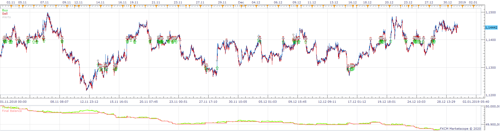
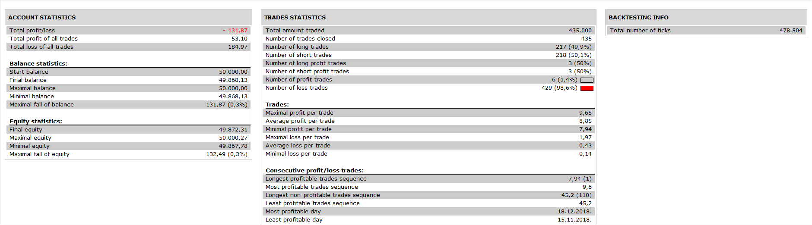
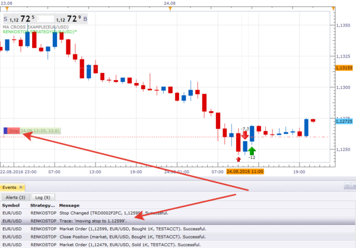

# RenkoStop Strategy

> Source: https://fxcodebase.com/code/viewtopic.php?f=31&t=69382  
> Forum: 31 · Topic 69382 · 15 post(s)

---

## RenkoStop Strategy

**Apprentice** · Wed Feb 05, 2020 9:45 am

 

Based on RenkoStop.lua
[viewtopic.php?f=17&t=62223](https://fxcodebase.com/code/viewtopic.php?f=17&t=62223)

 [RenkoStop Strategy.lua](files/131100/RenkoStop%20Strategy.lua)

---

## Re: RenkoStop Strategy

**yolerap** · Thu Feb 06, 2020 5:24 pm

Thank you for your working!

Could you add one more option please :
Look the first picture, it shows you a buy option position :
First arrow : The Renkostop was red
Second arrow : The renkostop becomes green ( so close the position if the close on opposite is on and inversly )
Third arrow : The renkostop is green while five candles since the second arrow so open buy position

Please, could you let to the user how many candles he wants to activate the buy/sell position ( like the first example is five and the second example is six ). Same, could you add the on/off option please.

The second picture shows you when the option is not confirmed but it is afterwards.
The first arrow : The Renkostop becomes red
The second arrow : The renkostop becomes green ( so don't open sell position )
The third arrow : The renkostop is always green while six candles since the second arrow soopen buy position
The fourth arrow : The renkostop becomes red ( so close the position if the close on opposite is on and inversly )
The fifth arrow : The renkostop is always red while six candles since the fourth arrow so open sell position

I hope this parameter is possible to coding because the current problem is that the strategy opens long and short positions several times a minute (sometimes) because the current price varies the color in real time and can make it change several times with a single candle.

Thank you,

---

## Re: RenkoStop Strategy

**Apprentice** · Mon Feb 10, 2020 6:29 am

Your request is added to the development list.
Development reference 704.

---

## Re: RenkoStop Strategy

**Apprentice** · Tue Feb 11, 2020 6:56 am

[RenkoStop Strategy.lua](files/131223/RenkoStop%20Strategy.lua)

Try this version.

---

## Re: RenkoStop Strategy

**yolerap** · Tue Feb 11, 2020 3:35 pm

Great, thank you !

---

## Re: RenkoStop Strategy

**MC. Trend Trader** · Wed Feb 12, 2020 1:45 pm

Hello, please insert PositionCount in this strategy so that we can open several options with different limits and stops.

---

## Re: RenkoStop Strategy

**Apprentice** · Wed Feb 12, 2020 1:57 pm

Your request is added to the development list.
Development reference 716.

---

## Re: RenkoStop Strategy

**Apprentice** · Thu Feb 13, 2020 4:26 am

[RenkoStop Strategy.lua](files/131259/RenkoStop%20Strategy.lua)

Try this version.

---

## Re: RenkoStop Strategy

**MC. Trend Trader** · Thu Feb 13, 2020 5:05 am

Hello,
loopback now appears under parameters.
what does it mean. it is not listed in the first version of the strategy.

---

## Re: RenkoStop Strategy

**MC. Trend Trader** · Thu Feb 13, 2020 9:17 am

great strategy, unfortunately the break even function doesn't work. the stop will not be dragged onto the entry course. Please correct the last published strategy

---

## Re: RenkoStop Strategy

**MC. Trend Trader** · Thu Feb 13, 2020 9:17 am

great strategy, unfortunately the break even function doesn't work. the stop will not be dragged onto the entry course. Please correct the last published strategy

---

## Re: RenkoStop Strategy

**Apprentice** · Sun Feb 16, 2020 5:57 am

Your request is added to the development list.
Development reference 726.

---

## Re: RenkoStop Strategy

**Apprentice** · Mon Feb 17, 2020 7:36 am

I don't have any issues.
It works well and the code is standard (the same as in most other strategies).

---

## Re: RenkoStop Strategy

**yolerap** · Tue Oct 19, 2021 4:06 am

Hello sir,

Is it possible to translate the strategy to MT4 please ?

Thank you,

---

## Re: RenkoStop Strategy

**Apprentice** · Wed Oct 20, 2021 6:09 am

Your request is added to the development list.
Development reference 926.
