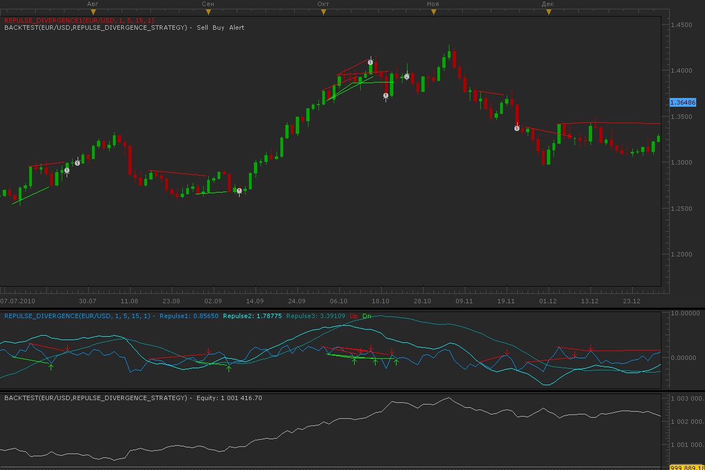

# Repulse divergence strategy

> Source: https://fxcodebase.com/code/viewtopic.php?f=31&t=3363  
> Forum: 31 · Topic 3363 · 4 post(s)

---

## Repulse divergence strategy

**Alexander.Gettinger** · Thu Feb 10, 2011 3:40 am

Strategy based on Repulse divergence indicator ([viewtopic.php?f=17&t=3362](https://fxcodebase.com/code/viewtopic.php?f=17&t=3362)).
Strategy supports direct and reverse signals.

 

Download:

 [Repulse_Divergence_Strategy.lua](files/8051/Repulse_Divergence_Strategy.lua)

For this strategy must be installed indicators:
 - Repulse ([viewtopic.php?f=17&t=2067](https://fxcodebase.com/code/viewtopic.php?f=17&t=2067))
 - Repulse divergence ([viewtopic.php?f=17&t=3362](https://fxcodebase.com/code/viewtopic.php?f=17&t=3362)).

---

## Re: Repulse divergence strategy

**blessing** · Mon Sep 03, 2012 9:19 pm

hi,

can you add following option in this divergence strategy .that will give divergence signals in trend direction.

buy: repulse 2> repulse 3 and repulse 1< repulse 3 and bullish divergence
sell: repulse2<repulse 3 and repulse 1>repulse3 and bearish divergence.

---

## Re: Repulse divergence strategy

**Apprentice** · Tue Sep 04, 2012 1:07 am

Your request is added to the development list.

---

## Re: Repulse divergence strategy

**Apprentice** · Mon Dec 05, 2016 9:58 am

Bump up.
