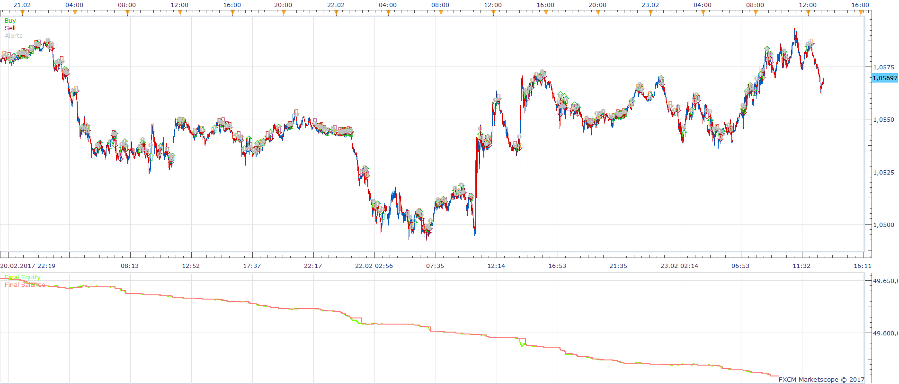
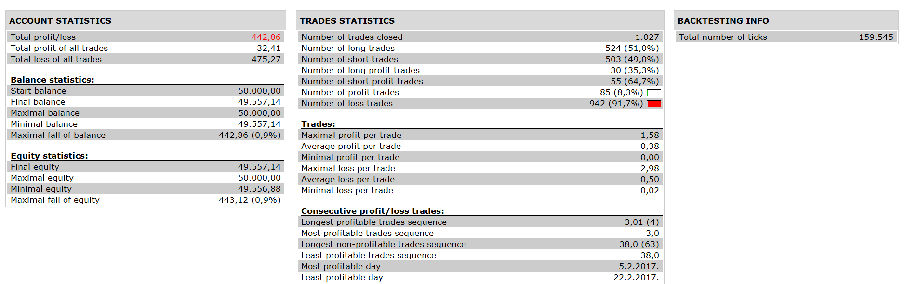

# Reverse EMA Strategy

> Source: https://fxcodebase.com/code/viewtopic.php?f=31&t=65011  
> Forum: 31 · Topic 65011 · 1 post(s)

---

## Reverse EMA Strategy

**Apprentice** · Mon Aug 21, 2017 5:23 am

 

As described in the article " The Reverse EMA Indicator" by John F. Ehlers
September 2017 issue of Technical Analysis of Stocks & Commodities

Open Long
Trend >0
Cycle Cross Over Zero Line

Close/Exit Long
Trend Cross Under Zero Line
OR
Cycle Cross Under Zero Line

Vice versa for short.

 [Reverse EMA Strategy.lua](files/114319/Reverse%20EMA%20Strategy.lua)

 [Reverse EMA Period Input Strategy.lua](files/114319/Reverse%20EMA%20Period%20Input%20Strategy.lua)

Reverse EMA.lua & Reverse EMA Period Input.lua are available here.
[viewtopic.php?f=17&t=65010](https://fxcodebase.com/code/viewtopic.php?f=17&t=65010)

The Strategy was revised and updated on January 21, 2019.
