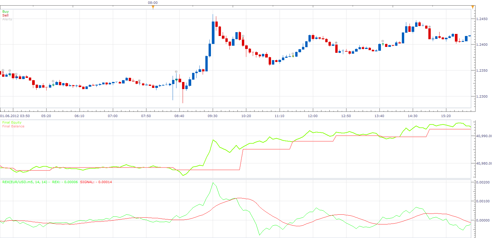

# Rex Indicator Strategy

> Source: https://fxcodebase.com/code/viewtopic.php?f=31&t=24705  
> Forum: 31 · Topic 24705 · 2 post(s)

---

## Rex Indicator Strategy

**Apprentice** · Sun Oct 21, 2012 4:29 am

Long
Rex/Signal Line CrossOver
Short
Rex/Signal Line CrossUnder

 [Rex Strategy.lua](files/42480/Rex%20Strategy.lua)

Please install Rex Indicator for this strategy.
[viewtopic.php?f=17&t=24005&p=42476#p42476](https://fxcodebase.com/code/viewtopic.php?f=17&t=24005&p=42476#p42476)

---

## Re: Rex Indicator Strategy

**Apprentice** · Sat Jan 13, 2018 10:52 am

The strategy was revised and updated.
