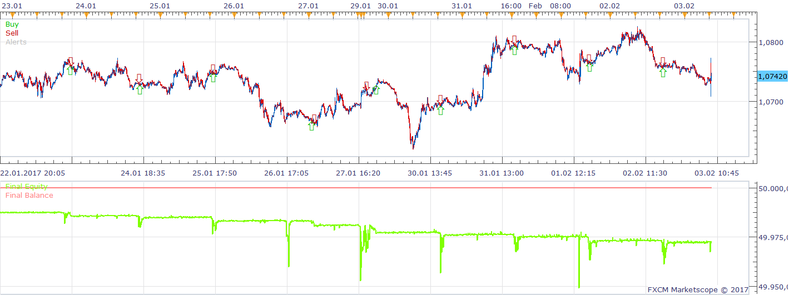
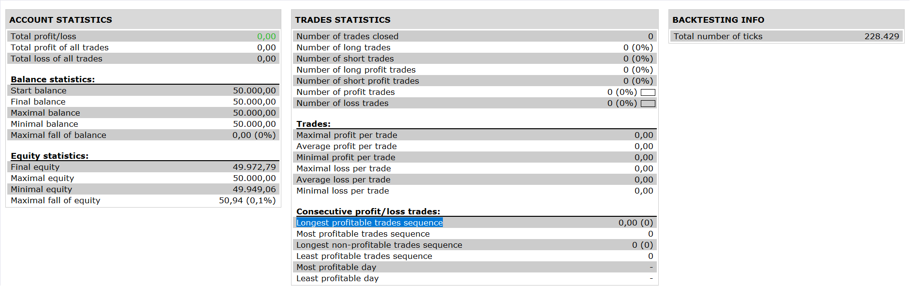

# Richard Donchian's Strategy

> Source: https://fxcodebase.com/code/viewtopic.php?f=31&t=64915  
> Forum: 31 · Topic 64915 · 1 post(s)

---

## Richard Donchian's Strategy

**Apprentice** · Mon Jul 10, 2017 4:42 pm

 

Based on request.
[viewtopic.php?f=27&t=64640](https://fxcodebase.com/code/viewtopic.php?f=27&t=64640)

1) if there is no position,
place buy stop entry order at highest of previous 4 candles,
place sell stop entry order at lowest of previous 4 candles.
2) if there is short position,
place buy stop close entry order at highest of previous 4 candles to close the short position
place the stop open order at the same level to open new long position.
3) if there is long position,
place sell stop close entry order at lowest of previous 4 candles to close the long position
place the stop open order at the same level to open new short position.
4) the order placed at 5pm will be cancelled (if not triggered) and replaced by new orders at 5pm next trade day.

 [Richard Donchian's Strategy.lua](files/113484/Richard%20Donchians%20Strategy.lua)

The Strategy was revised and updated on January 21, 2019.
