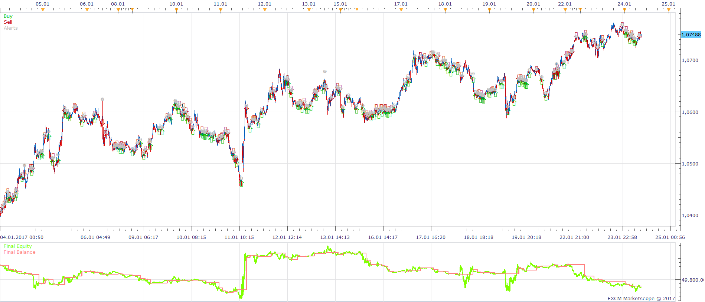
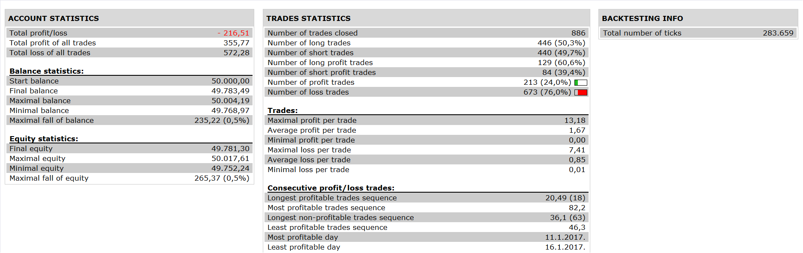

# RLW MA STRATEGY

> Source: https://fxcodebase.com/code/viewtopic.php?f=31&t=64823  
> Forum: 31 · Topic 64823 · 1 post(s)

---

## RLW MA STRATEGY

**Apprentice** · Fri Jun 23, 2017 5:15 am

 

Based on the request.
[viewtopic.php?f=27&t=64821](https://fxcodebase.com/code/viewtopic.php?f=27&t=64821)

Open Long:

1.PRICE > MVA of Price
2.MA of WPR<BUY LEVEL
3.WPR CROSS OVER MA of WPR

Open Short:

1.PRICE< MVA of Price
2.MA of WPR>SELL LEVEL
3.WPR CROSS UNDER MA of WPR

 [RLW MA STRATEGY.lua](files/113054/RLW%20MA%20STRATEGY.lua)

The Strategy was revised and updated on January 19, 2019.
