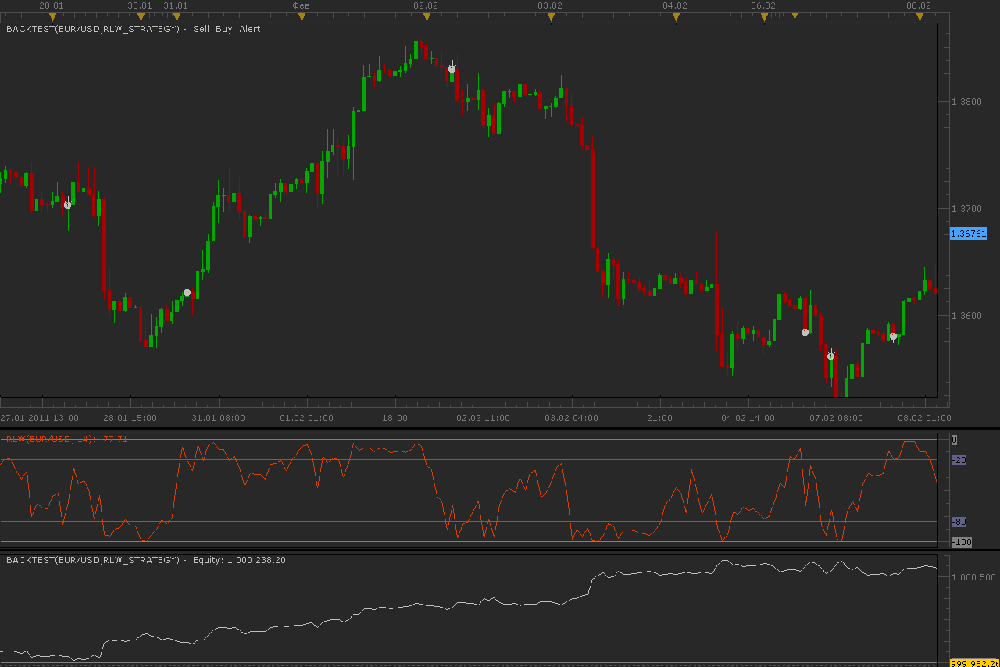
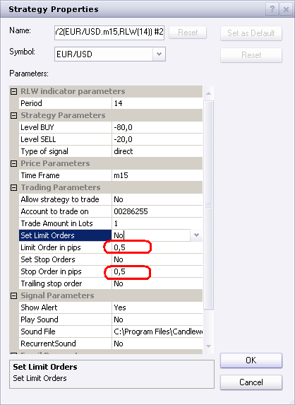

# RLW strategy

> Source: https://fxcodebase.com/code/viewtopic.php?f=31&t=3482  
> Forum: 31 · Topic 3482 · 53 post(s)

---

## RLW strategy

**Alexander.Gettinger** · Mon Feb 21, 2011 1:32 am

Strategy based on RLW (Willian's percent range) indicator.

BUY condition:
RLW crosses upwards [LevelB].

SELL condition:
RLW crosses down [LevelS].

 

Download:

 [RLW_Strategy.lua](files/8289/RLW_Strategy.lua)

---

## Re: RLW strategy to be able set limit pips to less than one pip

**NID007** · Fri Mar 04, 2011 6:11 pm

Hi There
I am very impressed with this RLW strategy ,thanks very much for your hard work.

I would like to set the Limit order in pips , to less than one pip in the parameters

 i.e. 0.1 , 0.2. 0.3 , 0.5 etc upto 0.9 max for my personal trading.

Please can you advise me on how this is possible ,it would be a great help many thanks

thanks
Nid007

---

## Re: RLW strategy

**sunshine** · Thu Mar 10, 2011 2:08 pm

Hi,
Please install the corrected version of the strategy attached to this post.

---

## Re: RLW strategy

**NID007** · Fri Mar 11, 2011 4:18 am

thanks for your post ,
I have installed the correct version ;

I would like to set the Limit order in pips , to less than one pip in the parameters

i.e. 0.1 , 0.2. 0.3 , 0.5 etc upto 0.9 max for my personal trading. this version does not permit it ,can we add it please thankyou in advance

Nid007

---

## Re: RLW strategy

**sunshine** · Fri Mar 11, 2011 4:32 am

Hi NID007,

I've just rechecked the version 2 that I uploaded.
[viewtopic.php?f=31&t=3482&p=8738#p8734](http://www.fxcodebase.com/code/viewtopic.php?f=31&t=3482&p=8738#p8734)

The default values for stop and limit orders are 0.5 pip and minimum allowed values are 0.1:

 

Could you please make sure that you use the new version.

---

## Re: RLW strategy

**NID007** · Fri Mar 11, 2011 8:01 am

Ok Ive managed to set it ,thats great , highly appreciated thank you for your time.

Nid007

---

## Re: RLW strategy

**NID007** · Wed Mar 16, 2011 4:32 am

Hi Alex ,

can we please get this strategy to work on Tick data .
The RLW indicator works well on a tick chart and I would be greatful if the RLW strategy works on a Tick chart.

Many thanks for your hard work,

Nid007

---

## Re: RLW strategy

**libbyz8888** · Wed Mar 23, 2011 5:49 am

Hi
I have just notice that the same request was made over 1 month ago? I have spoken to DBFX who have said you can help me ?????
is the RLW STRATEGY FOR TICK ALREADY ON THIS SITE? CAN HELP ME FIND IT?
THANK YOU

---

## Re: RLW strategy on Tickchart (T)

**NID007** · Sun Apr 03, 2011 11:36 am

> **sunshine wrote:**
> Hi,
> Please install the corrected version of the strategy attached to this post.

Hello Sunshine,

can we please get this RLW strategy to work on Tick data (Tick Frame, 'T' ).
The RLW indicator works well on a tick chart and I would be greatful if the RLW strategy works on a Tick chart.

Big thanks for your hard work,
Nid007

---

## Re: RLW strategy

**sunshine** · Wed Apr 06, 2011 11:54 am

Hi,
Please find the tick based version of the strategy in the attachment.
Note that since the standard RLW indicator uses high and low prices, this indicator cannot be used in the tick based strategy. So to be able to trade with the strategy, download and install the tick based version of the RLW indicator as well.
Let me know if you have any questions.

Download strategy:

 [RLW_Strategy_Tick.lua](files/9422/RLW_Strategy_Tick.lua)

Download indicator:

 [RLW tick.lua](files/9422/RLW%20tick.lua)

 [RLW tick.lua.rc](files/9422/RLW%20tick.lua.rc)

---

## Re: RLW strategy

**NID007** · Wed Apr 06, 2011 12:57 pm

Hi Sunshine

You are a real professional I really do appreciate your reponse and hard work, thanks so much I will test it out ,my partner really likes this strategy so he will be very happy when I notify him,,Thanks again .
Nid007

---

## Re: RLW strategy

**serchfx** · Thu Apr 07, 2011 2:53 pm

Hello

I really like this.

I'm looking for a RLW strategy,

Buy above -80
sell below -20

Thank's

---

## Re: RLW strategy

**Apprentice** · Fri Apr 08, 2011 4:14 am

This strategy allows this.
Try to use the Type of signal parameter.
Direct and Reverse.
In this case use Direct.

---

## Re: RLW strategy

**macogi37** · Thu Dec 01, 2011 5:06 am

Hi great man,
is possible, for this strategy, to allow work whit Hedging function, and select Buy or Sell, so it can close limit position in any direction?
It close position if another direction is open and cross the line...

Thanks

---

## Re: RLW strategy

**Apprentice** · Thu Dec 01, 2011 10:04 am

It is possible. But i have write something like that.
So far this option has not been used, as far as I know.

---

## Re: RLW strategy

**virgilio** · Thu Dec 01, 2011 6:06 pm

Hello Apprentice; is it OK to add the multiple trades feature within the strategy (right now only has a buy and a sell)? If so, that would be really nice.
Thank you so much.

---

## Re: RLW strategy

**jackfx09** · Thu Dec 01, 2011 8:38 pm

Apprentice,

How can we make it so that a signal is triggered AFTER the indicator goes DOWN through the oversold threshold of say -80 for example then indicator crosses UP through threshold of -80 for a bullish signal of LONG, and vice versa for sell signals, whether pertaining to this indicator in general or another other indicators that use the oversold/overbought mentality (Stochs, RSI, WPR, etc).

Thanks!

sjc

---

## Re: RLW strategy

**Apprentice** · Fri Dec 02, 2011 6:15 pm

Currently it is not possible.
It is necessary to adapt the code.

---

## Re: RLW strategy

**Xander Moss** · Wed Dec 07, 2011 9:53 am

This is a very interesting strategy.
But there is a problem.
At tick data strategy, everytime a losing trade closes and a new opposite opens, it opens at double ammount.
For example at first signal it opens 2 positions.It loses,a nee opposite signal is generated,and it opens 4 positions...then 8 positions etc.Like a martingale.It will blow an account in seconds that way.
Is there a way to fix this,so it opens only one position each time?

---

## Re: RLW strategy

**Booger** · Wed Dec 07, 2011 2:03 pm

Hi Alexander,

Thanks for all your hard work.

There has already been a request for a hedging function, I would like to ad my voice to that request please.

Thanks

Andy

---

## Re: RLW strategy

**NorokFX** · Wed Dec 07, 2011 10:32 pm

Greetings,

I have successfully backtested the Tick based strategy on the latest version of Trading Station. However, I cannot run optimizations nor make the strategy to trade actively on my account. Any ideas?

Thanks.

---

## Re: RLW strategy

**sunshine** · Thu Dec 08, 2011 2:04 am

Hi NorokFX,
Unfortunately it's currently not possible to optimize a strategy on tick data.
To make the strategy trading, add it using the command Alerts and Trading Automation -> New Strategy or Alert. Do not forget to set the parameter Allow strategy to trade to Yes.

---

## Re: RLW strategy

**surfandturf** · Mon Oct 01, 2012 4:39 am

Dear Developer,
can you add three MVA as additional filter. If price is below or above all three then allow to trade according to the specification for RLW Strategy, otherwise not.

Thanks

---

## Re: RLW strategy

**jackfx09** · Mon Oct 01, 2012 11:55 am

Can we please request a new version of the RLW Strategy. The Strategy would be based on the crossing of TWO (2) RLW Indicators crossing.

Example: RLW 50 one hour candle OPENS and CLOSES above RLW 200 indicator would open a LONG position. Position would be closed when the time candle does the opposite, opens and closes below the RLW 200 indicator.

Thanks,

sjc

---

## Re: RLW strategy

**Apprentice** · Tue Oct 02, 2012 7:20 am

Your request is added to the development list.

---

## Re: RLW strategy

**surfandturf** · Tue Oct 02, 2012 9:10 am

Dear Developer,
it seems that the strategy does not work simultaneously on several currencies. When I activate the strategy in marketscope for one currency and open a second chart with another currency and add then the strategy for this currency in a separate chart, then only the last one works? Am I doing something wrong or is this not possible?

Further, the strategy seems not to allow multiple trades (in one currency). I have a non FIFO account and would like to have in certain cases several trades open.

Thanks for a response or change in the strategy

---

## Re: RLW strategy

**Apprentice** · Thu Oct 04, 2012 4:32 am

Long
Short RLW / Long RLW Crossover
Short
Short RLW / Long RLW Under

Something like this.
In my opinion, this strategy requires further development.
Maybe RLW smoothing.

 [Two RLW Strategy.lua](files/41394/Two%20RLW%20Strategy.lua)

---

## Re: RLW strategy

**Apprentice** · Thu Oct 04, 2012 5:18 am

Long
RLW / OS CrossOver
and Price > MA1 (Optional)
and Price > MA2 (Optional)
and Price > MA3(Optional)
Short
RLW / OB CrossUnder
and Price < MA1 (Optional)
and Price < MA2 (Optional)
and Price < MA3(Optional)

Exit (Optional)
MA Exit (Optional)
Exit Long
Price < MA1 (Optional)
Price < MA2 (Optional)
Price < MA3 (Optional)
Exit Short
Price > MA1 (Optional)
Price > MA2 (Optional)
Price > MA3 (Optional)

RLW EXIT (Optional)
Exit Long
RLW / OB Level CrossUnder
Exit Short
RLW / OS Level CrossOver

 [RLW Strategy with MA confirmation.lua](files/41397/RLW%20Strategy%20with%20MA%20confirmation.lua)

---

## Re: RLW strategy with MA Crossover

**virgilio** · Thu Oct 04, 2012 4:17 pm

Hello, I downloaded this strategy a few times but there is always an error message.

---

## Re: RLW strategy

**Apprentice** · Thu Oct 04, 2012 4:40 pm

What is Strategy Name, and what is error message.

---

## Re: RLW strategy with MA confirmation

**virgilio** · Thu Oct 04, 2012 5:38 pm

The name of the strategy is: RLW Strategy with MA confirmation.

The error message is: Error in the file 'C:\Users\Admin\Desktop\RLW Strategy with MA confirmation.lua :[string "RLW Strategy with MA confirmation.lua"]:449

---

## Re: RLW strategy

**rtsayers** · Thu Oct 04, 2012 8:29 pm

I also get a error message 449: expected near 'andt'.

---

## Re: RLW strategy

**Apprentice** · Fri Oct 05, 2012 12:44 am

Bug Fixed.

---

## Re: RLW strategy

**sagymmm** · Wed Oct 31, 2012 1:02 pm

I wonder if we can make a strategy for RLW and it's MA
When RLW cross MA up go long and when RLW cross MA down go short

---

## Re: RLW strategy

**Apprentice** · Thu Nov 01, 2012 2:42 am

Your request is added to the development list.

---

## Re: RLW strategy

**Apprentice** · Mon Nov 05, 2012 5:43 am

Requested can be found here.
[viewtopic.php?f=31&t=25449](https://fxcodebase.com/code/viewtopic.php?f=31&t=25449)

---

## Re: RLW strategy

**sagymmm** · Mon Nov 05, 2012 4:22 pm

Thx for your efforts

---

## Re: RLW strategy

**marty0007** · Sat Jul 20, 2013 9:39 pm

hi there,

thanks so much for this excellent strategy. I have used it with some success and believe it can become much more powerful with a scale in feature whereby the program automatically "scales up" the amount of the trade upon each successive cross of the buy or sell threshold.

Can you help me with this?

Thanks

---

## Re: RLW strategy

**Apprentice** · Mon Jul 22, 2013 3:55 am

Your request is added to the development list.

---

## Re: RLW strategy

**Outside_The_Box** · Fri Sep 20, 2013 5:37 pm

Just to clarify, this strategy buys when RLW crosses up into the overbought zone and sells when price crosses down into the oversold zone? I'm assuming this is in hopes that the indicator becomes embedded in the zone because price is trending in that direction?

Question: Can anyone modify this so that the strategy buys when the RLW indicator crosses (or closes) in the oversold zone and sells when it crosses (or closes) in the overbought zone? This is a great indicator for getting in on pullbacks against the larger trend. I like using H1 for entry into the daily trend. Great for multi-day/week swings.

---

## Re: RLW strategy

**Apprentice** · Sun Sep 22, 2013 5:46 am

Open Long
RLW Cross Over Buy Level
Open Short
RLW Cross Under Sell Level

---

## Re: RLW strategy

**Apprentice** · Sun Sep 22, 2013 6:35 am

Try this Version.

You can define two situations.
Separately for Entry and exit signals.

Generate signal on, out of the zone cross or in the zone cross.

Examples,

Entry - out of zone
Open Long
RLW cross over Buy Line
Open Short
RLW cross under Sell Line

Exit - in this zone
Exit Long
RLW crossover Sell Line
Exit Short
RLW cross under Buy Line

Entry - in this zone
Open Long
RLW cross under Buy Line
Open Short
RLW crossover Sell Line

Exit - out of zone
Exit Long
RLW cross under Sell Line
Exit Short
RLW cross over Buy Line

and so on...

 [RLW Strategy.lua](files/89625/RLW%20Strategy.lua)

Update 16.dec. 2015

---

## Re: RLW strategy

**Outside_The_Box** · Sun Sep 22, 2013 4:29 pm

Awesome. No more missed entries for this guy.

This is a great strategy when used properly. It's not a "set it and forget it" strategy though. You still need to identify market flow on the larger time frame and only trade in that direction, and actively manage the strategy. I have it set to only open one position, and then only after price has moved in my favor I will have it open one more on the next pull back, and so forth. This, coupled with chart patterns, price action at key levels, and wave analysis make for a pretty solid system.

Thanks again!

---

## Re: RLW strategy

**Outside_The_Box** · Thu Sep 26, 2013 9:17 pm

I don't want to push my luck, but if someone could add the "with MA confirmation" feature (from page 3 of this thread) to this latest version, that would be epic.

---

## Re: RLW strategy

**Apprentice** · Fri Sep 27, 2013 6:12 am

Entry - out of zone
Open Long
RLW cross over Buy Line
Open Short
RLW cross under Sell Line

Exit - in this zone
Exit Long
RLW crossover Sell Line
Exit Short
RLW cross under Buy Line

Entry - in this zone
Open Long
RLW cross under Buy Line
Open Short
RLW crossover Sell Line

Exit - out of zone
Exit Long
RLW cross under Sell Line
Exit Short
RLW cross over Buy Line

and so on...

MA confirmation of RLW Signal

Long
Price > MA1 (Optional)
 Price > MA2 (Optional)
 Price > MA3(Optional)

Short
and Price < MA1 (Optional)
and Price < MA2 (Optional)
and Price < MA3(Optional)

MA Exit (Optional)
Exit Long
Price < MA1 (Optional)
Price < MA2 (Optional)
Price < MA3 (Optional)
Exit Short
Price > MA1 (Optional)
Price > MA2 (Optional)
Price > MA3 (Optional)

 [RLW Strategy MA confirmation.lua](files/89743/RLW%20Strategy%20MA%20confirmation.lua)

Update 16.dec. 2015

---

## Re: RLW strategy

**Outside_The_Box** · Fri Sep 27, 2013 3:28 pm

Thank you Apprentice. You rock.

---

## Re: RLW strategy

**pinimo** · Wed Sep 17, 2014 11:18 am

Dear developers,
like other user reported I've a problem with multiple RLW strategy active at the same time: **it seems that the strategy does not work simultaneously on several currencies**.

Also during the backtest, if I select 2 currency pairs the strategy won't work, it doesn't open any position.

Thank you for your support.

---

## Re: RLW strategy

**Apprentice** · Fri Sep 19, 2014 3:48 am

Strategy instance can only work one one currency pair.
For the second pair, you need to open second instance of strategy.

---

## Re: RLW strategy

**mikefx12** · Sat Dec 12, 2015 6:57 pm

Hi Apprentice,

Can you add Live/End of Turn to RLW Strategy? I believe this can help out a lot having this option.

Thanks!

---

## Re: RLW strategy

**Apprentice** · Wed Dec 16, 2015 5:53 am

We have a number of strategies in this topic.
Can you identify strategys of interest to you.

---

## Re: RLW strategy

**Apprentice** · Wed Dec 16, 2015 6:38 am

RLW Strategy.lua - Updated
RLW Strategy MA confirmation.lua -Updated

---

## Re: RLW strategy

**mikefx12** · Thu Dec 24, 2015 4:15 am

Apprentice,

Thanks so much for the fast & great work!!! The Live/End of Turn option works perfectly! Have a GREAT New Year!!!

---

## Re: RLW strategy

**Apprentice** · Sun Jan 21, 2018 7:15 am

The strategy was revised and updated.
