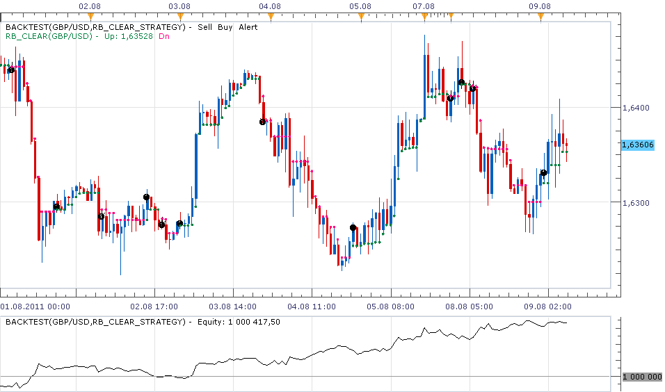

# Ron Black's 'Getting Clear With Short-Term Swings'

> Source: https://fxcodebase.com/code/viewtopic.php?f=31&t=5753  
> Forum: 31 · Topic 5753 · 5 post(s)

---

## Ron Black's 'Getting Clear With Short-Term Swings'

**sunshine** · Tue Aug 09, 2011 6:32 am

The strategy is based on [Ron Black's Clear Method indicator](https://fxcodebase.com/code/viewtopic.php?f=17&t=2107&p=13345&hilit=rb+clear#p4348).

Rules:
1) The strategy enters long when RB Clear indicator switches up.
2) The strategy enters short when RB Clear indicator switches down.
3) The strategy closes all opposite positions first.

Options:
1) The strategy can show signals (alerts, sounds (including recurrent), emails) as well as can trade. By default trading is disabled. To let the strategy trade please go to the "Trading Parameters" and switch "Allow strategy to trade" parameter to "Yes".
2) In trading parameters you can also switch on and configure stop and limit orders.

Please, do not forget to download and install the [Ron Black's Clear Method indicator (rb_clear.lua)](https://fxcodebase.com/code/viewtopic.php?f=17&t=2107&p=13345&hilit=rb+clear#p4348).

 

Download strategy:

 [rb_clear_strategy.lua](files/13627/rb_clear_strategy.lua)

Code: [Select all](https://fxcodebase.com/code/)
`function Init()
    strategy:name("Clear Method Strategy");
    strategy:description("Signals when Ron Black's clear method indicator changes direction");

    strategy.parameters:addGroup("Price Parameters");
    strategy.parameters:addString("Type", "Price type", "", "Bid");
    strategy.parameters:addStringAlternative("Type", "Bid", "", "Bid");
    strategy.parameters:addStringAlternative("Type", "Ask", "", "Ask");
    strategy.parameters:addString("TF", "Timeframe", "", "m1");
    strategy.parameters:setFlag("TF", core.FLAG_PERIODS);

    strategy.parameters:addGroup("Trading Parameters");
    strategy.parameters:addBoolean("AllowTrade", "Allow strategy to trade", "", false);
    strategy.parameters:addString("Account", "Account to trade on", "", "");
    strategy.parameters:setFlag("Account", core.FLAG_ACCOUNT);
    strategy.parameters:addInteger("Amount", "Trade Amount in Lots", "", 1, 1, 100);
    strategy.parameters:addBoolean("SetLimit", "Set Limit Orders", "", false);
    strategy.parameters:addInteger("Limit", "Limit Order in pips", "", 30, 1, 10000);
    strategy.parameters:addBoolean("SetStop", "Set Stop Orders", "", false);
    strategy.parameters:addInteger("Stop", "Stop Order in pips", "", 30, 1, 10000);
    strategy.parameters:addBoolean("TrailingStop", "Trailing stop order", "", false);
    strategy.parameters:addString("AllowDirection", "Allow direction for positions", "", "Both");
    strategy.parameters:addStringAlternative("AllowDirection", "Both", "", "Both");
    strategy.parameters:addStringAlternative("AllowDirection", "Long", "", "Long");
    strategy.parameters:addStringAlternative("AllowDirection", "Short", "", "Short");

    strategy.parameters:addGroup("Signal Parameters");
    strategy.parameters:addBoolean("ShowAlert", "Show Alert", "", true);
    strategy.parameters:addBoolean("PlaySound", "Play Sound", "", false);
    strategy.parameters:addFile("SoundFile", "Sound File", "", "");
    strategy.parameters:setFlag("SoundFile", core.FLAG_SOUND)
    strategy.parameters:addBoolean("Recurrent", "RecurrentSound", "", false);

    strategy.parameters:addGroup("Email Parameters");
    strategy.parameters:addBoolean("SendEmail", "Send email", "", false);
    strategy.parameters:addString("Email", "Email address", "", "");
    strategy.parameters:setFlag("Email", core.FLAG_EMAIL);

end

-- Internal Parameters
local source = nil;
local clear;
 
-- Signal Parameters
local ShowAlert;
local SoundFile;
local RecurrentSound;
local SendEmail, Email;

-- Trading parameters
local AllowTrade = nil;
local Account = nil;
local Amount = nil;
local BaseSize = nil;
local PipSize;
local SetLimit = nil;
local Limit = nil;
local SetStop = nil;
local Stop = nil;
local TrailingStop = nil;
local CanClose = nil;
local AllowDirection;

function Prepare()
    assert(core.indicators:findIndicator("RB_CLEAR") ~= nil, "The RB_CLEAR.LUA indicator must be downloaded and installed");

    ShowAlert = instance.parameters.ShowAlert;

    AllowDirection = instance.parameters.AllowDirection;

    local PlaySound = instance.parameters.PlaySound;
    if PlaySound then
        SoundFile = instance.parameters.SoundFile;
    else
        SoundFile = nil;
    end

    assert(not(PlaySound) or (PlaySound and SoundFile ~= ""), "Sound file must be specified");

    RecurrentSound = instance.parameters.Recurrent;

    SendEmail = instance.parameters.SendEmail;
    if SendEmail then
        Email = instance.parameters.Email;
    else
        Email = nil;
    end
    assert(not(SendEmail) or (SendEmail and Email ~= ""), "Email address must be specified");

    assert(instance.parameters.TF ~= "t1", "The time frame must not be tick");

    local name;
    name = profile:id() .. "(" .. instance.bid:instrument()  .. "[" .. instance.parameters.TF  .. "]" .. ")";
    instance:name(name);

    AllowTrade = instance.parameters.AllowTrade;
    if AllowTrade then
        Account = instance.parameters.Account;
        Amount = instance.parameters.Amount;
        BaseSize = core.host:execute("getTradingProperty", "baseUnitSize", instance.bid:instrument(), Account);
        Offer = core.host:findTable("offers"):find("Instrument", instance.bid:instrument()).OfferID;
        CanClose = core.host:execute("getTradingProperty", "canCreateMarketClose", instance.bid:instrument(), Account);
        PipSize = instance.bid:pipSize();
        SetLimit = instance.parameters.SetLimit;
        Limit = instance.parameters.Limit;
        SetStop = instance.parameters.SetStop;
        Stop = instance.parameters.Stop;
        TrailingStop = instance.parameters.TrailingStop;
    end

    source = ExtSubscribe(2, nil, instance.parameters.TF, instance.parameters.Type == "Bid", "bar");
    clear = core.indicators:create("RB_CLEAR", source);

    ExtSetupSignal(name .. ":", ShowAlert);
    ExtSetupSignalMail(name);
end

function ExtUpdate(id, source, period)
    clear:update(core.UpdateLast);

    -- Check that we have enough data
    if (clear.DATA:first() > (period - 1)) then
        return
    end

    local pipSize = instance.bid:pipSize()

    local trades = core.host:findTable("trades");
    local haveTrades = (trades:find('AccountID', Account) ~= nil)
   
    local MustB=false;
    local MustS=false;

--        if clear.Up:hasData(period) and clear.Dn:hasData(period - 1) then
--            ExtSignal(instance.bid, instance.bid:size() - 1, "Swing Up", SoundFile, Email);
--        elseif clear.Dn:hasData(period) and clear.Up:hasData(period - 1) then
--            ExtSignal(instance.bid, instance.bid:size() - 1, "Swing Down", SoundFile, Email);
--        end

   
    if clear.Dn:hasData(period) and clear.Up:hasData(period - 1) then
--     if instance.parameters.TypeSignal=="direct" then
      MustS=true;
--     else
--      MustB=true;
--     end
    end

    if clear.Up:hasData(period) and clear.Dn:hasData(period - 1) then
--     if instance.parameters.TypeSignal=="direct" then
      MustB=true;
--     else
--      MustS=true;
--     end
    end
   
    if (haveTrades) then
        local enum = trades:enumerator();
        while true do
            local row = enum:next();
            if row == nil then break end

            if row.AccountID == Account and row.OfferID == Offer then
                    -- Close position if we have corresponding closing conditions.
                if row.BS == 'B' then
                    if MustS==true then
              if ShowAlert then
                if AllowDirection~="Long" then
                            ExtSignal(source, period, "Close BUY and SELL", SoundFile, Email, RecurrentSound);
                          else
             ExtSignal(source, period, "Close BUY", SoundFile, Email, RecurrentSound);
           end 
             end

              if AllowTrade then
                            Close(row);
                            if AllowDirection~="Long" then
                              Open("S")
                            end 
             end
                    end
                elseif row.BS == 'S' then
                    if MustB==true then
                  if ShowAlert then
                    if AllowDirection~="Short" then
                            ExtSignal(source, period, "Close SELL and BUY", SoundFile, Email, RecurrentSound);
                          else
             ExtSignal(source, period, "Close SELL", SoundFile, Email, RecurrentSound);
           end 
             end

                  if AllowTrade then
                            Close(row);
                            if AllowDirection~="Short" then
                              Open("B")
                            end 
             end
                    end
                end

            end
        end
  else
        if MustB==true then

            if ShowAlert and AllowDirection~="Short" then
                ExtSignal(source, period, "BUY", SoundFile, Email, RecurrentSound)
                if AllowTrade then
                  Open("B")
                end
            end
        end

        if MustS==true then
            if ShowAlert and AllowDirection~="Long" then
               ExtSignal(source, period, "SELL", SoundFile, Email, RecurrentSound)
               if AllowTrade then
                 Open("S")
               end
       end

        end
    end

end

-- The strategy instance finalization.
function ReleaseInstance()
end

-- The method enters to the market
function Open(side)
    local valuemap;

    valuemap = core.valuemap();
    valuemap.OrderType = "OM";
    valuemap.OfferID = Offer;
    valuemap.AcctID = Account;
    valuemap.Quantity = Amount * BaseSize;
    valuemap.CustomID = CID;
    valuemap.BuySell = side;
    valuemap.QTXT="1";
    if SetStop and CanClose then
        valuemap.PegTypeStop = "O";
        if side == "B" then
            valuemap.PegPriceOffsetPipsStop = -Stop;
        else
            valuemap.PegPriceOffsetPipsStop = Stop;
        end
        if TrailingStop then
            valuemap.TrailStepStop = 1;
        end;
    end
    if SetLimit and CanClose then
        valuemap.PegTypeLimit = "O";
        if side == "B" then
            valuemap.PegPriceOffsetPipsLimit = Limit;
        else
            valuemap.PegPriceOffsetPipsLimit = -Limit;
        end
    end
    success, msg = terminal:execute(200, valuemap);
    assert(success, msg);

    -- FIFO Account, in that case we have to open Net Limit and Stop Orders
    if not(CanClose) then
        if SetStop then
            valuemap = core.valuemap();
            valuemap.OrderType = "SE"
            valuemap.OfferID = Offer;
            valuemap.AcctID = Account;
            valuemap.NetQtyFlag = 'y';
            if side == "B" then
                valuemap.BuySell = "S";
                rate = instance.ask[NOW] - Stop * PipSize;
                valuemap.Rate = rate;
            elseif side == "S" then
                valuemap.BuySell = "B";
                rate = instance.bid[NOW] + Stop * PipSize;
                valuemap.Rate = rate;
            end
            if TrailingStop then
                valuemap.TrailUpdatePips = 1
            end
            success, msg = terminal:execute(200, valuemap);
            --core.host:trace('Set stop @ ' .. rate);
            assert(success, msg);
        end
        if SetLimit then
            valuemap = core.valuemap();
            valuemap.OrderType = "LE"
            valuemap.OfferID = Offer;
            valuemap.AcctID = Account;
            valuemap.NetQtyFlag = 'y';
            if side == "B" then
                valuemap.BuySell = "S";
                rate = instance.ask[NOW] + Limit * PipSize;
                valuemap.Rate = rate;
            elseif side == "S" then
                valuemap.BuySell = "B";
                rate = instance.bid[NOW] - Limit * PipSize;
                valuemap.Rate = rate;
            end
            success, msg = terminal:execute(200, valuemap);
            --core.host:trace('Set limit @ ' .. rate);
            assert(success, msg);
        end
    end
end

-- Closes specific position
function Close(trade)
    local valuemap;
    valuemap = core.valuemap();

    if CanClose then
        -- non-FIFO account, create a close market order
        valuemap.OrderType = "CM";
        valuemap.TradeID = trade.TradeID;
    else
        -- FIFO account, create an opposite market order
        valuemap.OrderType = "OM";
    end

    valuemap.OfferID = trade.OfferID;
    valuemap.AcctID = trade.AccountID;
    valuemap.Quantity = trade.Lot;
    valuemap.CustomID = trade.QTXT;
    if trade.BS == "B" then valuemap.BuySell = "S"; else valuemap.BuySell = "B"; end
    success, msg = terminal:execute(200, valuemap);
    assert(success, msg);
end

function AsyncOperationFinished(cookie, successful, message)
  if not successful then
    core.host:trace('Error: ' .. message)
  end
end

dofile(core.app_path() .. "\\strategies\\standard\\include\\helper.lua");`

The Strategy was revised and updated on December 09, 2018.

---

## Re: Ron Black's 'Getting Clear With Short-Term Swings'

**BabyBull** · Wed Sep 19, 2012 10:12 am

Nice work on this strategy, is there a way to lime time frames and possibly optimize them. Interested in trading just the London/NY overlap or maybe the London open.
Thank you for all your hard work.

---

## Re: Ron Black's 'Getting Clear With Short-Term Swings'

**Apprentice** · Thu Sep 20, 2012 1:01 am

Your request is added to the development list.

---

## Re: Ron Black's 'Getting Clear With Short-Term Swings'

**BabyBull** · Thu Sep 20, 2012 11:04 am

Thank you, I have this strategy loaded and active on 4 pairs (EURUSD, GBPUSD, USDCHF, USDCAD and the USdollar). Last night I paused the strategies and this morning I unpaused them. Only one pair (USDCHF) had trades executed. All settings are the same with the exception of the pair in the drop down menu. A couple of question, how does the trailing stop work. It is either on or off. What are the parameters? Is it fixed and if so how many pips or is it dynamic? Also, with trading time parameters will the strategy allow an open trade to continue with out opening a new position or will it close all positions at the stop time, say 11:30 EST?
Thank you again for your assistance.

---

## Re: Ron Black's 'Getting Clear With Short-Term Swings'

**Apprentice** · Wed Dec 07, 2016 4:26 am

Bump up.
