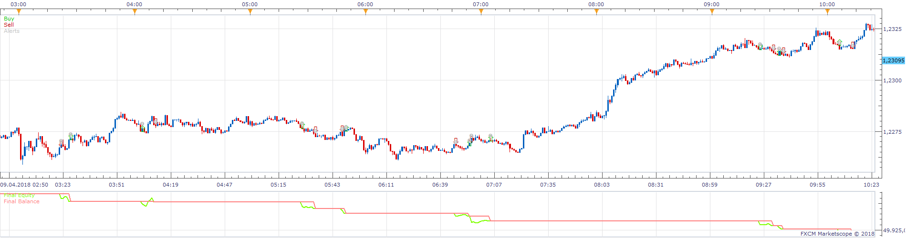
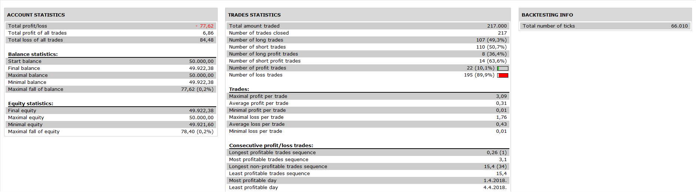

# RSI-2 system Strategy

> Source: https://fxcodebase.com/code/viewtopic.php?f=31&t=67012  
> Forum: 31 · Topic 67012 · 1 post(s)

---

## RSI-2 system Strategy

**Apprentice** · Tue Nov 27, 2018 6:31 am

 

Based on post.
[https://stockcharts.com/school/doku.php ... egies:rsi2](https://stockcharts.com/school/doku.php?id=chart_school:trading_strategies:rsi2)

Traders should look for buying opportunities when above the 200-day SMA and short-selling opportunities when below the 200-day SMA.

Connors found that returns were higher when buying on an RSI dip below 5 than on an RSI dip below 10.

For short positions, the returns were higher when selling-short on an RSI surge above 95 than on a surge above 90.

Waiting for the open gives traders more flexibility and can improve the entry level.

Exiting long positions on a move above the 5-day SMA and short positions on a move below the 5-day SMA.

 [RSI-2 system Strategy.lua](files/122375/RSI-2%20system%20Strategy.lua)
