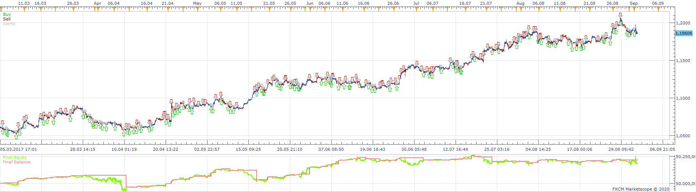
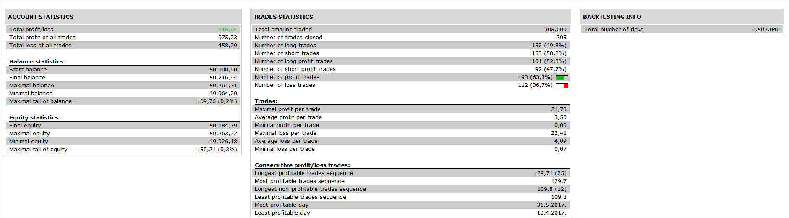

# RSI EMA Strategy

> Source: https://fxcodebase.com/code/viewtopic.php?f=31&t=69929  
> Forum: 31 · Topic 69929 · 26 post(s)

---

## RSI EMA Strategy

**Apprentice** · Wed May 27, 2020 7:42 am

 

Based on request.
[viewtopic.php?f=27&t=69918](https://fxcodebase.com/code/viewtopic.php?f=27&t=69918)

 [RSI EMA Strategy.lua](files/134367/RSI%20EMA%20Strategy.lua)

---

## Re: RSI EMA Strategy

**Andrea** · Wed May 27, 2020 11:31 am

Ciao. Grazie della velocità. Avevo già visto questa strategia non è quel che cerco. Io cerco qualcosa come in figura. Più semplice di una strategia, un indicatore.

---

## Re: RSI EMA Strategy

**Apprentice** · Tue Jun 02, 2020 6:28 am

Something like this?
[viewtopic.php?f=17&t=41176](https://fxcodebase.com/code/viewtopic.php?f=17&t=41176)

---

## Re: RSI EMA Strategy

**Andrea** · Tue Jun 02, 2020 7:25 am

CIAO. Qualcosa di simile, però non tutte le volte che incrocia la ema, ma solo quando incrocia la ema dopo che è stato sopra i 70 o sotto i 30.

---

## Re: RSI EMA Strategy

**Apprentice** · Wed Jun 03, 2020 5:54 am

OB/OS Filter added.

---

## Re: RSI EMA Strategy

**Andrea** · Wed Jun 03, 2020 6:01 am

mi mandi la versione con il filtro aggiunto? grazie

---

## Re: RSI EMA Strategy

**Apprentice** · Wed Jun 03, 2020 7:19 am

[download/file.php?id=29010](https://fxcodebase.com/code/download/file.php?id=29010)

---

## Re: RSI EMA Strategy

**Andrea** · Wed Jun 03, 2020 7:38 am

Visto. A me serve un indicatore non una strategia. Grazie

---

## Re: RSI EMA Strategy

**Andrea** · Wed Jun 03, 2020 12:42 pm

l'ho installato con il filtro ma non mi esce nessun segnale. Guarda la foto

---

## Re: RSI EMA Strategy

**Andrea** · Tue Jun 09, 2020 12:26 pm

Ciao. Hai notizie per l'indicatore? grazie

---

## Re: RSI EMA Strategy

**fx1954** · Sun Jun 14, 2020 11:04 am

Is it possible to ad also simmple moving average as an option for the strategy to get a RSI_SMA_Strategy as well?

---

## Re: RSI EMA Strategy

**fx1954** · Sun Jun 14, 2020 11:21 am

Would also be great if you can combine a faster EMA with a slower SMA average. Is this possible?

---

## Re: RSI EMA Strategy

**Andrea** · Mon Jun 15, 2020 2:56 am

si. importante che mi dia il segnale dell'incrocio che voglio io.

---

## Re: RSI EMA Strategy

**Apprentice** · Tue Jun 16, 2020 4:56 am

Your request is added to the development list.
Development reference 1492.

---

## Re: RSI EMA Strategy

**Apprentice** · Tue Jun 16, 2020 5:20 am

[RSI EMA Strategy v2.lua](files/134982/RSI%20EMA%20Strategy%20v2.lua)

Try this version.

---

## Re: RSI EMA Strategy

**fx1954** · Tue Jun 16, 2020 5:37 am

Is it possible to implement a crossover of EMA with SMA?
e.g.
Buy as long as EMA is above SMA on RSI
Sell as long es EMA is below SMA on RSI

---

## Re: RSI EMA Strategy

**Apprentice** · Tue Jun 16, 2020 6:56 pm

Your request is added to the development list.
Development reference 1501.

---

## Re: RSI EMA Strategy

**Apprentice** · Wed Jun 17, 2020 6:38 am

[RSI EMA Strategy v3.lua](files/135029/RSI%20EMA%20Strategy%20v3.lua)

Try this version.

---

## Re: RSI EMA Strategy

**fx1954** · Thu Jun 18, 2020 10:18 am

I would like to try it out on my demo account. Is it possible to combine the strategy with different timeframes? e.g. buy only when crossover on weekly and daily are positiv and vice versa?

---

## Re: RSI EMA Strategy

**Apprentice** · Fri Jun 19, 2020 4:19 am

You want option to select an individual indicator time frame?

---

## Re: RSI EMA Strategy

**fx1954** · Sun Jun 21, 2020 10:02 am

I tried the strategy, but no trades were executed.
Also it is not clear for me, which MA is the faster one and which is the slower one.
I would like a to sell when the faster crosses the slower to the downside.
For me it's not clear, what the strategy is doing in fact.
Is MA 1 the faster or the slower one?

---

## Re: RSI EMA Strategy

**Apprentice** · Wed Jun 24, 2020 4:22 am

Your request is added to the development list.
Development reference 1546.

---

## Re: RSI EMA Strategy

**Apprentice** · Wed Jun 24, 2020 5:49 am

The current logic is this:
BUY: MA Crosses over RSI and MA > MA2
SELL: MA Crosses under RSI and MA < MA2

---

## Re: RSI EMA Strategy

**fx1954** · Thu Jun 25, 2020 9:11 am

Can you change the logic to

The current logic is this:
BUY: When RSI > MA and MA > MA2 Exit when RSI < MA
SELL: When RSI < MA and MA < MA2 Exit when RSI > MA

---

## Re: RSI EMA Strategy

**Apprentice** · Thu Jun 25, 2020 1:39 pm

Your request is added to the development list.
Development reference 1561.

---

## Re: RSI EMA Strategy

**Apprentice** · Fri Jun 26, 2020 4:01 am

[RSI EMA Strategy v4.lua](files/135323/RSI%20EMA%20Strategy%20v4.lua)

Try this version.
